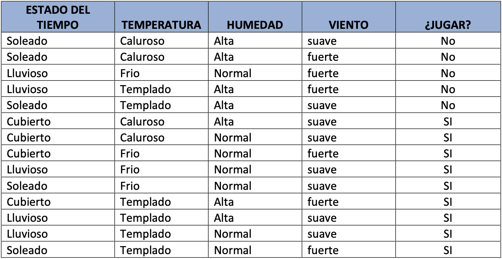
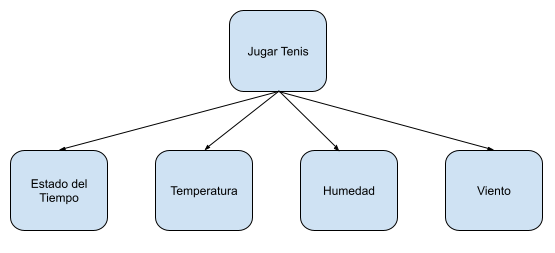
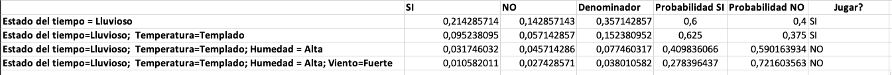

A continuación veremos un algoritmo no lineal de Machine Learning basado en el estudio
de las probabilidades, específicamente en el teorema de Bayes[^1].
[^1]: https://en.wikipedia.org/wiki/Bayes%27_theorem

# Dataset
Para entrenar el modelo utilizaremos el dataset clásico de "Jugar Tenis".  El
dataset tiene 4 atributos categóricos de entrada: _estado del tiempo_,
_temperatura_, _humedad_ y _viento_; la variable objetivo se llama _jugar_ y
sus valores son "Si" y "No".

La problemática que resuelve el dataset es si se juega o no al tenis dependiendo del
estado del tiempo, temperatura, humedad y viento.

El problema puede representarse con las siguiente red bayesiana 

# Modelo de Naïve Bayes
El modelo de Naïve Bayes aprende solamente desde el dataset, no tiene parámetros
adicionales para configurar. Se basa en el calculo de las probabilidades a priori
de los atributos y la variable objetivo, así también como de las probabilidades
condicionales de los atributos. Esto hace que el algoritmo sea particularmente rápido. 

## Predicciones
Para que el modelo pueda hacer predicciones, simplemente tenemos que aplicar el teorema
de Bayes a la nueva información. El algoritmo de Naïve Bayes utiliza una forma 
simplificada del teorema de Bayes, ya que para tomar una decisión no es necesario 
calcular la probabilidad. Simplemente basta con tener el numerador. Además, se asume
que los atributos son independientes entre sí (cosa que en la realidad es muy difícil),
lo que simplifica aun mas el cálculo.

Luego de aprender el modelo desde el dataset, podemos utilizarlo para predecir nuevos datos.
A continuación veremos algunos casos[^2]:
[^2]: Todos los cálculos necesarios se encuentran en la planilla electrónica

En el ejemplo anterior se ve claramente (al analizar las formulas de la planilla) la
naturaleza incremental del algoritmo a medida que se obtiene nueva evidencia; y como
podemos reutilizar los cálculos, esto es realmente fundamental a la hora de hacer de
Naïve Bayes un algoritmo muy rápido.

# Recursos
Se adjunta una planilla electrónica con el desarrollo del modelo y el dataset.
[>> Planilla Electrónica](bayes-play-tennis.xlsx)
