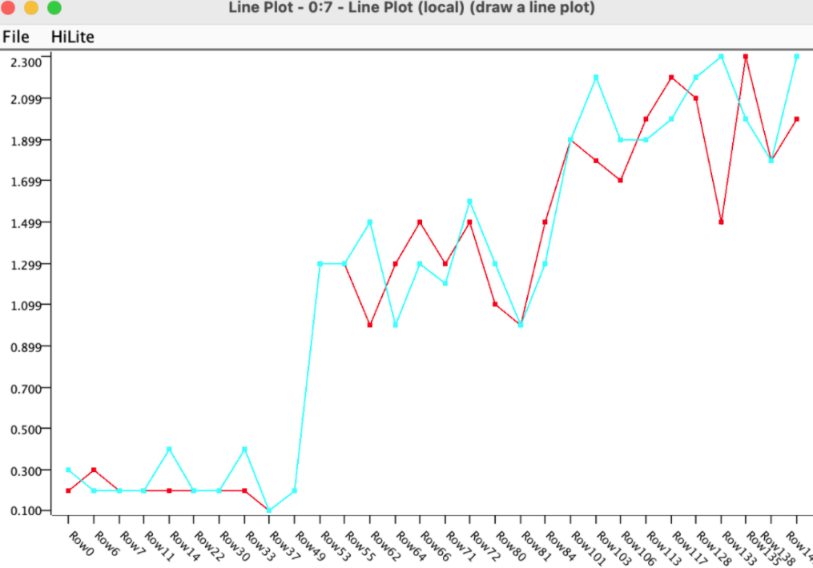

# Descripción del Modelo 
El primer paso es la carga del dataset, la cual se particiona en %80 para
entrenamiento y %20 para testing utilizando estratificación. Se entrena un
árbol de regresión simple con el atributo _petal width_ como target.  Luego el
workflow presenta los resultados a través de una predicción del score y un
gráfico que muestra los valores de _petal width_ y sus predicciones.

# Descripción de Operadores Principales
A continuación veremos los principales operadores a la hora de trabajar con un
árbol de decisión de regresión en KNIME. 

## Operador File Reader
El dataset observado es el de `IRIS`. El operador permite cargar un archivo
y provee un buscador, ademas incluye operadores para:

- leer/omitir los IDs de las filas
- seleccionar delimitador de columna
- ignorar espacios/tabs
- leer encabezados
- ver los datos y configurar las propiedades de las columnas

## Atributos del Dataset
El dataset IRIS es uno de los más presentes en la literatura de reconocimiento de
patrones. Contiene 3 clases con 50 instancias cada una, donde cada clase se refiere
a un tipo de planta Iris.

El dataset tiene los siguientes atributos:
- _sepal length_ (cm) -> Number (double)
- _sepal width_ (cm) -> Number (double)
- _petal length_ (cm) -> Number (double)
- _petal width_ (cm) -> Number (double)
- _class_ [Iris Setosa, Iris Versicolour, Iris Virginica] -> String
 
## Operador Partitioning
El operador ofrece las siguientes opciones:

- **Absolute:** Especificar la cantidad de filas.
- **Relative:** Permite especificar el porcentaje de filas en la partición.
- **Take from top:** Pone las filas de más arriba en la primer salida, y el
  resto en la segunda.
- **Linear sampling:** Incluye la primer y última fila, luego completa 
  linealmente el resto del dataset (cada 3 filas).
- **Draw randomly:** Selecciona de forma aleatoria.
- **Stratified sampling:** Utiliza estratificación.
- **Use random seed:** Si se utiliza `Draw randomly` o `Stratified sampling`
  permite configurar una semilla para obtener resultados reproducibles.

## Operador Simple Regression Tree Learning
El operador Simple Regression Tree Learning permite realizar un aprendizaje de un árbol
de regresión. Utiliza una versión modificada del algoritmo descripto en:
"Classification and Regression Trees" (Breiman et al, 1984)

Permite predictores nominales, numéricos y fingerprint (bit/byte/double-vector) y las
variables de predicción soportadas son del tipo numérico.

Además, permite configurar:

- Uso de splits binarios para atributos nominales
- Manejo de datos faltantes: _XGBoost_ y _Surrogate_
- Limitar el numero de niveles del árbol
- Especificar tamaño mínimo de nodos para split.
- Especificar tamaño mínimo de nodos.

### Funcionamiento de la Regresión
El valor de predicción para una hoja es la media de valores objetivos dentro de
la hoja.  Esto se obtiene con particiones (splits) que minimizan la suma de
errores cuadrados en sus respectivos hijos.

## Operador Simple Regression Tree Predictor
El operador presenta las siguientes entradas son dos:

- El modelo de árbol de regresión producido por "Simple Regression Tree
  Learner"
- La información a predecir

La salida del mismo es la información predicha.

Acepta los siguientes parámetros:
- **Change prediction column name:** Permite cambiar el nombre de la columna
  de la variable predicha si se elige la opción.
- **Prediction column name:** Nombre de la columna de la variable predicha.

## Operador Line Plot
A continuación veremos la gráfica del rendimiento del algoritmo AD regresión que nos
permite realizar el operador _Line Plot_. El operador permite ignorar columnas dado
un valor (limite superior) y se puede configurar la cantidad de filas a graficar.

## Operador Numeric Scorer
El operador computa diferentes estadísticas entre los valores numéricos y los
valores predichos, recibiendo como entrada la tabla con los valores predichos y
la información numérica.

Los resultados obtenidos para el dataset IRIS utilizando los operadores descriptos
anteriormente son:

$$
R^2: 0.897\\
\text{Mean absolute error}: 0.153\\
\text{Mean squared error: 0.055}\\
\text{Root mean squared error: 0.235}\\
\text{Mean signed difference: 0.053}\\
$$

# Recursos
[>> Dataset Iris](iris.data)
[>> Proyecto KNIME](cart-knime.knwf)
