Existen varias plataformas para trabajar con algoritmos de Machine Learning, en
éste trabajo particularmente nos vamos a centrar en los árboles de decisión,
haciendo foco en las características y diferencias que existen para éstos en
las diferentes plataformas.

# RapidMiner
RapidMiner es una de las herramientas mas completas e intuitivas para el desarrollo de
modelos de Machine Learning. Para trabajar con CART (Classification and Regression
Trees) tenemos el operador __Decision Tree__.

## Descripción
El operador de __Decision Tree__ permite trabajar tanto con árboles de regresión como
de clasificación.  

El árbol de decisión es una colección de nodos cuyo propósito es poder decidir
entre valores pertenecientes a una clase o estimar un valor numérico objetivo.
Cada nodo representa una regla de separación (splitting rule) para un atributo
especificó del dataset. En el caso de la clasificación dicha regla separa los
valores en clases, para el caso de la regresion los separa de manera tal de
reducir el error dado el criterio del parámetro seleccionado. Es importante notar
que para poder utilizar un árbol de decisión de clasificación, es necesario que
el dataset cuente con un _label_.

La construcción de nodos se repite hasta que el criterio de aceptación se
logra.  En el caso de predecir la clase, la predicción se basa en la mayoría de
los ejemplos que alcanzaron la hoja durante la generación. En caso de estimar
un valor numérico (regresion), este es obtenido realizando el promedio de los
valores en una hoja.

El operador tiene como entrada el dataset de entrenamiento y como salida provee:
el modelo CART, un set de ejemplos con la clasificación o estimación del valor y
los pesos de cada atributo del dataset, éstos pesos representan la importancia del
atributo en los datos.

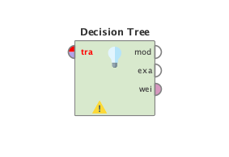

## Parámetros
Para configurar el CART, utilizamos los siguientes parámetros:

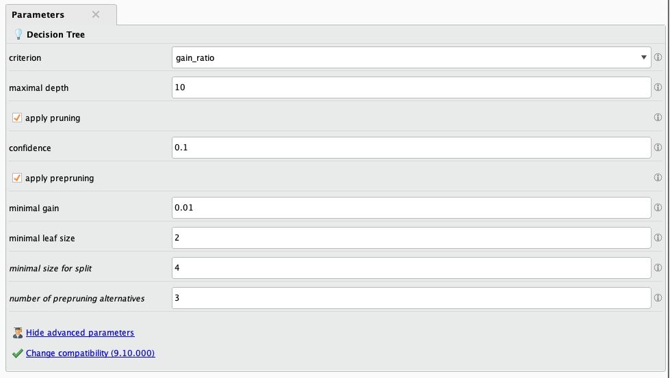

### Criterion
Selecciona el criterio en el que los atributos serán seleccionados al momento de hacer
splitting.

Tiene los siguientes valores:
* _information_gain:_ La entropia de todos los atributos se calculan, el atributo con
  menos entropia es seleccionado.
* _gain_ratio:_ Una variante de _information_gain_, ajusta el valor de la ganancia de 
  informacion para permitir uniformidad y amplitud de los valores de los atributos.
* _gini_index_: El indice Gini mide la desigualdad entre las distribuciones de las
  características de la etiqueta.
* _accuracy:_ Se selecciona el atributo que maximiza la _accuracy_ de todo el árbol.
* _lest_sqare_: Se selecciona el atributo que minimiza la distancia al cuadrado entre
  los promedios de valores del nodo en relación con su valor real.

### Maximal Depth
La profundidad del árbol varía dependiendo del tamaño y las características del dataset.
Éste parámetro se utiliza para restringir la profundidad del árbol. Si el valor es -1,
entonces no existe un limite máximo, el árbol se sigue construyendo hasta alcanzar otro
criterio de aceptación. En caso de que el valor sea 1, el árbol consiste solamente de un
nodo.

### Apply Pruning
El modelo del árbol de decisión puede ser podado luego de cada generación.
Si seleccionamos la opción, algunas ramas serán reemplazadas por hojas dependiendo
de la configuración del parámetro _confidence_.

### Confidence
Parámetro que se utiliza para especificar el nivel de confianza a la hora de calcular el 
error pesimista en la poda del árbol.

### Apply Prepruning
Especifica si algún otro criterio de aceptación ademas de _maximal_depth_
debería ser utilizado en la generación del modelo de decisión. Si se elige, los
parámetros minimal gain, minimal leaf size, minimal size for split y number de
_prepruning alternatives_ son utilizados como criterio de aceptación.

# KNIME
KNIME separa los arboles de regresion y clasificación en dos operadores, cada uno
con su configuración específica.

## Operador Simple Regression Tree Learning
El operador Simple Regression Tree Learning permite realizar un aprendizaje de
un árbol de regresión. Utiliza una versión modificada del algoritmo descripto
en: "Classification and Regression Trees" (Breiman et al, 1984)

Permite predictores nominales, numéricos y fingerprint (bit/byte/double-vector)
y las variables de predicción soportadas son del tipo numérico.

Además, permite configurar:

- Uso de splits binarios para atributos nominales
- Manejo de datos faltantes: _XGBoost_ y _Surrogate_
- Limitar el numero de niveles del árbol
- Especificar tamaño mínimo de nodos para split.
- Especificar tamaño mínimo de nodos.

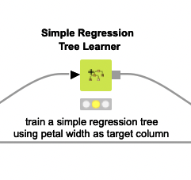

## Operador Decision Tree Learner
Genera un árbol de decisión en memoria. El atributo _label_ debe ser nominal. Los 
demás atributos utilizados a la hora de tomar decisiones pueden ser tanto numéricos
como nominales. Las divisiones (splits) numéricas son siempre binarias, mientras que
las divisiones nominales pueden ser binarias o pueden tener mas salidas como valores
nominales. En el caso de una división binaria los valores nominales son divididos en
dos subsets. El algoritmo provee dos medidas de calidad para el calculo de la división:
_gini_index_ y _gain_ratio_. Ademas, existe un método post poda para reducir el tamaño
del árbol. El algoritmo puede ejecutarse en múltiple hilos, para aprovechar múltiples
procesadores o núcleos.
La mayoria de los algoritmos utilizados en este operador pueden encontrarse en:
"C4.5 Programs for machine learning", by J.R. Quinlan and in
"SPRINT: A Scalable Parallel Classifier for Data Mining", by J. Shafer, R.
Agrawal, M. Mehta[^1]
[^1]:http://citeseerx.ist.psu.edu/viewdoc/download?doi=10.1.1.104.152&rep=rep1&type=pdf

El operador recibe el dataset de entrenamiento como entrada, por lo menos un atributo
debe ser nominal. La salida del operador es el modelo generado.

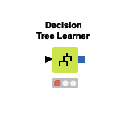

# Scikit Learn
Esta herramienta tiene grandes diferencias con las vistas anteriormente, principalmente
porque no es un entorno integrado de desarrollo sino que es una libreria de Python para
trabajar con modelos de Machine Learning y análisis de datos. Es necesario trabajar en
conjunto con otras librerías de Python para cargar, preparar y visualizar los datos.

Scikit Learn tambien separa los arboles de decision y regresion en sus propios operadores.

## DecisionTreeClassifier
Toma como parámetros de entrada dos arrays: _X_ que contiene los datos de entrenamiento
e _Y_ que contiene las etiquetas (labels) para los ejemplos de entrenamiento, es 
importante notar que las etiquetas se definen con números enteros.

Ejemplo de uso muy simple:
```python
from sklearn import tree
X = [[0, 0], [1, 1]]
Y = [0, 1]
clf = tree.DecisionTreeClassifier()
clf = clf.fit(X, Y)
```

Luego de entrenar el modelo podemos hacer predicciones:
```python
clf.predict([[2., 2.]])
```

El operador permite clasificaciones binarias y de clases múltiples.
Ademas, tenemos una herramienta de visualización del árbol dentro de la libreria
El siguiente snippet carga el dataset de prueba "IRIS", entrena un modelo de
árbol de decisión y luego gráfica el árbol resultante.

```python
from sklearn.datasets import load_iris
from sklearn import tree
iris = load_iris()
X, y = iris.data, iris.target
clf = tree.DecisionTreeClassifier()
clf = clf.fit(X, y)
tree.plot_tree(clf)
```

## DecisionTreeRegressor
Si necesitamos aplicar el árbol de decisión a un problema de regresion podemos hacerlo
mediante el operador DecisionTreeRegressor. Toma los mismos parámetros de entrada que
DecisionTreeClassifier, la diferencia es que el parametro _Y_ en lugar de tener números
reales para representar las clases, tiene numeros de punto flotante.

```python
from sklearn import tree
X = [[0, 0], [2, 2]]
y = [0.5, 2.5]
clf = tree.DecisionTreeRegressor()
clf = clf.fit(X, y)
clf.predict([[1, 1]])
```

## Algoritmo Utilizado
Existen muchos algoritmos para arboles de decisión (ID3, C4.5, C5.0, CART).
Scikit Learn utiliza una versión optimizada del algoritmo de CART con la
salvedad de que la implementación no soporta variables categóricas por ahora.

# Weka
Weka (Waikato Environment for Knowledge Analysis) es un entorno integrado,
similar a RapidMiner donde tenemos también herramientas para filtrar, analizar
y visualizar nuestro dataset. En Weka contamos con un operador para árboles de
decisión llamado "RepTree". Éste operador funciona tanto para clasificación como
para regresión.

## RepTree
El operador __RepTree__ (Reduced Error Pruning Tree) es un algoritmo para
arboles de decisión, tiene la característica de ser muy rápido y de construir
los arboles de decisión/regresion utilizando el criterio de _information_gain_
(ganancia de información) para sus divisiones (splits). Ademas, la poda utiliza
un algoritmo con reducción de error (reduced error pruning algorithm[^2]).
[^2]: https://www.researchgate.net/publication/294086112_A_Reduced_Error_Pruning_Technique_for_Improving_Accuracy_of_Decision_Tree_Learning

## Árbol de Decisión
Utilizando el operador __RepTree__ podemos construir un árbol de decisión.
El árbol divide los nodos en todas las variables y luego selecciona la división
que resulte en los sub-nodos mas homogéneos. Como mencionamos anteriormente el 
criterio de división utilizado es _information_gain_.
Dentro del operador podemos configurar:
* _Percentage split:_ Especifica que porcentaje de los datos queremos que se tomen
  para el entrenamiento del clasificador. El resto se usa en la etapa de testing.
* _Cross-validation Fold:_ Podemos configurar el uso de Cross validation, especificando
  el numero de sub-divisiones (N) que queremos hacerle al dataset.

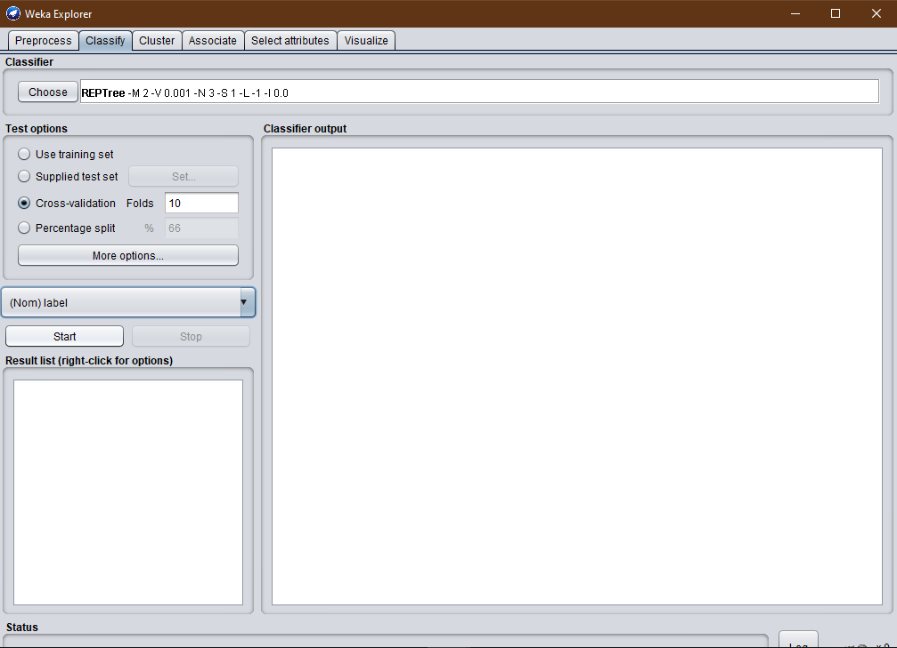

Los principales parámetros del operador son:
* _maxDepth:_ Determina la profundidad del árbol. Por defecto es -1, esto indica
  que el algoritmo controla la profundidad automáticamente.
* _noPruning:_ Evita la poda del árbol.
* _numFolds:_ El numero de particiones a utilizar en la poda. El resto se utiliza para
  mejorar las reglas.
* _minNum:_ Numero mínimo de instancias por hoja. De no configurarse, el árbol sigue
  dividiendo hasta que todos los nodos tengan una sola clase asociada.

## Árbol de Regresión
Para realizar un árbol de regresion utilizamos el mismo operador __RepTree__. Los
parámetros a configurar son los mismos. Weka detecta automáticamente los problemas de
regresion.

# Implementación

A continuación utilizaremos el dataset de "IRIS" para probar algunas de las
implementaciones detalladas anteriormente. 

## Atributos del Dataset
El dataset IRIS es uno de los más presentes en la literatura de reconocimiento de
patrones. Contiene 3 clases con 50 instancias cada una, donde cada clase se refiere
a un tipo de planta Iris.


El dataset tiene los siguientes atributos:
- _sepal length_ (cm) -> Number (double)
- _sepal width_ (cm) -> Number (double)
- _petal length_ (cm) -> Number (double)
- _petal width_ (cm) -> Number (double)
- _class_ [Iris Setosa, Iris Versicolour, Iris Virginica] -> String

## RapidMiner
Utilizando el dataset de _IRIS_, modelaremos un clasificador con un árbol de decisión.
Lo primero que debemos hacer es cargar el dataset y seleccionar el atributo _label_,
de esa forma el clasificador sabe cual es la variable objetivo. Luego, agregamos un
operador __SplitValidation__ para poder entrenar el modelo y validarlo, utilizando un
split de 0.7. Lo que implica que utilizaremos el 70% del dataset para entrenamiento
y el 30% restante para validación.

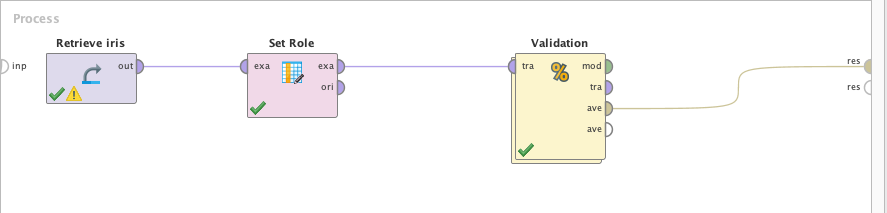
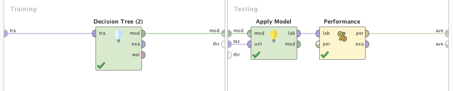

Configuramos el árbol de decisión para hacer los splits utilizando _gain_ratio_,
10 niveles de profundidad y poda.

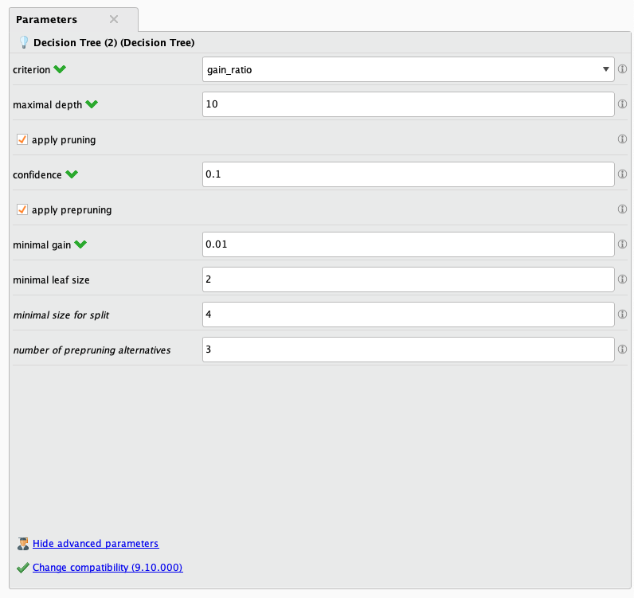

Por ultimo, obtenemos la matriz de confusión que nos permite ver los resultados
del modelo y validarlo.

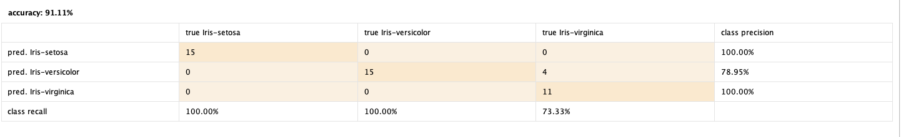

Como podemos observar, el modelo tuvo una performance correcta, teniendo dificultad
al clasificar correctamente 4 instancias de _Iris-virginica_.

## Scikit Learn
Realizaremos el mismo ejercicio en Scikit Learn, para esto utilizaremos Google
Colab.  Cargamos el dataset de IRIS desde Scikit Learn y lo modelamos con el
operador __Decision_Tree_Classifier__. Entrenamos el modelo y luego hacemos una predicción
para ver su desempeño.

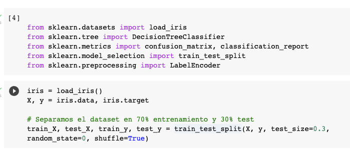

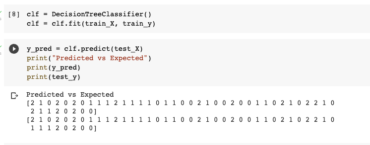

Como veremos a continuación, nuestro modelo se comporto un poco mejor que en el caso
anterior, solamente falló en la predicción de un valor. Como se puede observar
en los resultados, en Scikit Learn no podemos utilizar `labels` categóricos por lo que
dificulta un poco más la lectura de los resultados.

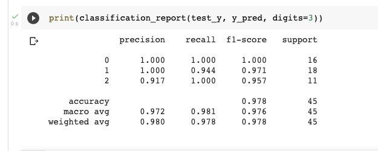

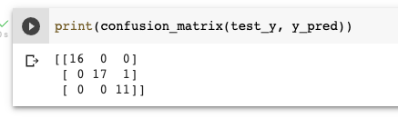
 
# Conclusiones
Como pudimos ver, existen una cantidad de herramientas excelentes para el desarrollo de
algoritmos de Machine Learning. Cada una tiene sus sutilezas y trae algo nuevo para
sacar provecho. A destacar está la diferencia de paradigma entre herramientas como
Weka, KNIME y RapidMiner contra Scikit Learn, ya que las primeras son un entorno integrado
de desarrollo mientras que la última es una librería. Cada enfoque tiene sus particularidades,
Sickit Learn es mucho mas flexible ya que lo podemos integrar fácilmente con cualquier
librería de Python, pero RapidMiner, KNIME y Weka tienen todas las herramientas necesarias
para desarrollar un modelo dentro de su entorno.
También existen diferencias mas sutiles, como el hecho de que Weka tiene la validación
del modelo integrado en el operador del árbol de decisión mientras que RapidMiner tiene
operadores específicos para validar los modelos (SplitValidation y CrossValidation por ejemplo),
o el hecho de que tanto KNIME como Scikit Learn tienen un operador para árbol de regresion
y otro para clasificación, mientras que RapidMiner y Weka usan un mismo operador para ambas.

# Recursos
[>> Dataset Iris](iris.data)
[>> Proyecto RapidMiner](decision-tree.rmp)
[>> Proyecto Scikit Learn](decision-tree.ipynb)
