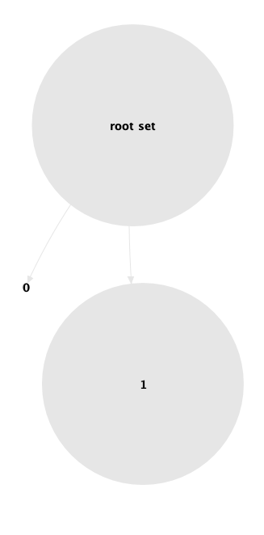

Aplicaremos diferentes métodos de clustering a un dataset educacional, el
objetivo del trabajo es minar los datos con diferentes estrategias y comparar
los resultados.

Modelaremos los diferentes algoritmos de clasificación:
* K-Means
* DBSCAN
* Clustering Aglomerativo
* Clustering Divisivo

# Caso de Estudio
Se necesita minar información estudiantil de un dataset, el objetivo es clasificar los
estudiantes en grupos de acuerdo a sus características. Con esta información, los
profesores podrán crear planes de estudios a medida para las distintas necesidades de
los estudiantes. Obtener esta información es de mucho interés para los docentes, ya que
puede tener un impacto significativo en el aprendizaje y generar interés en los estudiantes
generando contenidos que les sean especialmente interesantes.

## Dataset
El dataset fue obtenido de la Facultad de Ciencias Organizacionales,
Universidad de Belgrado, Servia. Tiene un total de 366 registros de estudiantes
graduados y su rendimiento académico.

__Atributos del dataset:__
* __Sexo:__ femenino / masculino, binomial
* __Región:__ De donde proviene el estudiante, nominal
* __Puntaje en la prueba de admisión:__ Valores obtenidos en el examen de ingreso.
  Valores 40-100, tipo real.
* __Calificaciones en el primer año:__ Notas en cada uno de los 11 exámenes del
  primer año de estudios. Valores: 6 a 10, tipo: entero
* __Calificación promedio:__ Promedio de calificaciones del estudiante luego de la
  graduación, valores: 6 – 10, tipo: continuo
* __Rendimiento académico del estudiante:__ Rendimiento al finalizar los estudios,
  valores: “Malo", “Bueno", y “Excelente"; tipo: polinomial

__Rendimiento académico (RA):__ el atributo se ha obtenido discretizando la
calificación promedio, de la siguiente manera:
* Si la calificación es 8 o menor, el RA es “Malo”
* Si la calificación está entre 8 y 9, el RA es “Bueno”,
* Y si es mayor a 9, el RA es “Excelente”

El atributo __Rendimiento Académico__ no será tenido en cuenta para realizar
los clusters.

El dataset está dividido en dos partes, un archivo con los datos y un archivo
con la metadata de los atributos. Al importar los datos, es necesario editar
los nombres y los tipos de los atributos. RapidMiner permite hacer esto al
importar el CSV.

A continuación observaremos las características de los atributos del dataset
utilizando el análisis estadístico de RapidMiner:

Con el análisis anterior podemos observar algunas características de los
atributos:
* Los exámenes tienen un rango de valores de 6 a 10, sin ser en _Exam1_ y
  _Exam10_ donde es de 0 a 10. 
* _EntranceExam_ tiene rangos de valor de 0 a 100, mientras que el resto de
  los atributos que representan exámenes van del 6 al 10.
* Existen datos faltantes en varios atributos: _Exam2_, _Exam3_, _Exam4_,
  _Exam5_, _Exam8_, _Exam9_, _Exam10_, _Exam11_ y _Exam12_.
* Recordar que el atributo _Rendimiento Académico_ no va a ser utilizado.

# Preparación del Dataset
Los datos faltantes y los outliers son dos de las cosas que más afectan a los
algoritmos de clustering. Como vimos anteriormente, existen atributos con datos
faltantes por lo que debemos decidir que hacer con ellos. En el caso de _Exam9_
y _Exam10_ los datos faltantes son considerables por lo que es una buena idea
utilizar algún mecanismo de imputación de valores para no desbalancear el
dataset.
Otra observación importante es que los datos tienen diferentes rangos por lo
que es importante normalizarlos. Además, sabemos que no vamos a utilizar el
atributo _Rendimiento Académico_ pero también removeremos los atributos _Sex_ y
_Region_.

Por tanto los pasos de preparacion de datos a seguir son:
* Agregar nombres y tipos de variables al dataset (realizado al importar el
  archivo a RapidMiner).
* Remover atributos que no sean necesarios en el proceso.
* Reemplazar datos faltantes.
* Detectar outliers y removerlos.
* Normalizar los atributos.

## Normalizar y Filtrar Atributos.
Utilizando el operador _SelectAtributes_, podemos quitar los atributos no
deseados del dataset. Luego de tener el dataset listo, podemos normalizar
los atributos (con centrado y escalado) utilizando el operador _Nomralize_.
La transformación que queremos aplicar es _range transformation__ al rango
[0, 1].

## Datos Faltantes
Los datos faltantes simplemente los imputaremos utilizando el operador
_Replace_Missing_Values_, con la estrategia del promedio.

## Outliers
A continuación veremos el resultado del análisis de RapidMiner sobre los
outliers en el dataset, estos datos serán removidos del dataset para el
proceso de clustering.

Se puede observar que se detectaron 30 outliers, veremos la distribución 
de los mismos en función de _EntranceExam_ y _Average_Grade_.

# K-Means

## Modelado
Utilizando K-Means, intentaremos dividir el dataset en un conjunto de grupos
no muy grande para analizar si existen clusters interesantes en los datos que
nos permitan agrupar a los estudiantes.

Luego de varias pruebas, utilizaremos los siguientes parámetros para subdividir
a los estudiantes en 5 grupos:

El modelo resultante generó 5 clusters, a continuación se presentan los
resultados.

Podemos observar algunos clusters interesantes, el _cluster_3_ parece
ser el que tiene las mejores notas en promedio mientra que el _cluster_4_
es el que tiene menos nota. Simplemente con esta información ya podríamos
generar planes de apoyo para los estudiantes del _cluster_4_ y algunos
ejercicios más desafiantes para el _cluster_3_.

Los demás clusters tienen un rendimiento académico medio, particularmente el
caso del _cluster_1_ es interesante ya que el promedio académico es bastante
bueno pero hay un 0 de promedio en el examen 10.

## Evaluación

Como podemos ver el cluster 0 y el cluster 4 son los que están mas alejados
en relación al promedio de la distancia dentro del cluster. Podríamos intentar
reducir la distancia interna y generar más clusters, pero los actuales son
representativos en cuanto al rendimiento académico y permiten generar planes de
estudios para diferentes grupos.

# DBSCAN

## Modelado
Intentaremos determinar clusters de densidad dentro del dataset. Teniendo
en cuenta lo observado en el dataset al momento de estudiar los datos
parece que los datos están bastante bien distribuidos y no existen zonas
mucho más densas que las otras.

Configuraremos el modelo __DBSCAN__ con los siguientes parámetros.

El modelo resultante es detectó valores insignificantes de ruido y luego
solamente pudo formar un cluster. Parece ser que los datos están muy bien
distribuidos y no existen zonas de alta densidad. DBSCAN no puede generar muy
buenos resultados, más allá de hacernos saber que todo el dataset forma un
único cluster bastante uniforme. 

A continuación veremos algunos gráficos generados por el modelo:

## Evaluación
La evaluación de DBSCAN nos indica que solamente pudo detectar un cluster, el
algoritmo no pudo separar el dataset en grupos que puedan ser de interés para
los profesionales.

# Clustering Aglomerativo

## Modelado
Al configurar el clustering aglomerativo, el atributo _mode_ tiene suma
importancia. Éste juega un papel importante en como se van a generar los
clusters. El siguiente dendograma se obtuvo utilizando el _mode_="SingleLink"

Como puede observarse los datos están agregados en un grupo gigante y no hay
una clara manera de separarlos. Esto se debe a que a medida que el cluster
aumenta, el valor más cercano siempre es el cluster y los siguientes datos se
agregan al mismo. El dataset tiene los valores distribuidos bastante
uniformemente y no se generan clusters. Para intentar generar clusters con
cierta relevancia, podemos utilizar el _mode_="CompleteLink" que toma en cuenta
otros factores como combinar clusters con menos diámetro en cada paso.

Tomaremos los siguientes parámetros:

Utilizando "CompleteLink" obtenemos un dendograma mucho mas balanceado, que nos permite separar nuestros
datos en clusters representativos.

El modelo generado obtiene 3 clusters, los cuales se pueden ver a continuación:

El _cluster_0_ pertenece a los alumnos con rendimiento académico más bajo,
los alumnos del _cluster_2_ tienen un rendimiento medio y finalmente los
alumnos presentes en el _cluster_1_ tienen un rendimiento alto.

## Evaluación
Podemos observar que los clusters tienen una distancia interna media de -174,
esto nos indica que los clusters no son muy cohesivos (lo que ya habíamos
podido) comprobar al intentar usar "SingleLink". De todas maneras, los clusters
están definidos y permiten generar una división valorable.

# Clustering Divisivo

## Modelado
Sabemos que nuestro dataset es bastante uniforme y queremos obtener 
representaciones de estudiantes de malo, buen y excelente nivel académico.
Por ésto y habiendo analizado también los resultados de los otros algoritmos
podemos configurar el clustering divisivo para que genere un árbol de poca
profundidad, y que tenga solo una hoja como máximo.

El modelo detectó 63 clusters, al aplicar el operador "Flatten Clustering"
vamos a poder obtener mejores valores de clusters.

Luego de aplicar el operador "Flatten Clustering", reducimos los clusters a
3. Estos son los mismos ejemplos vistos anteriormente en clustering aglomerativo (en cuanto a su significado).

Si bien el modelo pudo detectar 3 clusters,  los clusters para bajo y mediano
rendimiento están un poco mezclados. Es por esta razón que la performance de
éste modelo no fue tan buena como la del clustering aglomerativo.

## Evaluación
Podemos ver que el vector de performance generado muestra dificultad a la hora
de generar el cluster de los alumnos con rendimiento académico bajo. Pero puede
diferenciar bastante bien aquellos que se encuentran en un rendimiento medio.
Existe también un poco de dificultad de evaluar los rendimientos excelentes.

# Conclusión

Los modelos presentaron resultados interesantes y permitieron entender mejor el
dataset y la información subyacente. DBSCAN pudo solamente generar un cluster,
con lo que pudimos ver que no existen clusters de densidad en el dataset
claramente definidos.  K-Means pudo dividir el dataset en clusters con cierta
facilidad, pero los resultados obtenidos no fueron del todo precisos. A pesar
de esto, permitió descubrir un conjunto interesante de estudiantes con buen
rendimiento académico general y que obtuvieron un 0 en el examen 10.

Las clasificaciones mas relevantes la presentaron los algoritmos de clustering
jerárquicos. En el caso de clustering aglomerativo, pudimos definir mejor a los
rendimientos bajos y excelentes pero no tan bien a los estudiantes de
rendimiento medio. Por el contrario, el algoritmo de clustering divisivo pudo
detectar mejor el cluster de estudiantes con rendimiento medio y no tan bien
los extremos.

# Recursos

Dataset con la información de los estudiantes graduados.
[>> ClusteringStudents](ClusteringStudents)

Descripción XML del dataset.
[>> ClusteringStudents.aml](ClusteringStudents.aml)
