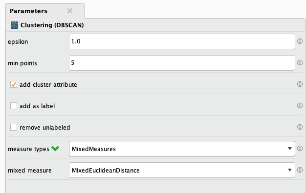
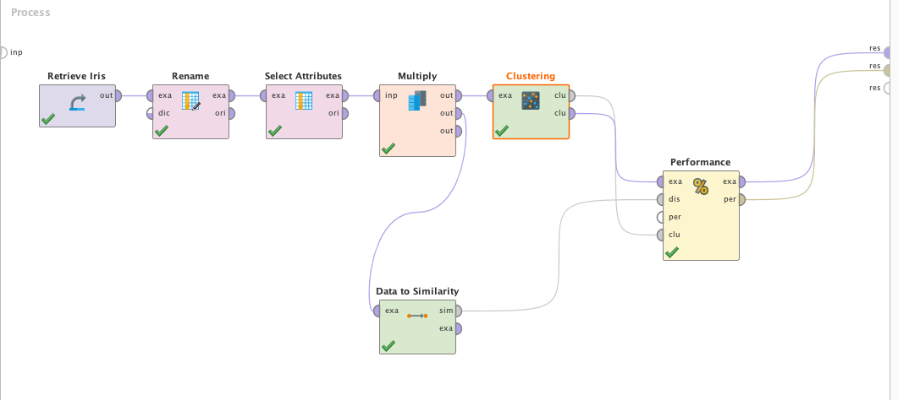
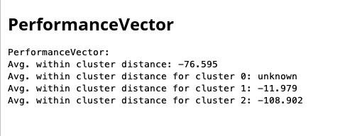
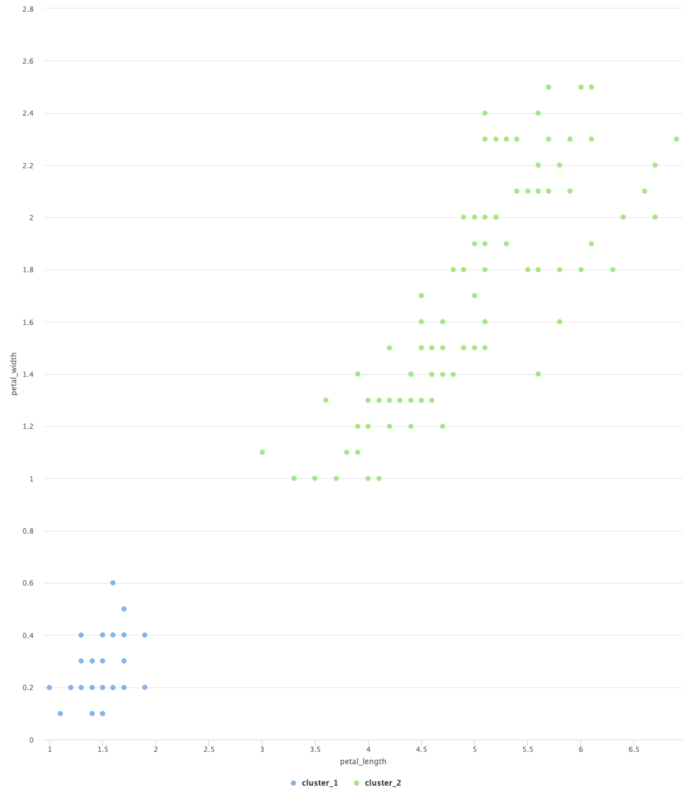
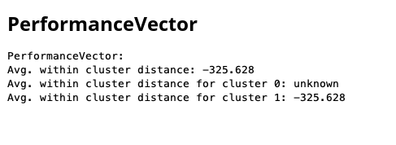
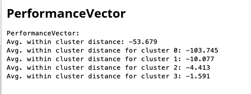

DBSCAN es un algoritmo no supervisado de Machine Learning, el algoritmo se encarga de
encontrar clusters de datos en la información, estos clusters son formados utilizando
una distancia definida (epsilon), que permite separar los clusters densos del ruido
del dataset.

# Dataset
Utilizaremos el Dataset de Iris, pero en este caso solamente tomaremos en cuenta los
atributos _petal_length_ y _petal_width_. Esto es para poder visualizar mejor los
clusters (el dataset de Iris tiene una correlacion alta entre los valores de petal y stem).

El dataset IRIS es uno de los más presentes en la literatura de reconocimiento de
patrones. Contiene 3 clases con 50 instancias cada una, donde cada clase se refiere
a un tipo de planta Iris.

Estos son los atributos que nos interesan del dataset:
- _petal length_ (cm) -> Number (double)
- _petal width_ (cm) -> Number (double)
- _class_ [Iris Setosa, Iris Versicolour, Iris Virginica] -> String

# Modelado
Para modelar DBSCAN en RapidMiner simplemente debemos agregar un operador __DBSCAN__
y configurarlo. A continuación se muestran los parámetros seleccionados:

A destacar tenemos el parametro _epsilon_, el cual define el tamaño del grupo de alta
densidad. Ademas, podemos ajustar _min points_ que nos permite definir el mínimo de
elementos que deben tener los clusters. El calculo de las distancias puede realizarse
de maneras diferentes, dentro de las opciones tenemos:
*  _Mixed Measure:_ El único tipo de medida que tenemos aquí es la distancia euclidiana mezclada.
*  _Nominal Measure:_ Método de distancia para atributos nominales, no puede
   ser utilizada si el dataset tiene valores numéricos.
* _Numerical Measure:_ Únicamente puede ser utilizado para atributos numéricos,
  en caso de tener atributos nominales deberíamos usar _Nominal Measure_.
  Cuenta con diferentes algoritmos para calcular la distancia numéricamente.
* _Bregman Divergences:_ Es un metodo de calculo de distancias en base a
  funciones estrictamente convexas

# Evaluación
Los clusters pueden ser evaluados dependiendo de la media de las distancias dentro de los
clusters. Esto nos permite determinar la efectividad de los mismos.
En RapidMiner podemos hacer uso del operador __ClusterDensityPerformance__, es necesario
también hacer uso del operador __SimilarityMeasure__ ya que el operador de performance lo
necesita. El operador __SimilarityMeasure__ genera un vector de similaridad; que es una
medida de distancia entre los ejemplos del cluster. 

Analizando el resultado del vector de performance, podemos ver que el cluster 0 no tuvo
datos, esto significa que no se encontró ruido en el dataset. Luego, se puede observar
que se detectaron 2 clusters más.

Si recordamos, el dataset de Iris tiene 3 clases, por lo
que se podría pensar que deberíamos tener 3 clusters. El problema es que los grupos
_versicolor_ y _virginica_ no hay suficiente distancia entre los dos clusters para que
DBSCAN los vea como clusters de densidad separados. Es posible que utilizando los
parámetros _epsilon_ y _min points_ podamos generar la diferenciación. En este caso
podemos hacer el ejercicio porque sabemos de antemano el contexto del dataset, y entendemos
que deberían ser 3 clusters.

## Pruebas ajustando valores de parámetro
Podemos utilizar diferentes configuraciones del modelo para analizar la generación de
clusters y ver el comportamiento del algoritmo.

Los valores a ajustar son _epsilon_ y _min points_, estos dos parámetros tienen mucho
peso en la generación de los clusters. _epsilon_ es la distancia mínima para que el algoritmo
reconozca al cluster como un cluster de densidad, y _min points_ es la cantidad mínima 
de datos dentro de épsilon para configurar un cluster.

Si tomamos un valor de alto de _epsilon_ como 3, y 4 en _min points_ obtenemos:
Podemos observar que solamente se detectó un cluster, ya que la distancia era
demasiado grande.

En caso de configurar valores chicos de epsilon (0.2) y min points en 10,
obtenemos mas clusters de densidad (que no se ajusta tampoco con la realidad
del problema).  Además, el algoritmo comienza a detectar "ruido" en el dataset.

Se intentaron muchas pruebas con valores diferentes de _epsilon_ y _min points_, pero
nunca se llego al resultado de 3 clusters que como sabemos es el resultado ideal.

# Recursos
[>> Proyecto RapidMiner](dbscan.rmp)
