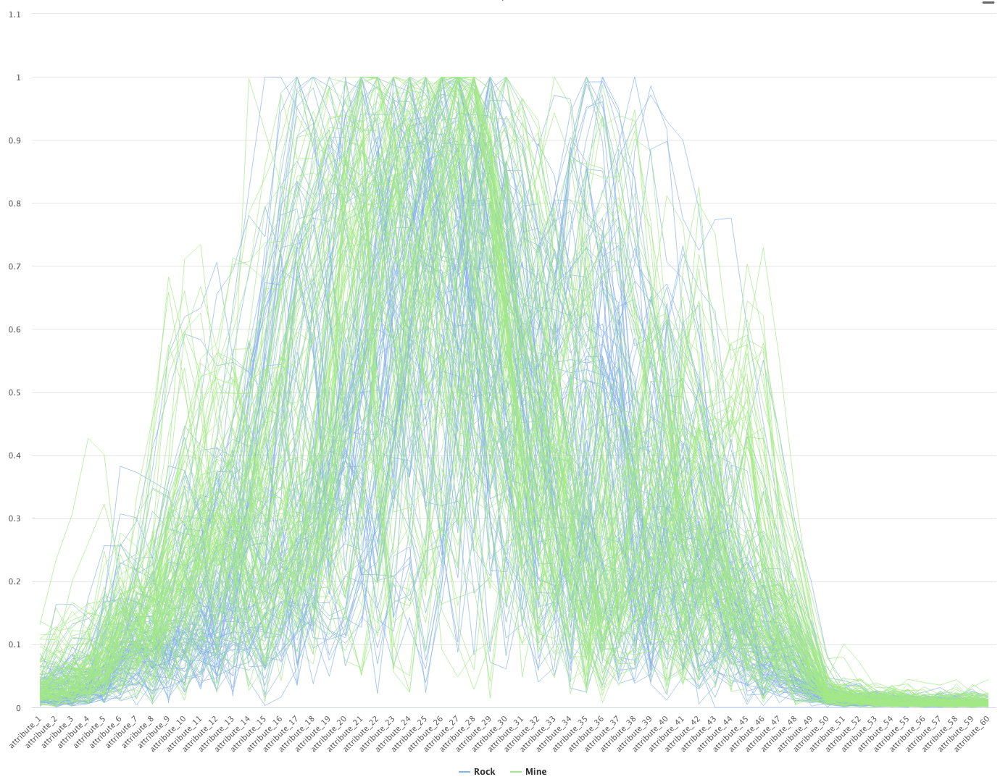
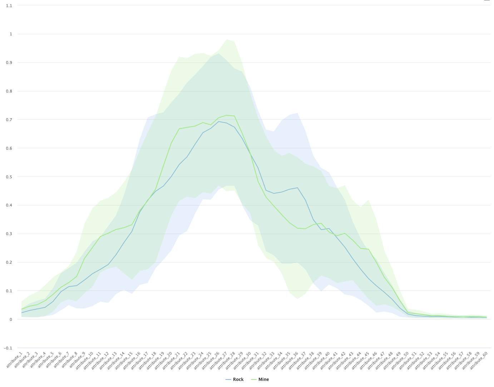
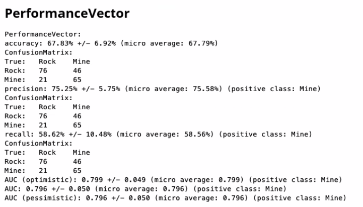
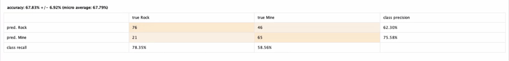
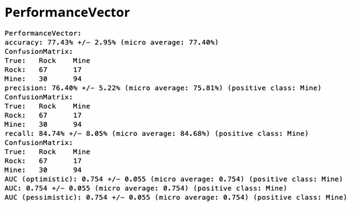
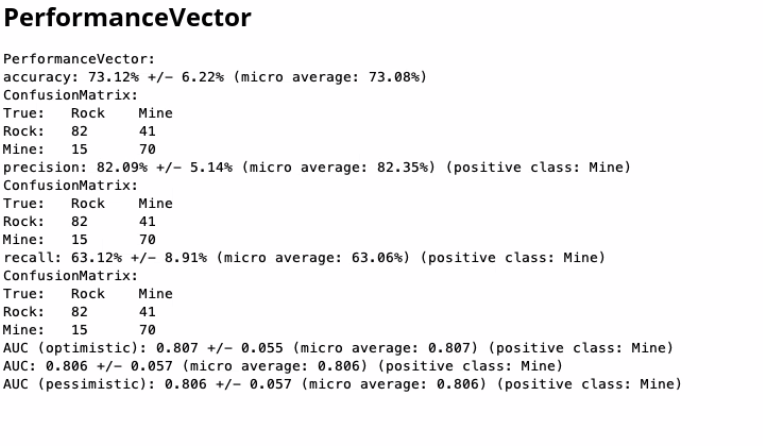
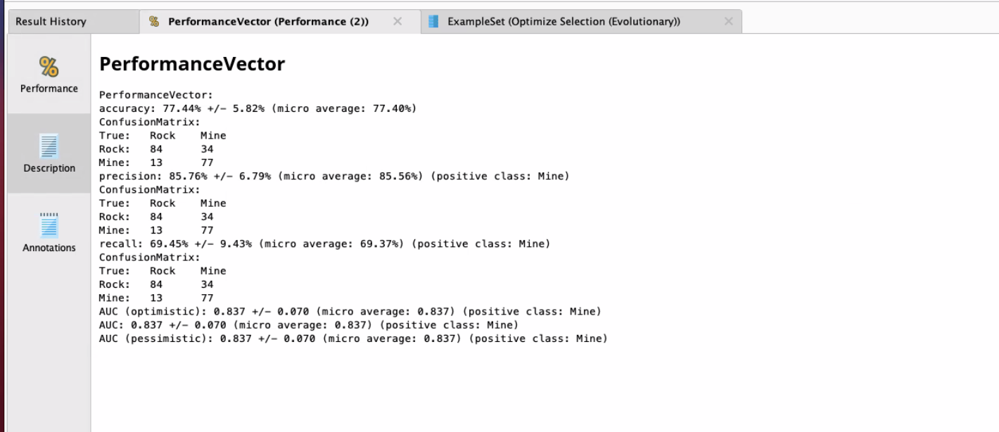
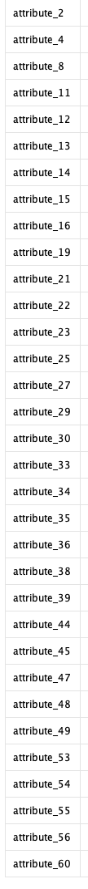

Feature Selection (en español llamado selección de atributos), es un método
utilizado en la preparación de datos que sirve para mejorar el dataset. Nos
permite disminuir significativamente el ruido en la información, así también
como eliminar atributos irrelevantes (o que tienen mucha correlación con otro)
que perjudican el funcionamiento del modelo de Machine Learning utilizado.

Al realizar Feature Selection, obtenemos un dataset mas simple y relevante; lo que
facilita el entrenamiento y el manejo del dataset. En muchos casos, el simple hecho
de reducir la cantidad de atributos mejora la capacidad del modelo de predecir
las instancias. A continuación, veremos diferentes métodos de Feature Selection
que pueden ser utilizados.

# Dataset
Utilizaremos el dataset de práctica Sonar[^1]. El dataset consiste de patrones
obtenidos al rebotar ondas de sonar contra cilindros metálicos y rocas, éstos
patrones se componen de 60 valores numéricos reales en el rango (0.0, 1.0), el
dataset entonces tiene 60 atributos y la variable de salida _label_ indica si
el patrón recibido por el sonar pertenece a una roca o a una mina.
[^1]: https://archive.ics.uci.edu/ml/datasets/Connectionist+Bench+(Sonar,+Mines+vs.+Rocks)

El dataset es muy útil para utilizar Feature Selection ya que contiene un número
interesante de atributos (60), lo que nos permite analizar el impacto en la
clasificación a la hora de reducir los atributos.

## Análisis del Dataset.
Resulta interesante trabajar en el dataset para entender cuales son los atributos que
a priori parecen más relevantes a la hora de clasificar el modelo.

Como se puede observar en los gráficos, el azul representa las instancias clasificadas
como rocas y el verde las minas. 

Analizando los datos podemos ver que hay zonas que donde las clases están mas diferenciadas. A simple vista pareciera que los atributos más significativos sondel _attribute_9_ al _attribute_14_ y del _attribute_34_ al _attribute_38_.

# Benchmarking
Para poder comenzar a trabajar, necesitamos tener una linea de base que nos
permita entender si la reducción de atributos está teniendo el efecto deseado.
Utilizaremos un modelo de __Naïve Bayes__ y lo validaremos con __Cross
Validation__, con 5 folds, muestreo estratificado y una semilla (1992). Es
importante destacar el uso de una semilla, ya que de otra manera los resultados
no serian reproducibles y no podríamos comparar correctamente el comportamiento
del modelo al utilizar diferentes estrategias de Feature Selection.

Luego de entrenar el modelo y validarlo, agregamos un operador de __Performance
(Clasification)__ para analizar los resultados obtenidos.

# Aplicación de Feature Selection
En principio podríamos probar a la fuerza bruta con todas las combinaciones posibles,
pero esto es una perdida de tiempo y de recursos (mas para un dataset con 60 atributos).
Existen varias estrategias para agilizar el proceso y poder elegir el mejor subset de
atributos para el modelo.

## Forward Selection
Forward Selection comienza con una lista vacía de potenciales atributos, en
cada ronda agrega atributos del dataset que no fueron utilizados todavía. Para
cada atributo agregado se calcula la performance y dependiendo del parámetro
_stopping_behaviour_ continuara agregando atributos o terminara la ejecución.

Los valores posibles de _stopping_behaviour_ son:
* _without_increase:_ Las iteraciones continúan siempre y cuando haya cualquier
  aumento de performance.
* _without_increase_of_at_lest:_ Las iteraciones continúan siempre y cuando el aumento
  sea de al menos el valor especificado.
* _without_significant_increase:_ Las iteraciones terminan en el momento que
el aumento de performance no es significativo respecto al parámetro _alpha_.

Al aplicar el operador de __ForwardSelection__ en RapidMiner, obtenemos los
siguientes resultados:

Podemos notar que el algoritmo se queda en un máximo local, debido a que es un
algoritmo ávido, pero de todas maneras tienen mejores resultados que nuestra
linea de base.  Los atributos seleccionados por el operador fueron:
_attribute_12_, _attribute_15_, _attribute_17_ y _attribute_18_. Éstos
atributos están todos dentro de los atributos mencionados en el análisis del
dataset.

## Backwards Elimination
Comenzamos con el conjunto completo de atributos, en cada ronda quitamos un
atributo del dataset. Para cada iteración calculamos la performance del modelo,
solamente quitamos el atributo que tuvo peor performance en el dataset.
El proceso se para dependiendo de la configuración del parámetro _stopping_behaviour_.

En este caso podemos observar una performance un poco peor que en el caso de
Forward Selection. También podemos observar que el algoritmo se estanca en un
máximo local.

El algoritmo selecciono todos los atributos menos: _attribute_3_, _attribute_14_,
_attribute_20_, _attribute_36_, _attribute_47_, _attribute_48_, _attribute_52_
y _attribute_59_.

Podemos observar que ninguno de los atributos seleccionados por Forward
Selection fue eliminado. La baja en la performance (respecto a Forward
Selection) puede deberse a que se utilizan mas atributos y existe mucho ruido y
correlación en los mismos.

## Optimización de atributos con Algoritmos Genéticos
Otra estrategia a utilizar es calcular la mejor combinación de atributos
utilizando algoritmos genéticos. Estos funcionan ajustando una funcion de aptitud
a los individuos de una población. De generación en generación, el algoritmo
se va quedando con los mejores individuos y luego de muchas generaciones
obtenemos el resultado. 

### Configuracion del operador Optimize Selection (Evolutionary)
Parámetros:
* Use exact number of attributes: determina si se tienen que seleccionar un número específico de atributos
* Exact number of attributes: el número de atributos a elegir si se usa el parámetro anterior
* Restrict maximum: restringe el máximo número de atributos a elegir si se usa el número exacto de atributos
* Min of attributes: restringe el mínimo de atributos usados
* Max number of attributes: restringue el maximo numero de caracteristicas a ser usadas
* Population size: restringe la cantidad de individuos por generación
* Maximum number of generations: restringe el número máximo de generaciones
* Use early stopping: se detiene cuando no se logren mejoras si no se ejecuta el máximo número de generaciones
* Generations without improval: especifica el criterio de corte para el early stopping
* Normalize weights: normaliza los pesos finales
* Use local random seed: define la semilla aleatoria para reproducir el mismo resultado del algoritmo
* Local random seed: especifica el número de la semilla aleatoria
* Show stop dialog: deja un cuadro de mensaje para parar la búsqueda del algoritmo, si se detiene se obtiene la mejor encontrada hasta la actualidad
* User result invidiual selection: deja seleccionar al individuo de la última población
* Show population plotter: muestra la población en un espacio de performance
* Plot generations: define que generaciones se plotean en el atributo anterior
* Constraint draw range: normaliza el dibujado de los plots
* Draw dominated points: dibuja solamente puntos del tipo de Pareto
* Population criteria data file: path del archivo resultante de los criterios de la población
* Maximal fitness: la optimizaciones parará si se llega a este valor.
* Selection scheme: define que tipo de selecciones se hace
* Tournament size: cuando se selecciona tournament scheme en selection scheme se define la cantidad de miembros a participar en el torneo
* Start temperature: cuando selection scheme es Boltzmann especifica el ajuste de temperatura 
* Dynamic selection pressure: cuando selection scheme es Boltzmann o tournament la selection pressure se incrementa al máximo durante toda la optimización
* Keep best individual: se guarda el mejor individuo de cada generación para la próxima
* Save intermediate weights: se salvan los resultados intermedios de los pesos
* Intermediate weights generations: se especifica cada cuantas generaciones se salvan los pesos intermedios
* Intermediate weights file: path del archivo a donde salvar estos pesos
* P initialize: la probabilidad de un atributo a ser cambiado de valor
* P mutation: la probabilidad de mutación de un atributo
* P crossover: la probabilidad de un individuo a ser seleccionado para crossover
* Crossover type: el tipo de crossover puede ser seleccionado por este atributo

### Evaluación
En este caso obtuvimos la mejor performance de todos los métodos, pero no por mucho.

El siguiente cuadro presenta los atributos seleccionados por el algoritmo genético:

Como podemos observar, el conjunto de atributos es menor que el obtenido en
Backwards Elimination y mayor al obtenido en Forward Selection. Ambos métodos
mencionados anteriormente son ávidos, por lo que es muy fácil que se estanquen
en máximos locales. En el caso de los algoritmos genéticos, tenemos mejores
chances de explorar todo el campo de factibilidad y obtener mejores resultados,
ya sea en un máximo global o cerca de esté.

# Recursos
[>> Proceso de RapidMiner](feature-selection.rmp)
