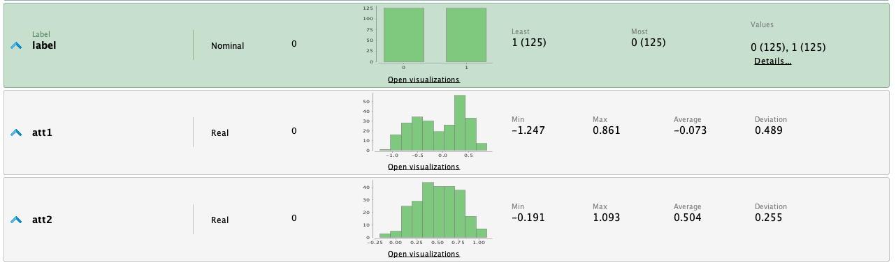
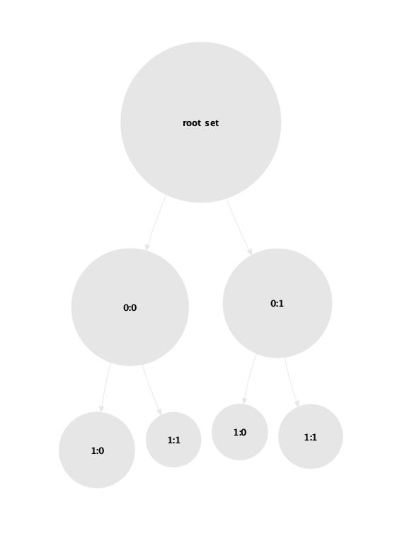

Los algoritmos de Clustering Jerárquicos funcionan de manera diferente a otros algoritmos
del mismo tipo como K-Means. Estos no necesitan saber la cantidad de clusters a buscar
de antemano, sino que conforman los clusters según la similitud de los datos en el dataset
de entrenamiento. A continuación veremos una comparación entre los dos métodos de clustering
jerárquicos: Clustering Aglomerativo (Bottom-up) y Clustering Divisivo (Top-down); y el
método de clustering K-Means.

# Dataset
Para probar los modelos utilizaremos el dataset de Ripley, este dataset consta de dos
clases generadas a partir de dos distribuciones gausianas. El dataset contiene 250 instancias
con dos atributos con valores numéricos reales y un atributo de salida _label_ con valores
de 0 y 1.

Como podemos observar, las dos clases están bastante bien separadas pero en los límites
hay elementos mezclados. Estos casos son muy difíciles de agregar correctamente al cluster
natural del dataset.

# K-Means
Configuramos un clustering por K-Means, como sabemos que el dataset tiene dos clases
utilizaremos un valor de _k_=2. 

Se puede observar que el modelo generó 2 clusters, lo que es correcto. Pero vemos
que el primer cluster tuvo 131 elementos y el segundo 119. El dataset original tiene
125 elementos en cada clase, existen instancias del dataset que están mezcladas en los
limites de las clase, por lo que el algoritmo confunde un poco los valores. 

# Clustering Aglomerativo
En el caso del clustering Aglomerativo, el algoritmo va armando los clusters agrupando
los datos mas similares a medida que avanza. Para el caso de estudio del dataset Ripley,
el algoritmo detecta muchos sub-clusters dentro de los 2 clusters naturales del dataset.

Podemos ver la subdivisión que realiza el algoritmo en el siguiente Dendograma:

Otra herramienta de visualización que tenemos al alcance es la posibilidad de representar
los clusters de diferentes maneras, a continuación se muestra una representación de
árbol:

Luego, utilizando el operador __Flatten Clustering__ podemos definir el valor de clusters
que queremos obtener. Veremos la performance para 2 clusters.

La performance para el clustering Aglomerativo fue un poco peor que la de K-Means, pero
la ventaja que tiene es que no necesita saber la cantidad de clusters a buscar de antemano
, teniendo la libertad de seleccionar el punto de corte analizando los resultados.

# Clustering Divisivo
El clustering divisivo comienza con toda la información del dataset en un cluster, y luego
aplica una estrategia plana de clustering recursivamente, en nuestro caso usaremos K-Means.

Configuramos el árbol de clustering con _max_depth_=2 y _max leaf size_=1 ya que queremos
poder generar la menor cantidad de clusters posibles para ver si podemos ajustarlos a los
clusters naturales que presenta el dataset.

El modelo generado por el clustering divisivo tiene 7 clusters:

Para poder evaluar la estrategia de clustering, vamos a utilizar el operador
__Flaten Clustering__ con el numero de clases igual a 2. Observando los valores
del vector de performance vemos que el algoritmo divisivo clasificó
exactamente igual que K-Means, con la diferencia que ademas de los 2 clusters principales
encontramos sub-clusters que podrían darnos más información del contexto del dataset. 

# Conclusiones
Los tres algoritmos vistos tuvieron una buena performance a la hora de agrupar los datos
en clusters. El modelo de K-Means encontró los 2 clusters rápidamente y con una buena
performance, pero no tenemos mas información sobre la relación de los datos (que podría ser
de interés). 

Al utilizar clustering aglomerativo, obtuvimos la mejor subdivisión de los datos (como se
puede observar en el dendograma). Al aplicar 2 clusters al dendograma, obtuvimos una buena
performance en los clusters pero no tan buena como en el caso de K-Means.

El clustering divisivo tuvo exactamente la misma performance en los 2 clusters que el
modelo de K-Means (cabe destacar que el operador de clustering utilizado dentro fue K-Means).
El modelo generado por clustering divisivo además nos permite tener información de cierta
sub-división de los datos por si es de interés, cabe destacar que ajustando los parámetros
_max height_ y _max leaf size_ podemos tener resultados de clusters diferentes.

# Recursos
[>> Proceso RapidMiner](hierarchical-clustering.rmp)
