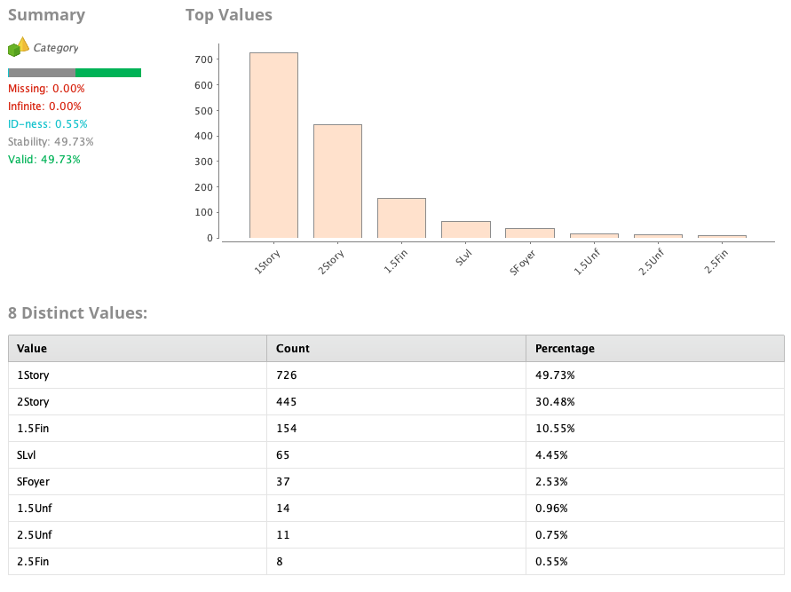
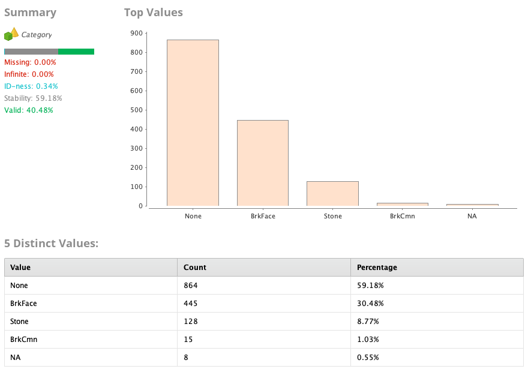
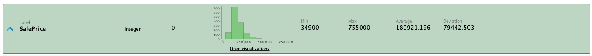

# Caso de Estudio
El siguiente trabajo estudia los datos recabados en la ciudad de Ames, Iowa
(Estados Unidos) relacionados a la venta de propiedades dentro de la ciudad.
La información recopilada desde 2006 al 2010, contiene datos de las
características de las propiedades a la venta; estos datos son bastante
abarcativos y realmente presentan todo lo que un comprador querría saber antes
de aventurarse a cerrar la venta. El objetivo del trabajo es poder utilizar esta
información para la creación de un algoritmo de regresión capaz de estimar los
precios de las propiedades.

# Dataset
El dataset se obtuvo de la pagina de Kaggle[^1], existen dos datasets distintos:
uno de entrenamiento y otro de testing (utilizado en Kaggle para puntuar los
trabajos). En este estudio nos centraremos en el dataset de entrenamiento y 
realizaremos la validación del modelo con este mismo. El dataset presenta 1460
instancias y tiene un atributo de ID (simplemente el numero de instancia), 45
atributos nominales y 35 atributos numéricos.
[^1]: https://www.kaggle.com/c/house-prices-advanced-regression-techniques/overview

## Atributos
A continuación se presenta una descripción de los atributos del dataset,
indicando tipo del atributo y posibles valores en caso de variables nominales.
Además se agregara un análisis estadístico de los atributos y observaciones
pertinentes al momento de cargar el dataset.

### MSSubClass:
Identifica el tipo de vivienda de la venta.

_Tipo:_ Categórico

_Valores:_
* 20 ->	1-STORY 1946 & NEWER ALL STYLES
* 30 ->	1-STORY 1945 & OLDER
* 40 ->	1-STORY W/FINISHED ATTIC ALL AGES
* 45 ->	1-1/2 STORY - UNFINISHED ALL AGES
* 50 ->	1-1/2 STORY FINISHED ALL AGES
* 60 ->	2-STORY 1946 & NEWER
* 70 ->	2-STORY 1945 & OLDER
* 75 ->	2-1/2 STORY ALL AGES
* 80 ->	SPLIT OR MULTI-LEVEL
* 85 ->	SPLIT FOYER
* 90 ->	DUPLEX - ALL STYLES AND AGES
* 120 -> 1-STORY PUD (Planned Unit Development) - 1946 & NEWER
* 150 -> 1-1/2 STORY PUD - ALL AGES
* 160 -> 2-STORY PUD - 1946 & NEWER
* 180 -> PUD - MULTILEVEL - INCL SPLIT LEV/FOYER
* 190 -> 2 FAMILY CONVERSION - ALL STYLES AND AGES

### MSZoning
Identifica la clasificación general de la zona de la venta.

_Tipo:_ Categórico
		
_Valores:_
* A ->	Agricultura
* C -> Comercial
* FV ->	Floating Village Residential
* I ->	Industrial
* RH ->	Residential Alta Densidad
* RL ->	Residential Baja Densidad
* RP ->	Residential Baja Densidad Parque
* RM ->	Residential Media Densidad

### LotFrontage
Distancia en linea recta a la calle desde la propiedad (en pies)

_Tipo:_ Real

_Transformaciones:_ RapidMiner detectó el valor como polinominal, al cargar el
dataset se hizo la transformación a _Number_.

### LotArea
Tamaño del lote en pies cuadrados.

_Tipo:_ Entero

### Street
Tipo de calle para acceder a la propiedad.

_Tipo:_ Categórico

_Valores:_
* Grvl -> Gravilla
* Pave -> Pavimentada

### Alley
Tipo de callejón para acceder a la propiedad.

_Tipo:_ Categórico

_Valores:_
* Grvl -> Gravilla
* Pave -> Pavimentada
* NA -> Sin acceso a callejón

### LotShape
Forma general de la propiedad.

_Tipo:_ Categórico
       
_Valores:_
* Reg ->	Regular	
* IR1 ->	Poco irregular
* IR2 ->	Moderadamente Irregular
* IR3 ->	Irregular

### LandContour
Determina que tan plana es la propiedad.

_Tipo:_ Categórico

_Valores:_
* Lvl ->	Casi al nivel del piso.
* Bnk ->	Banco - Aumento significativo del nivel del piso al edificio.
* HLS ->	Hillside - Pendiente significante de lado a lado
* Low ->	Depresión

### Utilities
Tipo de servicios disponibles.

_Tipo:_ Categórico

_Valores:_
* AllPub ->	Todos las servicios públicos (Electricidad, Gas, Agua y Saneamiento)	
* NoSewr ->	Electricidad, Gas y Agua (Tanque Séptico)
* NoSeWa ->	Solo Electricidad y Agua
* ELO ->	Solo Electricidad

### LotConfig
Configuración del lote.

_Tipo:_ Categórico

_Valores:_
* Inside ->	Lote interior
* Corner ->	Lote esquinado
* CulDSac ->	Cul-de-sac
* FR2 ->	Frente en 2 lados de la propiedad
* FR3 ->	Frente en 3 lados de la propiedad

### LandSlope
Pendiente de la propiedad

_Tipo:_ Categórico
		
_Valores:_
* Gtl -> Pendiente gentil	
* Mod -> Pendiente moderada
* Sev -> Pendiente severa

### Neighborhood
Ubicación dentro de los límites de la ciudad de Ames.

_Tipo:_ Categórico

_Valores:_
* Blmngtn ->	Bloomington Heights
* Blueste ->	Bluestem
* BrDale ->	Briardale
* BrkSide ->	Brookside
* ClearCr ->	Clear Creek
* CollgCr ->	College Creek
* Crawfor ->	Crawford
* Edwards ->	Edwards
* Gilbert ->	Gilbert
* IDOTRR ->	Iowa DOT and Rail Road
* MeadowV ->	Meadow Village
* Mitchel ->	Mitchell
* Names ->	North Ames
* NoRidge ->	Northridge
* NPkVill ->	Northpark Villa
* NridgHt ->	Northridge Heights
* NWAmes ->	Northwest Ames
* OldTown ->	Old Town
* SWISU ->	South & West of Iowa State University
* Sawyer ->	Sawyer
* SawyerW ->	Sawyer West
* Somerst ->	Somerset
* StoneBr ->	Stone Brook
* Timber ->	Timberland
* Veenker ->	Veenker

### Condition1
Proximidad en criterio de las condiciones especificadas.

_Tipo:_ Categórico
	
_Valores:_ 
* Artery ->	Adyacente a calle principal
* Feedr ->	Adyacente a calle secundaria
* Norm ->	Normal	
* RRNn ->	Dentro de 200' de North-South Railroad
* RRAn ->	Adyacente a North-South Railroad
* PosN ->	Cercano a caracteristicas off-site negativas.
  Parques, espacios abiertos, greenbelt, etc.
* PosA ->	Adyacente a carcteristicas off-site postivas.
* RRNe ->	Dentro de 200' de East-West Railroad
* RRAe ->	Adyacente a East-West Railroad

### Condition2
Proximidad en criterio de las condiciones especificadas (si existe más de una
presente).

_Tipo:_ Categórico
	
_Valores:_ 
* Artery ->	Adyacente a calle principal
* Feedr ->	Adyacente a calle secundaria
* Norm ->	Normal	
* RRNn ->	Dentro de 200' de North-South Railroad
* RRAn ->	Adyacente a North-South Railroad
* PosN ->	Cercano a caracteristicas off-site negativas.
  Parques, espacios abiertos, greenbelt, etc.
* PosA ->	Adyacente a carcteristicas off-site postivas.
* RRNe ->	Dentro de 200' de East-West Railroad
* RRAe ->	Adyacente a East-West Railroad

### BldgType
Tipo de vivienda.

_Tipo:_ Categórico
		
_Valores:_
* 1Fam ->	Familia Única
* 2FmCon ->	Two-family Conversion; originalmente construida como vivienda para familia unica.
* Duplx ->	Duplex
* TwnhsE ->	Townhouse End Unit
* TwnhsI ->	Townhouse Inside Unit

### HouseStyle
Estilo de vivienda

_Tipo:_ Categórico
	
_Valores:_
* 1Story -> Un piso
* 1.5Fin -> Un piso y medio: Segundo nivel terminado
* 1.5Unf -> Un piso y medio: Segundo nivel no terminado
* 2Story -> Dos pisos
* 2.5Fin -> Dos pisos y medio: Segundo nivel terminado
* 2.5Unf -> Dos pisos y medio: Segundo nivel no terminado
* SFoyer -> Split Foyer
* SLvl	-> Split Level

### OverallQual
Calidad del material y el acabado de la casa.

_Tipo:_ Categórico

_Transformación:_ Al importar el dataset se tomó el atributo como numérico, esto
facilita el tratamiento en la regresión. Como el atributo es un ranking ordenado
la transformación no debería tener un impacto negativo.

_Valores:_
* 10 ->	Muy Excelente
* 9 ->	Excelente
* 8 ->	Muy bueno
* 7 ->  bueno
* 6 ->	Sobre el promedio
* 5 ->	Promedio
* 4 ->	Debajo del promedio
* 3 ->	Aceptable
* 2 ->	Pobre
* 1 ->	Muy Pobre 

### OverallCond
Puntaje sobre la condición general de la vivienda.

_Tipo:_ Categórico

_Transformación:_ Al importar el dataset se tomó el atributo como numérico, esto
facilita el tratamiento en la regresión. Como el atributo es un ranking ordenado
la transformación no debería tener un impacto negativo.

_Valores:_
* 10 ->	Muy Excelente
* 9 ->	Excelente
* 8 ->	Muy bueno
* 7 ->  bueno
* 6 ->	Sobre el promedio
* 5 ->	Promedio
* 4 ->	Debajo del promedio
* 3 ->	Aceptable
* 2 ->	Pobre
* 1 ->	Muy Pobre 

### YearBuilt
Año original de construcción.

_Tipo:_ Entero

### YearRemodAdd
Fecha de remodelación (igual al año original de construcción si no se realizaron).

_Tipo:_ Entero

### RoofStyle
Tipo de techo.

_Tipo:_ Categórico

_Valores:_
* Flat ->	Flat
* Gable ->	Gable
* Gambrel ->	Gabrel (Barn)
* Hip ->	Hip
* Mansard ->	Mansard
* Shed ->	Shed

### RoofMatl
Material del techo.

_Tipo:_ Categórico

_Valores:_
* ClyTile ->	Clay or Tile
* CompShg ->	Standard (Composite) Shingle
* Membran ->	Membrane
* Metal ->	Metal
* Roll ->	Roll
* Tar&Gr -> Gravel & Tar
* WdShake ->	Wood Shakes
* WdShngl ->	Wood Shingles

### Exterior1st
Exterior de la casa

_Tipo:_ Categórico

_Valores:_
* AsbShng ->	Asbestos Shingles
* AsphShn ->	Asphalt Shingles
* BrkComm ->	Brick Common
* BrkFace ->	Brick Face
* CBlock ->	Cinder Block
* CemntBd ->	Cement Board
* HdBoard ->	Hard Board
* ImStucc ->	Imitation Stucco
* MetalSd ->	Metal Siding
* Other ->	Other
* Plywood ->	Plywood
* PreCast ->	PreCast	
* Stone ->	Stone
* Stucco ->	Stucco
* VinylSd ->	Vinyl Siding
* WdSdng -> Wood Siding
* WdShing ->	Wood Shingles

### Exterior2nd
Exterior de la casa (si existe más de un material)

_Tipo:_ Categórico

_Valores:_
* AsbShng ->	Asbestos Shingles
* AsphShn ->	Asphalt Shingles
* BrkComm ->	Brick Common
* BrkFace ->	Brick Face
* CBlock ->	Cinder Block
* CemntBd ->	Cement Board
* HdBoard ->	Hard Board
* ImStucc ->	Imitation Stucco
* MetalSd ->	Metal Siding
* Other ->	Other
* Plywood ->	Plywood
* PreCast ->	PreCast	
* Stone ->	Stone
* Stucco ->	Stucco
* VinylSd ->	Vinyl Siding
* WdSdng -> Wood Siding
* WdShing ->	Wood Shingles

### MasVnrType
Tipo de revestimiento de mampostería.

_Tipo:_ Categórico

_Valores:_
* BrkCmn ->	Brick Common
* BrkFace ->	Brick Face
* CBlock ->	Cinder Block
* None ->	None
* Stone ->	Stone

_Observaciones:_ Existen 8 valores como "NA", esto indica que son datos faltantes.
Los valores que no tienen revestimiento de mampostería deberían tener el valor "None".

### MasVnrArea
Área en pies cuadrados de revestimiento de mampostería.

_Tipo:_ Real

### ExterQual
Evalúa la calidad de los materiales del exterior.
		
_Tipo:_ Categórico

_Valores:_
* Ex ->	Excelente
* Gd ->	Bueno
* TA ->	Promedio/Típico
* Fa ->	Aceptable
* Po ->	Pobre

### ExterCond
Evalúa la condición de los materiales del exterior.
		
_Tipo:_ Categórico

_Valores:_
* Ex ->	Excelente
* Gd ->	Bueno
* TA ->	Promedio/Típico
* Fa ->	Aceptable
* Po ->	Pobre

### Foundation
Tipo de cimiento.
		
_Tipo:_ Categórico

_Valores:_
* BrkTil ->	Brick & Tile
* CBlock ->	Cinder Block
* PConc ->	Poured Contrete	
* Slab ->	Slab
* Stone ->	Stone
* Wood ->	Wood

### BsmtQual
Evalúa el alto del sótano.

_Tipo:_ Categórico

_Valores:_
* Ex ->	Excelente (100+ pulgadas)	
* Gd ->	Bueno (90-99 pulgadas)
* TA ->	Típico (80-89 pulgadas)
* Fa ->	Aceptable (70-79 pulgadas)
* Po ->	Pobre (<70 pulgadas)
* NA ->	Sin sótano

### BsmtCond
Evalúa al condición general del sótano

_Tipo:_ Categórico

_Valores:_
* Ex ->	Excelente
* Gd ->	Bueno
* TA ->	Típico (Poco nivel de Humedad)
* Fa ->	Aceptable (Humedad o rajaduras)
* Po ->	Pobre (Rajaduras y Humedad severas)
* NA ->	Sin sótano

### BsmtExposure
Altura de las paredes contra el jardín o calle.

_Tipo:_ Categórico

_Valores:_
* Gd ->	Good Exposure
* Av ->	Average Exposure (split levels or foyers typically score average or above)	
* Mn ->	Mimimum Exposure
* No ->	No Exposure
* NA ->	No Basement

### BsmtFinType1
Evaluación del acabado del sótano

* GLQ ->	Buen nivel de vivienda.
* ALQ ->	Nivel de vivienda promedio.
* BLQ ->	Nivel de vivienda debajo del promedio.
* Rec ->	Average Rec Room
* LwQ ->	Low Quality
* Unf ->	Unfinshed
* NA ->	No Basement

### BsmtFinSF1
Medidas en pies cuadraros del acabado de tipo 1.

_Tipo:_ Real

### BsmtFinType2
Evaluación del acabado del sótano (si existe mas de un caso)

* GLQ ->	Buen nivel de vivienda.
* ALQ ->	Nivel de vivienda promedio.
* BLQ ->	Nivel de vivienda debajo del promedio.
* Rec ->	Average Rec Room
* LwQ ->	Low Quality
* Unf ->	Unfinshed
* NA ->	No Basement

### BsmtFinSF2
Medidas en pies cuadraros del acabado de tipo 2.

_Tipo:_ Real

### BsmtUnfSF
Medidas en pies cuadraros del espacio sin terminar.

_Tipo:_ Real

### TotalBsmtSF
Medidas en pies cuadraros total del sótano.

_Tipo:_ Real

### Heating
Tipo de calefacción

_Tipo:_ Categórico
		
_Valores:_
* Floor ->	Floor Furnace
* GasA ->	Gas forced warm air furnace
* GasW ->	Gas hot water or steam heat
* Grav ->	Gravity furnace	
* OthW ->	Hot water or steam heat other than gas
* Wall ->	Wall furnace

### HeatingQC
Calidad y condición de la calefacción

_Tipo:_ Categórico

_Valores:_
* Ex ->	Excelente
* Gd ->	Bueno
* TA ->	Típico
* Fa ->	Aceptable
* Po ->	Pobre

### CentralAir
Calefacción central

_Tipo:_ Categórico

_Valores:_
* N ->	No
* Y ->	Yes

### Electrical
Sistema eléctrico

_Tipo:_ Categórico

_Valores:_
* SBrkr ->	Standard Circuit Breakers & Romex
* FuseA ->	Fuse Box over 60 AMP and all Romex wiring (Average)	
* FuseF ->	60 AMP Fuse Box and mostly Romex wiring (Fair)
* FuseP ->	60 AMP Fuse Box and mostly knob & tube wiring (poor)
* Mix ->	Mixed

### 1stFlrSF
Medida en pies cuadrado del primer piso.

_Tipo:_ Entero

### 2ndFlrSF
Medida en pies cuadrado del segundo piso.

_Tipo:_ Entero

### LowQualFinSF
Medida en pies cuadrado del acabado de baja calidad (todos los pisos).

_Tipo:_ Entero

### GrLivArea
Área de vivienda sobre el nivel del piso.

_Tipo:_ Entero

### BsmtFullBath
Sótano con baño completo

_Tipo:_ Entero

### BsmtHalfBath
Sótano con baño sin bañera o duchero.

_Tipo:_ Entero

### FullBath
Baños completos sobre el nivel del piso.

_Tipo:_ Entero

### HalfBath
Baños sin bañera o duchero sobre el nivel del piso.

_Tipo:_ Entero

### BedroomAbvGrd
Cuartos sobre el nivel del piso (No incluye cuartos en el sótano).

_Tipo:_ Entero

### KitchenAbvGrd
Cocina sobre el nivel del piso.

_Tipo:_ Entero

### KitchenQual
Calidad de la cocina.

_Tipo:_ Categórico

_Valores:_
* Ex ->	Excelente
* Gd ->	Bueno
* TA ->	Típico
* Fa ->	Aceptable
* Po ->	Pobre

### TotRmsAbvGrd
Cuartos totales sobre el nivel del piso (No incluye baños).

_Tipo:_ Entero

### Functional
Funcionalidades del hogar

_Tipo:_ Categórico

_Valores:_
* Typ ->	Funcionalidad Típica
* Min1 ->	Reducciones Mínimas 1
* Min2 ->	Reducciones Mínimas 2
* Mod ->	Reducciones Moderadas
* Maj1 ->	Grandes Reducciones 1
* Maj2 ->	Grandes Reducciones 2
* Sev ->	Severamente Dañado
* Sal ->	Solamente Salvataje

### Fireplaces
Cantidad de estufas

_Tipo:_ Entero

### FireplaceQu
Calidad de la estufa

_Tipo:_ Categórico

_Valores:_
* Ex ->	Excelente - Excelente estufa de mampostería
* Gd ->	Bueno - Estufa de mampostería en el nivel principal
* TA ->	Promedio - Estufa prefabricada en nivel principal o estufa de mampostería en  sótano.
* Fa ->	Aceptable - Estufa prefabricada en sótano
* Po ->	Pobre - Estufa Ben Franklin
* NA ->	Sin estufa

### GarageType
Ubicación del garaje

_Tipo:_ Categórico
		
_Valores:_
* 2Types ->	Más de un tipo de garaje. 
* Attchd ->	Adjunto a la casa.
* Basment -> Garaje en sótano	
* BuiltIn ->	Built-In
* CarPort ->	Car Port
* Detchd ->	Aparte de la casa   
* NA ->	Sin Garaje

### GarageYrBlt
Año de construcción del garaje.

_Tipo:_ Entero

_Observación:_ Existen 81 valores (5.55%) con valor "NA". En este contexto, podría
tomarse como que la vivienda no tiene garaje.

### GarageFinish
Acabado interior del garaje.

_Tipo:_ Categórico

_Valores:_
* Fin -> Finalizado
* RFn -> Acabado rústico
* Unf -> Sin acabado
* NA ->	Sin Garaje

### GarageCars
Capacidad del garaje en autos.

_Tipo:_ Entero

### GarageArea
Medida del garaje en pies cuadrados.

_Tipo:_ Entero

### GarageQual
Calidad del garaje.

_Tipo:_ Categórico

_Valores:_
* Ex ->	Excelente
* Gd ->	Bueno
* TA ->	Promedio
* Fa ->	Aceptable
* Po ->	Pobre
* NA ->	Sin garaje

### GarageCond
Condición del garaje.

_Tipo:_ Categórico

_Valores:_
* Ex ->	Excelente
* Gd ->	Bueno
* TA ->	Promedio
* Fa ->	Aceptable
* Po ->	Pobre
* NA ->	Sin garaje

### PavedDrive
Entrada de coche pavimentada

_Tipo:_ Categórico

_Valores:_
* Y -> Pavimentada
* P	-> Parcialmente pavimentada
* N	-> Tierra/Gravilla

### WoodDeckSF
Área cubierta de madera en pies cuadrados.

_Tipo:_ Entero

### OpenPorchSF
Área del porche en pies cuadrados.

_Tipo:_ Entero

### EnclosedPorch
Área del porche (cerrado) en pies cuadrados.

_Tipo:_ Entero

### 3SsnPorch
Área del Porche de tres estaciones en pies cuadrados.

_Tipo:_ Entero

### ScreenPorch
Área del Porche con ventanas en pies cuadrados.

_Tipo:_ Entero

### PoolArea
Área de piscina en pies cuadrados.

_Tipo:_ Entero

### PoolQC
Calidad de la piscina.		

_Tipo:_ Categórico

_Valores:_
* Ex ->	Excelente
* Gd ->	Bueno
* TA ->	Promedio
* Fa ->	Aceptable
* NA ->	Sin piscina

### Fence
Calidad del cerco.

_Tipo:_ Categórico
		
_Valores:_
* GdPrv -> Buena Privacidad
* MnPrv	-> Privacidad Mínima
* GdWo	-> Buena Madera
* MnWw	-> Cantidad de madera minima/Alambre
* NA	-> Sin Cerco

### MiscFeature
Prestaciones misceláneas que no se cubrieron en otras categorías.

_Tipo:_ Categórico
		
_Valores:_
* Elev -> Elevador
* Gar2 ->	2ndo Garaje (si no está descripto en la sección de garaje)
* Othr	 -> Otro
* Shed ->  Covertizo (mas de 100 pies cuadrados)
* TenC -> Cancha de Tenis
* NA  ->  Ninguno

### MiscVal
Valor de las prestaciones misceláneas.

_Tipo:_ Real

### MoSold
Mes de la venta (MM).

_Tipo:_ Entero

### YrSold
Año de la venta (YYYY).

_Tipo:_ Entero

### SaleType
Tipo de venta.

_Tipo:_ Categórico
		
_Valores:_
* CWD ->	Warranty Deed - Cash
* VWD ->	Warranty Deed - VA Loan
* New ->	Home just constructed and sold
* COD ->	Court Officer Deed/Estate
* Con ->	Contract 15% Down payment regular terms
* ConLw ->	Contract Low Down payment and low interest
* ConLI ->	Contract Low Interest
* ConLD ->	Contract Low Down
* Oth ->	Other

### SaleCondition
Condición de la venta.

_Tipo:_ Categórico

_Valores:_
* Normal ->	Normal Sale
* Abnorml ->	Abnormal Sale -  trade, foreclosure, short sale
* AdjLand ->	Adjoining Land Purchase
* Alloca ->	Allocation - two linked properties with separate deeds, typically condo with a garage unit	
* Family ->	Sale between family members
* Partial ->	Home was not completed when last assessed (associated with New Homes)

## Variable de Salida - SalePrice
El dataset cuenta con una variable de salida, llamada _SalePrice_ que es de
tipo entero (no hay precios con punto flotante en el dataset). Ésta variable
representa el precio en dólares americanos de la venta del inmueble y es la
variable que intentaremos predecir en nuestra regresión.

# Preparación del Dataset
El dataset necesita mucho trabajo y preparación para poder ser utilizado en un
problema de regresión de manera eficiente. Existen varias problemáticas que a
simple vista podemos reconocer: debemos tratar los datos faltantes, estudiar el
dataset para detectar outliers, buscar variables correlacionadas que puedan
afectar la predicción y estudiar la relevancia de los atributos en el problema.
Además, por tratarse de un algoritmo de regresión, debemos resolver cómo tratar
a las variables categóricas; ya sea utilizando "dummy variables" o en casos
particulares (dónde las variables son numéricas y representan un orden)
transformando su tipo a variables numéricas.

En la sección anterior hicimos un análisis de los atributos en cuanto a sus
características estadísticas y a lo que representan en el contexto del
problema.  Existen ciertas variables que no pueden tener un efecto en el precio
final, ya que no sabemos su valor hasta el momento de realizar la compra.
Información como el año y el mes de la compra no aportan nada  a la estimación
final del precio. Es importante quitar estas variables antes de realizar un
trabajo más profundo de detección de outliers y casos faltantes ya que
cualquier información que se desprenda de éstos atributos no es de nuestro
interés.

## Configuración de la Variable de Salida
Debemos configurar la columna _SalePrice_ como nuestro "label". Esto le permite
a RapidMiner entender que es la variable que queremos estimar en nuestros modelos
de regresión. Para esto simplemente utilizaremos el operador de __SetRole__.

## Eliminación de Atributos dado el Contexto del Problema
El objetivo del algoritmo de regresión es predecir el valor de una propiedad
en base a los atributos del dataset, pero existen ciertos atributos que pierden
sentido en este contexto. Los siguientes atributos no serán tenidos en cuenta ya
que no pueden tener ningún efecto en el precio de la venta ya que su valor se
conoce después de que se concreta la misma. 

Los atributos a descartar son:
* _MoSold_: Mes de la venta (MM).
* _YrSold_: Año de la venta (MM).
* _SaleType_: Tipo de venta.
* _SaleCondition_: Condición de la venta.
* _Id_: Representa el numero de ítem, no aporta valor al resultado final.

Éstos atributos serán filtrados en el proceso de RapidMiner con el operador
__SelectAtributes__.

## Outliers
Los outliers afectan directamente en la capacidad de los algoritmos de
regresión a la hora de poder estimar la variable objetivo. Estos valores tan
alejados de la media "contaminan" los resultados provocando estimaciones
desviadas.

Luego de un análisis de outliers en RapidMiner a través del operador __Detect
Outlier (Distances)__, obtuvimos un total de 10 instancias.

Como podemos observar en los gráficos, los outliers detectados son propiedades
con tamaños muy grandes en relación al resto o situaciones en las que la
relación precio/tamaño no condicen. Dado el efecto tan representativo de los
outliers en los algoritmos de regresión y la cantidad baja de los mismos,
optamos por eliminar estas instancias del dataset.

## Tratamiento de Variables Categóricas
Las variables Nominales, Polinominales y Categóricas no pueden utilizarse 
correctamente en la regresión ya que se esperan valores numéricos. Existen casos
de variables categóricas que en representan un puntaje numérico, en estos
casos simplemente podríamos convertir esas columnas a números. Además, tenemos
otras variables categóricas que no pueden transformarse directamente a variables
numéricas, en esos casos utilizaremos variables "dummy". A continuación
