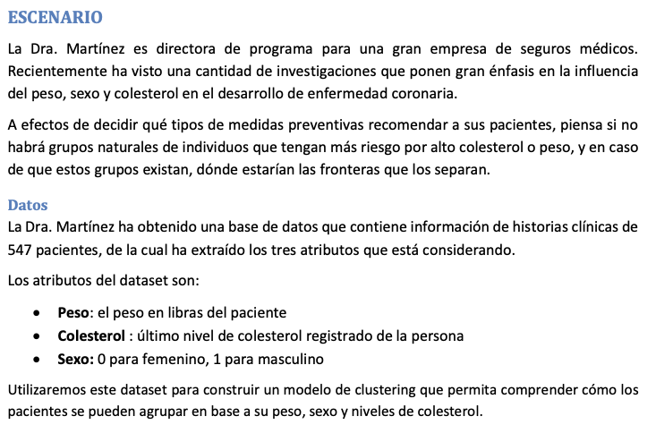
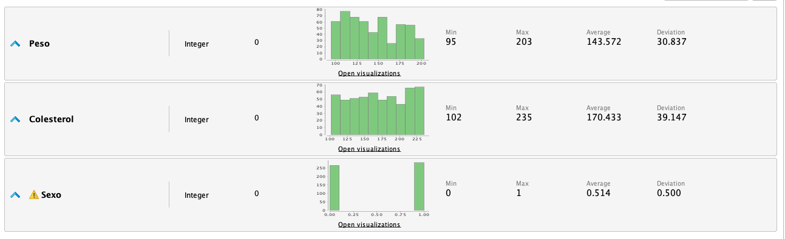
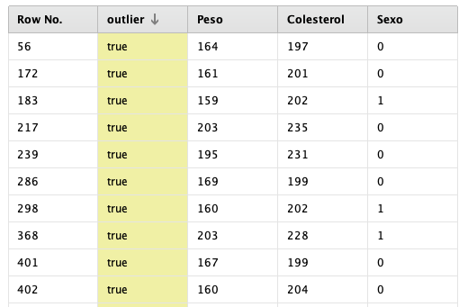
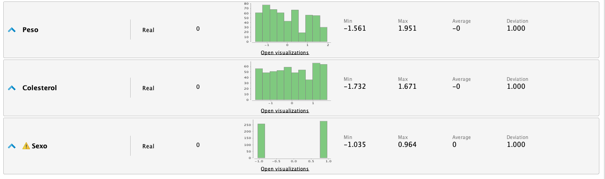
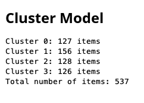
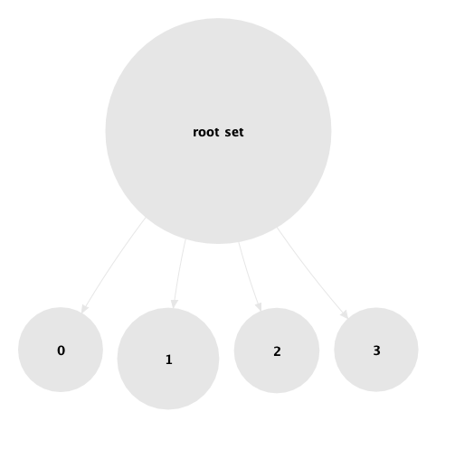
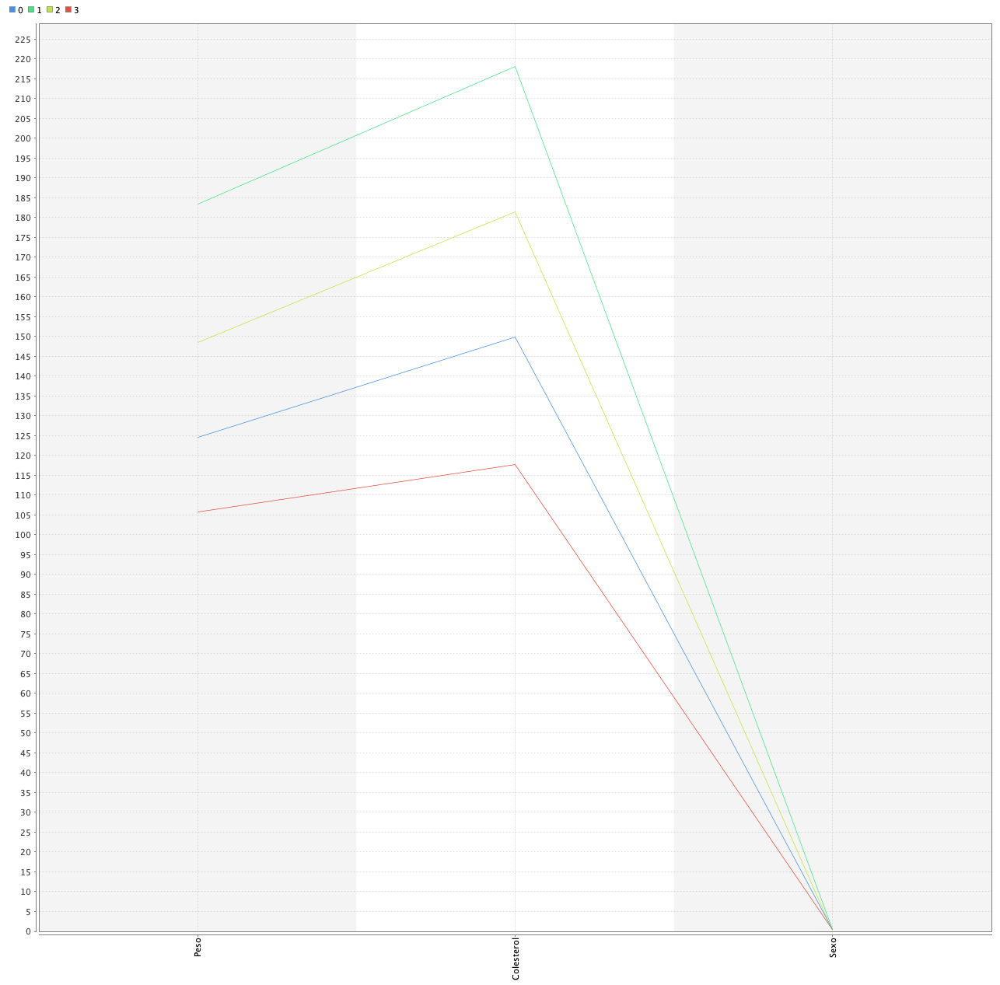
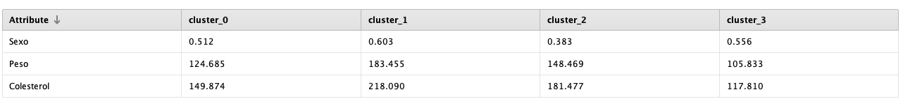
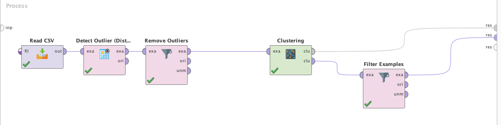
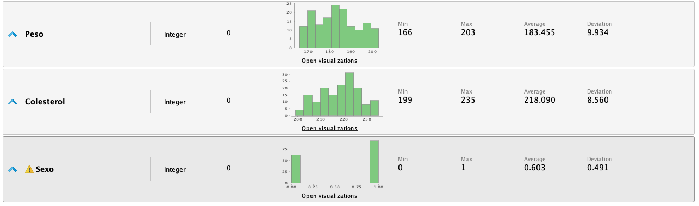

A continuación veremos un algoritmo de Machine Learning no supervisado llamado "K-Means".
Exploraremos un caso de uso y veremos como "K-Means" permite encontrar y resaltar información
subyacente en el dataset, la cual es de altísimo valor a la hora de tomar decisiones.

# Caso de Estudio



# Preparación del Dataset
Existen varias cosas a tener en cuenta al utilizar K-Means, principalmente el impacto
que tienen ruido y los outliers en el dataset a la hora de poder agrupar los datos
de buena manera.

El dataset solamente contiene variables numéricas, y no tiene datos faltantes en sus
atributos. Además, las distribuciones en los atributos no está sesgada. En principio
solamente deberíamos analizar la existencia de outliers que puedan afectar la performance,
y normalizar los datos del dataset escalándolo y centrándolo.

Al analizar los valores de las estadísticas de los atributos en RapidMiner, vemos que
los datos tienen un rango razonable en el contexto del problema.


## Manejo de Outliers
Dentro de RapidMiner, podemos utilizar el operador _Detect Outliers_ para que pueda
diferenciar outliers dentro del dataset y podamos tomar una decisión respecto a su manejo.



Detectamos un total de 10 outliers dentro del dataset, que tiene un total de 547 instancias.
Dado que K-Means se ve realmente afectado por estos valores, filtraremos los outliers
del dataset de entrenamiento.

## Normalización de Datos
Otro punto importante en K-Menans es asegurarse que los atributos estén centrados y escalados.
Podemos lograr eso con el operador __Normalize__ de RapidMiner, a continuación se muestra
el impacto en los atributos del dataset luego del tratamiento.



El problema que tenemos con esto es que perdemos información en los atributos,
y luego es difícil poder utilizar los clusters con la información obtenida y
filtrar los resultados para que los profesionales puedan hacer su trabajo.
Por tanto, evitaremos utilizar la normalización en esta instancia. 

# Modelado
Luego de preparar el dataset, comenzamos con el modelado de K-Means.
Para el caso de estudio actual, tenemos información de quien curó el dataset
que potencialmente se espera tener 4 grupos diferentes. Esto es importante, ya
que nos permite adelantarnos y configurar el operador __k_Means__ indicándole
4 clusters (_k_).

El modelo retorna 4 clusters bien definidos como se pensaba, el total de
los datos del dataset esta muy bien repartido en estos 4 clusters.


Además, podemos visualizar información de los clusters de diferentes maneras.





# Evaluación
El operador de "K-Means" provee varias herramientas para poder evaluar los
resultados de los clusters. Por ejemplo, si observamos la información sobre los
centroides para los clusters podemos observar que el cluster 1 tiene los
promedios mayores para peso y colesterol. Ésta información es de mucha utilidad
ya que tanto el paso como el colesterol elevado son dos de los indicadores de
riesgo mas importantes para las enfermedades coronarias. Otra información
relevante, es que en el atributo _sexo_ tenemos un valor de 0.603 lo que indica
que hay mayor numero de hombres que de mujeres en el cluster 1 (ya que el
dataset representa 0 como femenino y 1 como masculino).



# Utilización de los Datos
Luego de haber hecho todo el estudio de los datos, modelado y evaluado los
resultados, seria de mucha utilidad poder filtrar la información relevante
que le permita a los profesionales detectar potenciales pacientes con riesgo
coronario y poder adelantar los tratamientos.

Para esto utilizaremos el operador __Filter Examples__ al final del proceso de
RapidMiner.





Como podemos observar los valores mínimos de colesterol son de 199 y el peso
mínimo es de 166. Con esta información los profesionales pueden hacer consultas
en la base de datos de sus organizaciones y obtener la información de los
pacientes en riesgo. 

Un ejemplo de consulta podría ser:
```sql
SELECT First_Name, Last_Name, Policy_Num, Address, Phone_Num FROM PolicyHolders_view
WHERE Weight >= 166
AND Cholesterol >= 199;
```

# Recursos
[>> Dataset](k-means-cardio.csv)
[>> Proceso RapidMiner](k-means-cardio.rmp)
