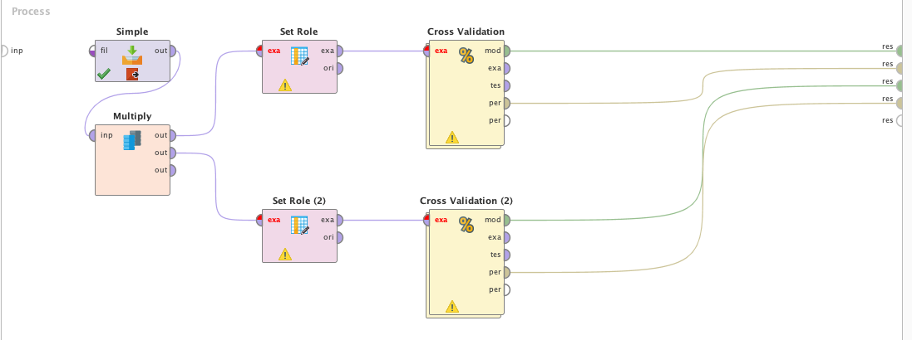

A continuación exploraremos los algoritmos de ensamble RandomForest y Adaboost
en el contexto de las enfermedades crónicas renales.

# Caso de Estudio
Se utilizara un dataset con información relevante de pacientes en el contexto de
las enfermedades crónicas del riñón. Los datos fueron tomados particularmente en
la India. El objetivo es evaluar los datos para intentar prevenir o retrasar la
enfermedad mediante la detección y tratamientos tempranos.

## Atributos
* age	- age	
* bp	- blood pressure
* sg	- specific gravity
* al	-   	albumin
* su	- sugar
* rbc	- red blood cells
* pc	- pus cell
* pcc	- pus cell clumps
* ba	- bacteria
* bgr	- blood glucose random
* bu	- blood urea
* sc	- serum creatinine
* sod	- sodium
* pot	- potassium
* hemo	- hemoglobin
* pcv	- packed cell volume
* wc	- white blood cell count
* rc	- red blood cell count
* htn	- hypertension
* dm	- diabetes mellitus
* cad	- coronary artery disease
* appet	- appetite
* pe	- pedal edema
* ane	- anemia
* class	- class

A continuación mostraremos las estadísticas de los mismos:

# Modelado

El problema sera modelado con el siguiente proceso de RapidMiner:

RandomForest es un algoritmo compuesto de arboles de decisión con la particularidad
que esos arboles se generan de manera aleatoria. Cada árbol se construye utilizando
atributos diferentes (elegidos aleatoriamente). Es un clasificar muy utilizado debido
a su performance.

Configuramos RandomForest de la siguiente manera:

Adaboost es un algoritmo de boosting adaptativo, incrementa su performance en
base a varios clasificadores y los utiliza para ir mejorando las predicciones:

# Evaluación
Utilizaremos Cross Validation con 10 folds y sampleo aleatorio para ambos modelos.

Como se pudo observar en el dataset, hay varios datos faltantes. Ambos algoritmos
tuvieron una performance excelente dado esto. Podemos concluir que RandomForest y
Adaboost son bastante tolerantes a la falta de datos sin necesidad de imputar los
mismos si no son demasiados. En este caso RandomForest tuvo un 100% de accuracy y
obtuvo mejores resultados que Adaboost (98.75%)

# Recursos
Los datasets están en formato de WEKA por lo que para cargarlos hay que utilizar el
operador __Simple (Read ARFF)__

[>>chronic_kidney_disease_full.arff](chronic_kidney_disease_full.arff)

[>>chronic_kidney_disease.arff](chronic_kidney_disease.arff)

[>>chronic_kidney_disease.info.txt](chronic_kidney_disease.info.txt)

[>>Proceso RapidMiner](kidney-disease.rmp)
