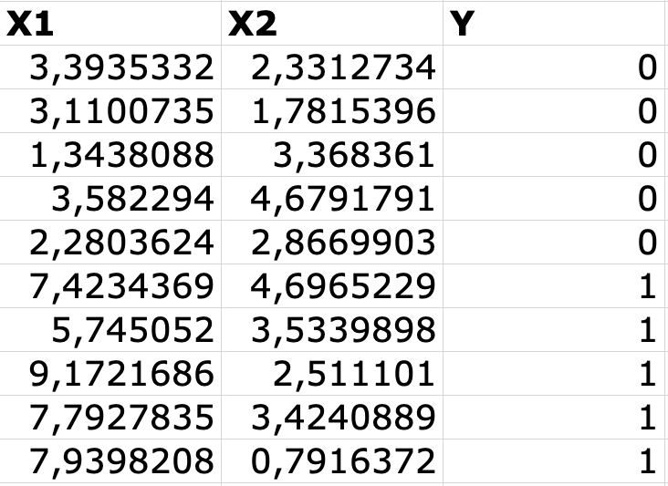
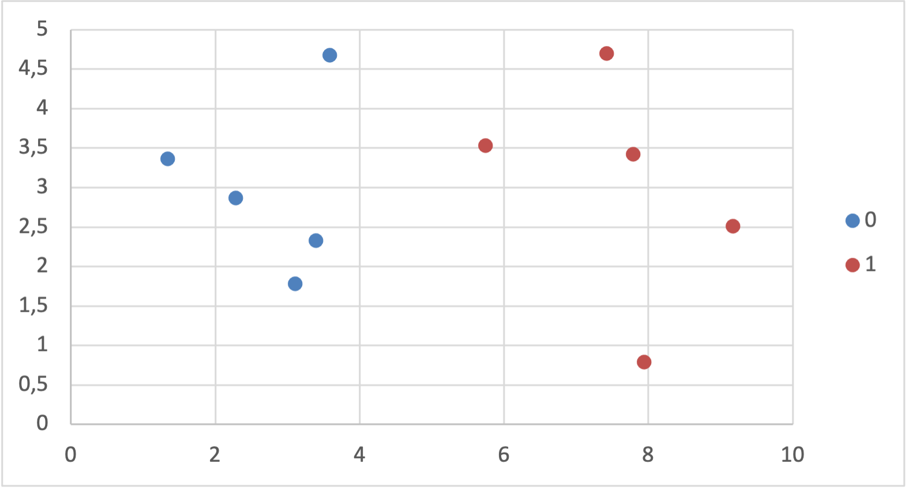
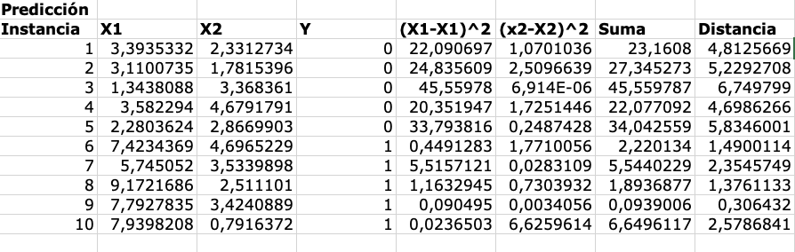
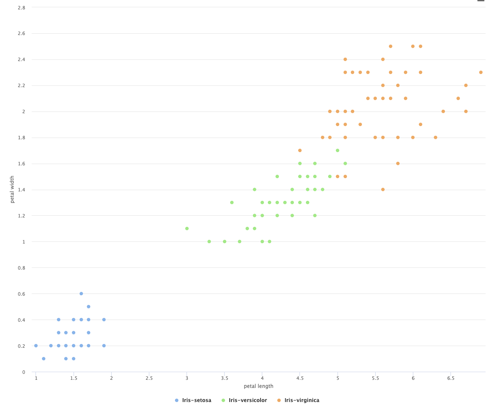
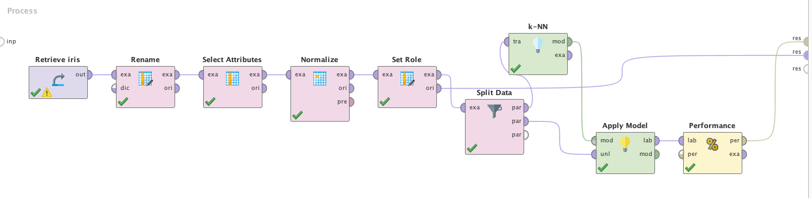
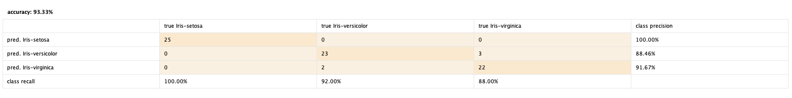
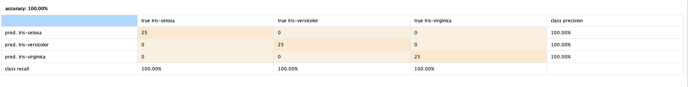

K-Nearest Neighbors es un algoritmo de Machine Learning supervisado que puede
ser utilizado tanto en problemas de clasificación como regresion. A
continuación, exploraremos el funcionamiento básico del algoritmo y luego
utilizaremos RapidMiner para clasificar el dataset de practica Iris.

# Funcionamiento del Algoritmo k-NN

Para investigar como funciona k-NN, utilizaremos una planilla electrónica y un dataset artificial especialmente preparado.

## Dataset
El dataset tiene dos atributos de entrada reales: _X1_ y _X2_, y una variable
de salida _Y_ nominal con los valores 0 o 1.

Se puede observar que las clases están bien separadas en el dataset, esto fue
diseñado artificialmente para poder concentrarnos y entender mejor el funcionamiento del algoritmo.

## Predicciones con k-NN
El algoritmo de k-NN no tiene un entrenamiento propiamente dicho, funciona guardando todo el dataset en memoria y calculando distancias entre los datos. Para poder calcular las distancias existen diferentes métodos:

* _Distancia Euclidiana_: Se calcula como la raíz cuadrada de la suma de los
  cuadrados de la diferencia entre dos puntos.
  $$
  DistanciaEuclidiana(a, b) = \sqrt{\sum_{i=1}^{n} (a_i - b_i)^2}
  $$
* _Distancia de Hamming_: Calcula la distancia entre dos vectores binarios.
* _Distancia de Manhatan_: Calcula la distancia de dos vectores reales utilizando
  la suma de sus diferencias.
* _Distancia de Minkowski_: Generalización de la distancia euclidiana y de Manhatan.

Para estudiar el algoritmo, utilizaremos la distancia euclidiana. A modo de ejemplo, la distancia euclidiana entre los dos primeros datos del dataset es: 0,618511605[^1]. 
[^1]: Puede seguirse el cálculo en la planilla electrónica adjunta.

Para predecir una instancia, se eligen _k_ datos con la menor distancia a la
instancia que queremos predecir.

La instancia que se quiere predecir es:
$$
\text{X1=8.093607318, X2=3.365731514, Y=1}
$$

Para calcular la predicción debemos calcular la distancia de la instancia a
predecir a todas las instancias del dataset. Esto puede ser particularmente
costoso, por lo que a veces se deja de calcular la raíz cuadrada
(computacionalmente costosa) ya que los datos mantienen la coherencia. 

Elegiremos un valor de _k=3_, por lo que deberemos encontrar los 3 ejemplos del
dataset más cercanos. Luego, al clasificar podemos utilizar la función moda
para obtener el valor mas frecuente de los vecinos mas cercanos, esto es
básicamente una votación.

Analizando los cálculos vemos que los valores de las 3 clases mas cercanas son 1. Por tanto, la predicción para el ejemplo es 1.

El ejemplo anterior es muy simple, si tomamos un valor menos obvio para testear
el algoritmo vamos a ver diferencias en los valores de las clases de los
vecinos. Para esos casos, con valores de _k_ bajos vamos a obtener predicciones
incorrectas en un gran porcentaje de las veces.

# k-NN en RapidMiner
Veremos como crear un modelo k-NN dentro de RapidMiner utilizando el dataset
de practica Iris. 

## Atributos del Dataset
El dataset IRIS es uno de los más presentes en la literatura de reconocimiento
de patrones. Contiene 3 clases con 50 instancias cada una, donde cada clase se
refiere a un tipo de planta Iris.

El dataset tiene los siguientes atributos:
- _sepal length_ (cm) -> Number (double)
- _sepal width_ (cm) -> Number (double)
- _petal length_ (cm) -> Number (double)
- _petal width_ (cm) -> Number (double)
- _class_ [Iris Setosa, Iris Versicolour, Iris Virginica] -> String
 
## Preparación del dataset
k-NN funciona calculando distancias entre las instancias del dataset y la
instancia a predecir, esto significa que los atributos de las instancias
pueden tener incidencias diferentes si los datos no están normalizados.
Luego de normalizar los datos con el operador __Normalize__, debemos configurar
la variable _class_ como _label_ utilizando __SetRole__.

El siguiente gráfico nos ayuda a ver como los atributos _petal_length_ y _petal_width_ separan muy bien en clases las instancias.

Con esta nueva información, podemos prescindir de los atributos _sepal_lenght_
y _sepal_width_ por lo que podemos filtrarlos.

## Evaluación
Tomamos el dataset de Iris y lo repartimos a la mitad, con estratificación.
Al hacer pruebas, vemos realmente que utilizar todos los atributos del dataset
genera un clasificador con menor _accuracy_, utilizando solamente _petal_width_
y _petal_length_ el _accuracy_ llega al 100%. Esto se debe a que la distancia
del resto de los atributos agrega ruido, ya que no son tan definitorios a la
hora de clasificar la instancia.

# Recursos
[>>Planilla Electrónica](knn.xlsx)
[>>Dataset Iris](iris.data)
[>>Proceso RapidMiner](knn.rmp)
