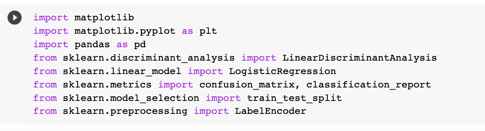
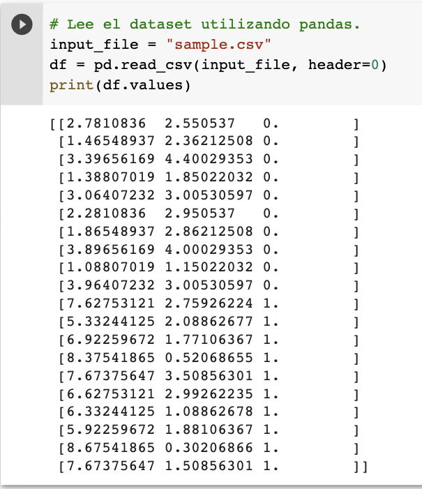
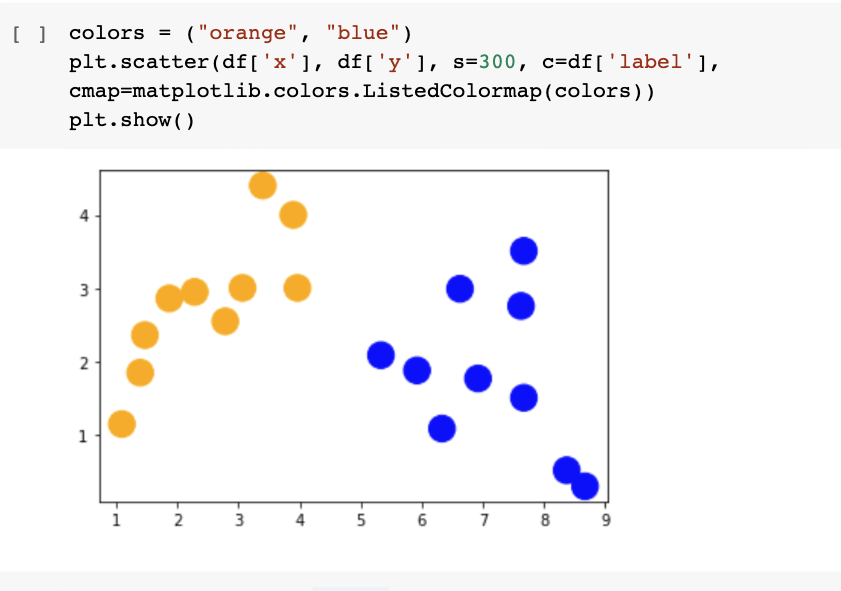
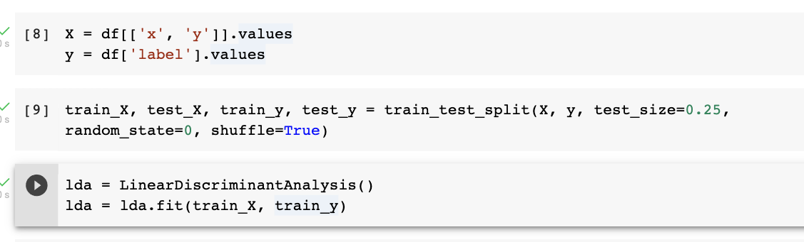
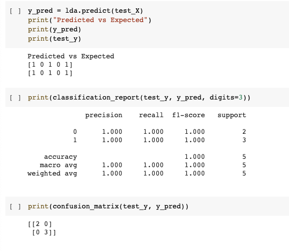

Scikit Learn es una libreria de Python para trabajar con Machine Learning, a 
continuación exploraremos el rico ecosistema de Python, librerías útiles para Machine
Learning y aplicaremos el modelo de LDA en un dataset simple. Al trabajar con datasets y 
algoritmos de Machine Learning, Jupyter Notebooks es una herramienta muy útil. Para
este trabajo utilizaremos Google Colab, que es una implementación de Jupyter Notebooks
en la nube de Google.

# Librerías a utilizar

Utilizaremos tres librerías de Python:
* Matplotlib: Para la creación de graficas y visualización de datos.
* Pandas: Carga, procesamiento y preparación de datos.
* Scikit Learn: Colección de herramientas para Machine Learning y Análisis de Datos.

Para importar esas librerías, y las funciones que utilizaremos necesitamos el
siguiente código:

# Carga de datos y preparación
Lo primero es leer el dataset a utilizar (en nuestro caso "sample.csv"). Para ésto
utilizaremos la librería pandas.

Esto nos permite ver el dataset de manera rápida:

Utilizando Matplotlib, podemos graficar el dataset:

# Entrenamiento y Testing
Con Scikit Learn es realmente muy fácil crear un modelo LDA y entrenarlo.
En los siguientes pasos se obtienen los datos y las clases del dataset, se divide el 
conjunto de datos en entrenamiento y prueba; se crea y entrena un modelo LDA:

# Evaluación
En esta etapa, se predicen las clases para el conjunto de prueba y se evalúan los 
resultados. Podemos probar el modelo y observar le reporte y la matriz de confusión.

# Recursos

[>> Dataset](sample.csv)

[>> Jupyter Notebook](lda_scikit_learn.ipynb)
