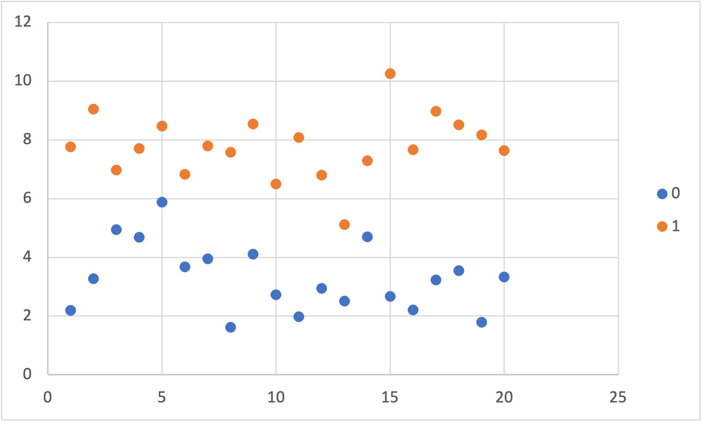

El algoritmo de Análisis Discriminante Lineal es otro método para resolver problemas de
clasificación, surge de la necesidad de un algoritmo lineal más robusto dadas las 
limitaciones de la regresión logística[^1]. En caso de contar con problemas de clasificación
de más de dos variables, LDA es el algoritmo linear a tener en cuenta.
[^1]: La regresión lineal puede ser usada solamente en problemas de clasificación de dos clases. Además, si el dataset cuenta con clases bien separadas y/o tiene pocos ejemplos de entrenamiento entonces la regresión lineal puede ser inestable.

# Dataset
El conjunto de datos de entrenamiento cuenta con un atributo _"X"_ y una salida _"Y"_
con dos clases: 0 y 1. Además, los valores de _"X"_ han sido generados con distribuciones
normales y varianzas similares.

Al graficar los datos tenemos:

# Modelo de Análisis Discriminante Lineal

La representación de LDA consiste de propiedades estadísticas del dataset, las cuales
son calculadas para cada clase. Para una variable cualquiera _"x"_, éstas serían la
media y la varianza.

## Preparación del Dataset
LDA asume dos cosas del dataset de entrenamiento:
* Que las variables tengan una distribución normal en sus valores.
* Que cada atributo tenga la misma varianza.

El dataset presentado anteriormente cuenta con estas dos características, por lo que
no es necesario hacerle modificaciones.

## Modelado
Tomando en cuenta que los datos están preparados para LDA, entonces el modelo LDA
estima la media y la varianza del dataset para cada clase. Se utilizan las siguientes
funciones:

$$
mean_k = \frac{1}{n_k} * \sum_{i=1}^{n} (x_i)
$$

Donde _meank_ es la media de _x_ para la clase _k_, y _nk_ es
el numero de instancias con la clase _k_.

$$
sigma^2 = \frac{1}{n-K} * \sum_{i=1}^{n} (x_i - mean_k)^2
$$

Donde _sigma2_ es la varianza de todos las entradas, _n_ es el número de
instancias y _K_ es el numero de clases.

Para obtener la predicción, utilizamos el siguiente modelo:

$$
D_k(x) = x * \frac{mean_k}{sigma^2} - \frac{mean_k^2}{(2*sigma^2)} + ln(P(k))
$$

Al aplicar el modelo al dataset llegamos a los siguientes resultados:

$$
mean_k = 23,91922558\\
sigma^2 = 1,258906609\\
exactitud = 0,875
$$

# Recursos
La siguiente planilla tiene el dataset, todo el desarrollo del modelo explicado
anteriormente, las gráficas y todas las columnas necesarias para hacer los cálculos
paso a paso.

[>> Dataset](dataset.csv)

[>> Planilla](lda.xlsx)
