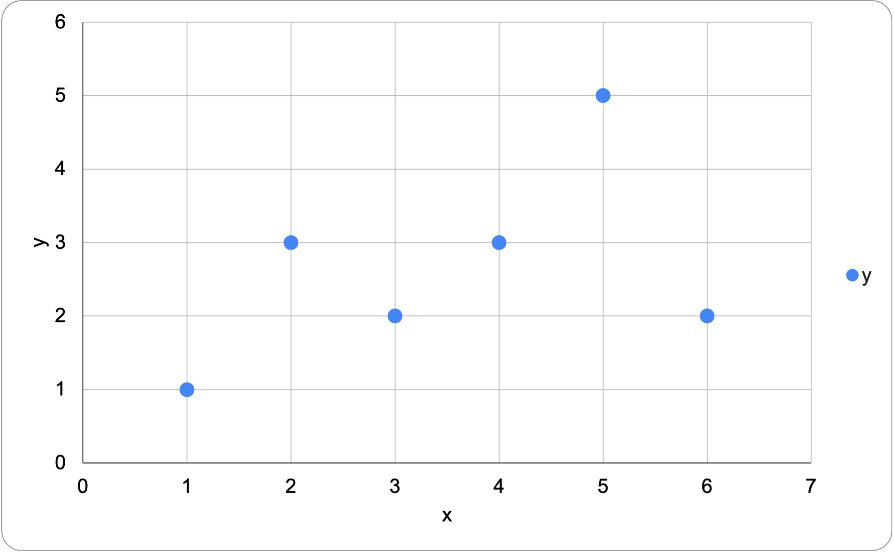
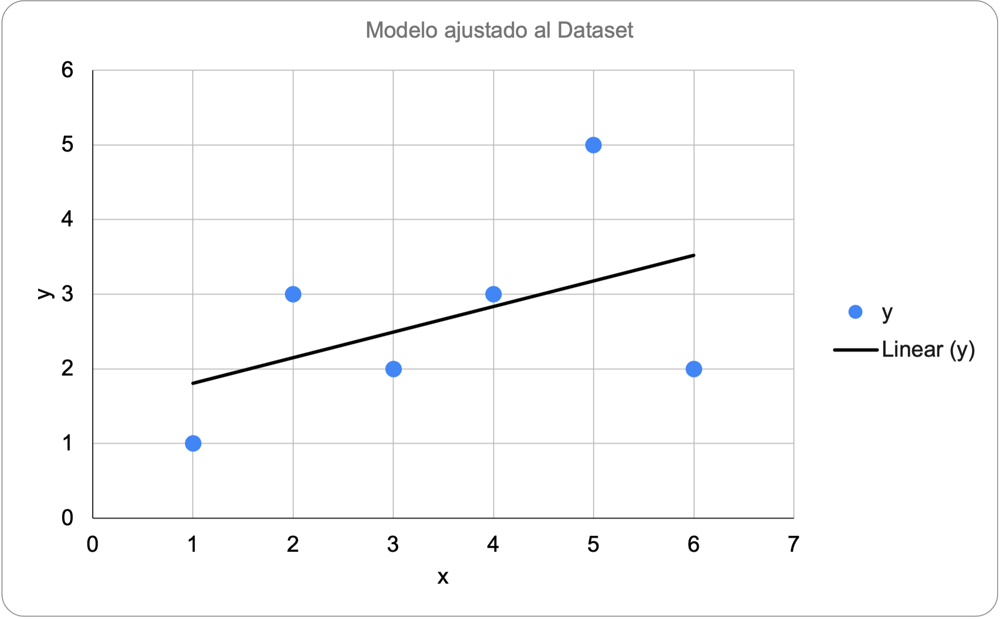
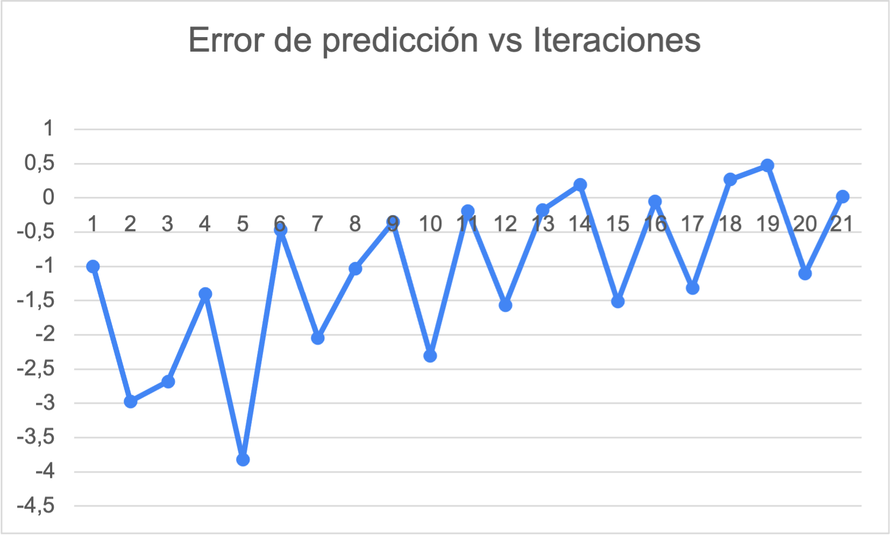

A continuación veremos el algoritmo de Regresión Lineal, como generar un modelo para
el mismo y como evaluar los resultados. Todos los cálculos se realizaran en una 
planilla electrónica, la cuál que se adjuntara para su estudio.

# Dataset
El Dataset a utilizar es muy sencillo ya que el foco se realizara en la explicación del
modelo de regresión lineal.

Los datos tienen una única variable de entrada _"x"_ y una variable de salida _"y"_:

$$
x = \{1,3,2,4,6,5\}
$$

$$
y = \{1,2,3,3,2,5\}
$$

Al graficar los datos obtenemos: 

# Modelo Simple
Utilizaremos un modelo simple de regresión lineal:

$$
y = B0 + B1 * x 
$$

El modelo anterior describe la ecuación de una recta, necesitamos estimar los
coeficientes B0 y B1. La estimación debe tomar en cuenta que los coeficientes
minimicen los errores de la función al predecir _"y"_.

Las fórmulas[^1] para calcular los coeficientes son las siguientes:
[^1]: La función _mean(x)_ calcula la media para la variable _"x"_

$$
B0 = mean(y) - B1 * mean(x)
$$

$$
B1 = \frac{\sum_{i=1}^{n} (x_i = mean(x)) * (y_i - mean(y))}{\sum_{i=1}^{n} (x_i - mean(x))^2}
$$

Luego de aplicar las fórmulas obtenemos los siguientes valores para __B0__ y __B1__:

$$
B0 = 0,342857143
$$

$$
B1 = 1,466666667
$$

## Predicciones
Aplicamos el modelo anterior al dataset de entrenamiento (utilizando los coeficientes
calculados), al graficar tenemos una idea de que tan bien nuestra linea modela nuestros
datos.

| X   | Y Predicho |
| --- | ---------- |
| 1   | 1.2        |
| 2   | 2          |
| 4   | 3.6        |
| 3   | 2.8        |
| 5   | 4.4        |

## Estimación del Error
Para calcular la estimación del error, utilizamos la formula de error cuadrático medio.

$$
RMSE = \sqrt{\frac{\sum_{i=1}^{n} (p_i - y_i)^2}{n}}
$$

Éste valor nos indica, en promedio, que tanto se aleja la predicción del valor real.

En este caso el resultado es _RMSE = 0.692820323_

# Regresión Lineal con Descenso de Gradiente
El descenso de gradiente es un algoritmo muy utilizado en Machine Learning. En ésta
sección veremos como utilizarlo para el aprendizaje de los coeficientes del modelo
de regresión lineal. El descenso de gradiente nos permitirá calcular los coeficientes
minimizando el error en un dataset de entrenamiento. Realizar repetidas iteraciones
puede generar un modelo de regresión preciso.

El dataset a utilizar es el mismo que el visto en la sección del modelo de regresión
simple.

Minimizaremos la función siguiendo el gradiente de la función de costos. Procederemos
a actualizar los coeficientes _B0_ y _B1_ de tal manera que en cada iteración se reduzca
el error cuadrático medio de la predicción.

El modelo hace una predicción para una instancia de entrenamiento, se calcula el error
y el modelo se actualiza de forma de reducir el error en la próxima iteración.
Los coeficientes se actualizan de acuerdo a la siguiente función:

$$
w = w - alpha * delta
$$
    
Donde _w_ es el coeficiente a ser actualizado, _alpha_ es la tasa de aprendizaje y
_delta_ es el error.

Utilizaremos el mismo modelo de regresión lineal visto anteriormente:

$$
y = B0 + B1 * x 
$$

Algunas consideraciones al comenzar con el descenso de gradiente:
  * _alpha_ es 0.01
  * __B0__ y __B1__ se inicializan con 0.0
  * _delta_ = p(i) - y(i)

El proceso de descenso de gradiente puede hacerse tanto como sea necesario, lo
coherente seria repetir el proceso hasta que no hayan diferencias significativas en los
errores y éstos ya no puedan reducirse. Cuando todos los datos del conjunto de
entrenamiento son utilizados a esto se le denomina una _época_. Para éste caso
particular al llegar a cuatro épocas ya vemos que los valores del error llegan al
mínimo. Para determinar cuando terminar con el proceso es de mucha utilidad graficar
el error de las predicción en función del numero de iteraciones:

Luego de 20 iteraciones (o 4 épocas), los valores que obtenemos son:
$$
B0 = 0.230897491
$$

$$
B1 = 0.79043861
$$

$$
RMSE = 0.720626401
$$

# Planilla de Cálculo
La siguiente planilla tiene el dataset, todo el desarrollo del modelo explicado
anteriormente, las gráficas y todas las columnas necesarias para hacer los cálculos
paso a paso. [>> Descargar aquí](linear_regression.xlsx)
