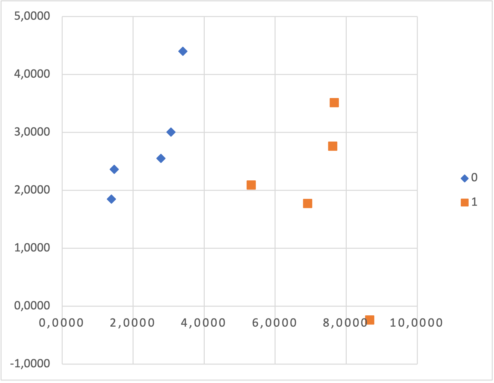
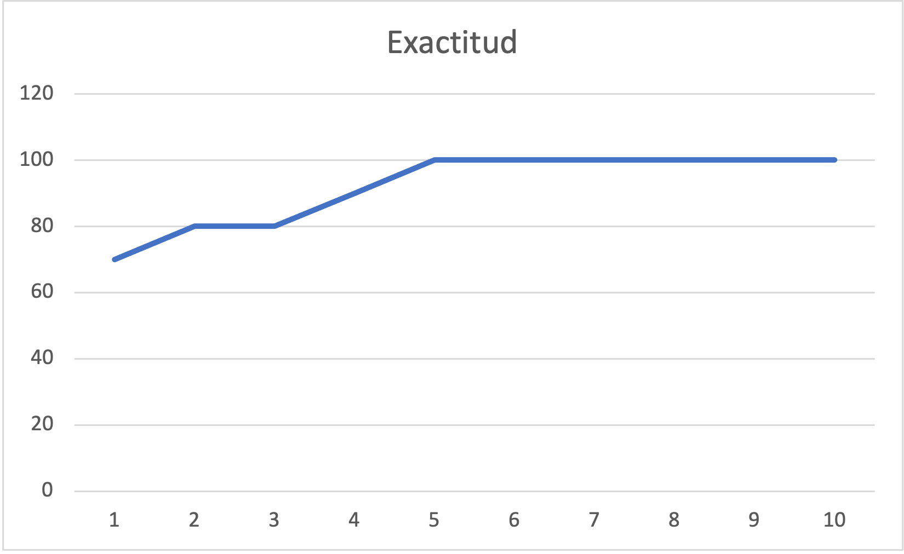
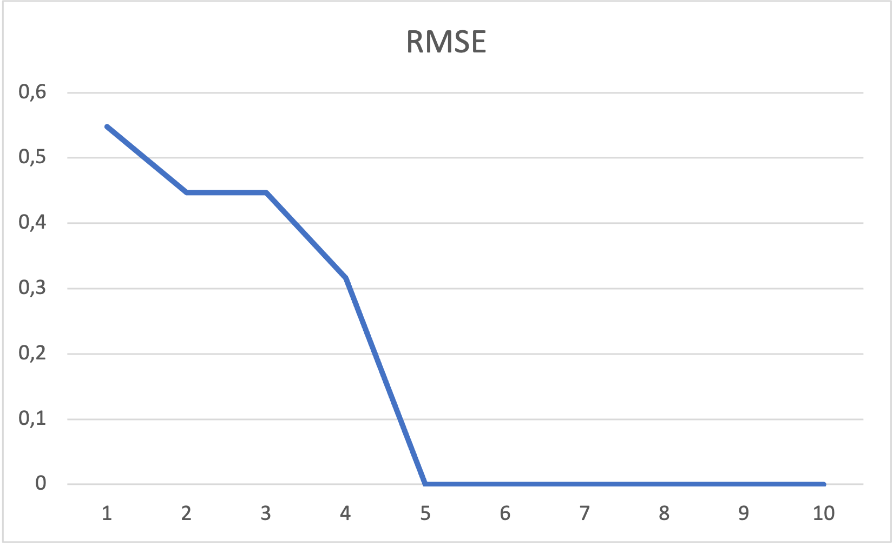

En el siguiente trabajo veremos el algoritmo de regresión logística, el
modelo será desarrollado en Excel y el foco del trabajo explicar los
mecanismos del algoritmo.

El principal uso de la regresión logística es para realizar una clasificación binaria,
por lo que a diferencia de la regresión lineal, que genera un valor numérico, éste
algoritmo genera una clase como resultado.

# Función Logística
El método de regresión logística se basa en la función logística:

$$
\frac{1}{1+e^{-value}}
$$

Esta función fue desarrollada en el campo de la estadística, y es utilizada en 
muchísimos otros campos. La función tiene una forma de _"S"_ y puede tomar cualquier
valor real y transformarlos en un valor en el intervalo (0, 1). 

Para más información, se puede ver: [https://en.wikipedia.org/wiki/Logistic_function](https://en.wikipedia.org/wiki/Logistic_function)

# Dataset
Utilizaremos un dataset sencillo para ilustrar el algoritmo ágilmente:

| X1     | X2      | Y   |
| ---    | ---     | --- |
| 2,7811 | 2,5505  | 0   |
| 1,4655 | 2,3621  | 0   |
| 3,3966 | 4,4003  | 0   |
| 1,3881 | 1,8502  | 0   |
| 3,0641 | 3,0053  | 0   |
| 7,6275 | 2,7593  | 1   |
| 5,3324 | 2,0886  | 1   |
| 6,9226 | 1,7711  | 1   |
| 8,6754 | -0,2421 | 1   |
| 7,6738 | 3,5086  | 1   |

Al graficar el dataset, fácilmente observamos que los datos están claramente separados
en sus clases. No es muy común tener una distribución tan clara, éste ejemplo sencillo
sirve para ilustrar la mecánica del algoritmo, si bien no presenta un caso de estudio
muy interesante desde la perspectiva de los datos.

# Modelo de Regresión Logística
El modelo a utilizar es:

$$
salida = B0 + B1 * X1 + B2 * X2
$$

El objetivo es poder calcular los valores de los coeficientes en función del dataset
de entrenamiento. Para poder generar una predicción y clasificarla, utilizaremos la
función logística para transformarla en una probabilidad.

$$
p(clase=0) = \frac{1}{1+e^{-salida}}
$$

# Regresion Logística con Descenso de Gradiente Estocástico
La estimación de los coeficientes se realizara utilizando el algoritmo de descenso
de gradiente estocástico.

La predicción se calcula aplicando el modelo descripto anteriormente:

$$
predicción = \frac{1}{1+e^{-(B0 + B1 * X1 + B2 * X2)}}
$$

Luego de tener una predicción, podemos determinar un umbral que nos permita transformar
la predicción en una clase:

$$
concreto = IF (predicción < 0.5) Then 0 Else 1
$$

## Cálculo de Coeficientes

Comenzamos inicializando __B0__, __B1__ y __B2__ con 0.0, al aplicar el modelo a la
primera instancia de entrenamiento[^1] obtenemos una predicción de __0.5__.
[^1]: _X1 = 2.7811, X2 = 2,5505, Y = 0_

Para calcular los próximos coeficientes utilizamos la siguiente función:

$$
b = b + alpha * (y - predicción) * predicción * (1 - predicción) * x
$$

Donde _b_ es el coeficiente a calcular y _alpha_ es la tasa de aprendizaje (fija
durante todas las iteraciones, utilizaremos el valor __0.3__). Para el cálculo de __B0__
(término independiente), podemos tomar un valor de entrada fijo de __1.0__.

La primera iteración deja los siguientes resultados:

$$
B0 = -0.0375\\
B1 = -0,10429125\\
B2 = -0,09564375\\
$$

Al completar una iteración de todas las instancias de entrenamiento en el dataset,
habremos completado una _época_. Es necesario ejecutar un numero de épocas que sean lo
suficientemente grande para que los coeficientes permitan generar un buen modelo. Para
ésto podemos calcular la _exactitud_ y el _error medio cuadrático_ (RMSE) en cada época.

## Exactitud

$$
exactitud = \frac{prediccionesCorrectas}{prediccionesTotales} * 100
$$

## Error Medio Cuadrático (RMSE)
$$
RMSE = \sqrt{\frac{\sum_{i=1}^{n} (p_i - y_i)^2}{n}}
$$

## Finalización del Descenso de Gradiente Estocástico
Se pueden realizar tantas épocas como sea necesario, para este dataset realizamos
10. Se muestran lo resultados de graficar la exactitud en función de las iteraciones, y
el error medio cuadrático en función de las iteraciones. Se puede observar que el
algoritmo de descenso de gradiente consigue estimar coeficientes con muy buenos
resultados de manera muy rápida, por lo que es particularmente útil cuando tenemos 
datasets extensos.

Luego de las 10 épocas, obtenemos los siguientes coeficientes:

$$
B0 = -0,395916905\\
B1 = 0,806932294\\
B2 = -1,09622155\\
$$

# Planilla de Cálculo
La siguiente planilla tiene el dataset, todo el desarrollo del modelo explicado
anteriormente, las gráficas y todas las columnas necesarias para hacer los cálculos
paso a paso. [>> Descargar aquí](logistic-regression.xlsx)
