# Caso de Estudio
Estudiaremos el caso de un banco con el interés de hacer un estudio de
marketing para llegar rápidamente a lo usuarios potencialmente interesados en
su nuevo producto. Éste se diferencia de lo que ofrece el banco actualmente y
ya cuenta con un pequeño porcentaje de clientes que han abierto cuentas de este
nuevo producto.

La intención de la campaña de marketing es no desperdiciar esfuerzos en la
pronta adaptación de la nueva cuenta. Por esto, a través de varios procesos de
data mining se quiere llegar al 20% de los clientes que tenga mayor afinidad
por el nuevo producto.

Contamos con la información de los clientes que actualmente abrieron cuentas del
nuevo producto, por lo que utilizaremos esa información para buscar similitudes
de éstos en el resto de los clientes del banco (con la esperanza de que sean compradores)

# Comprensión del Negocio
El banco ofrece cuarto tipos de cuentas corrientes, CC01-CC04, CC04 es el nuevo producto.
Cada cuenta tiene sus costos e intereses mensuales fijos, los clientes VIP pueden estar
exentos de ciertos pagos.

No hay limite de cuentas para los clientes, los cuales pueden no tener ninguna cuenta
abierta y no por eso dejar de ser clientes.

Cada cuenta tiene fecha de apertura y cierre. Al cierre de una cuenta no se permiten
mas operaciones, quedando el balance en 0. Un cliente es considerado activo si tiene
por lo menos una cuenta activa.

Las transacciones monetarias tienen varios tipos: "retiro de caja", "sueldo",
"etc"; existe también un valor "desconocido".  Los datos personales son
conocidos pero pueden estar desactualizados.

# Análisis del Dataset
Los datos para este caso de estudio están en un formato de Data Warehousing de tipo
Estrella.

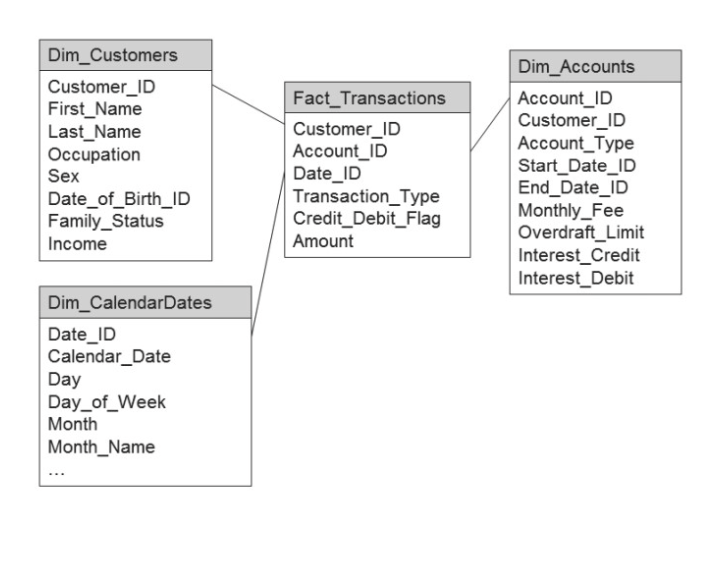

Como se puede observar, tenemos una _facts_table_ (llamada "Fact_Transactions") de las
que se desprenden varias dimensiones.

## Dim_Customers
Contiene la información personal del cliente como: nombre y apellido, fecha de
nacimiento, ocupación, sexo, estado civil e ingresos. Existen valores faltantes
en "income", estos son para los adultos que optaron por no dar la información.
En el caso de los jovenes el valor es 0.

## Dim_Accounts
Hay una fila por cuenta. Se encuentra la información del propietario de la cuenta
(con una referencia), el tipo de cuenta, inicio y fin.

## Dim_CalendarDates
Contiene la información de todos los días desde el 1 de enero de 1900 hasta el 23
de noviembre de 2036. Toda la información de fechas del dataset está referenciada a
esta tabla.

## Fact_Transactions
Tiene información de todas las transacciones realizadas en la cuenta. Incluye
una referencia al propietario, tipo de transacción (con categorías como
"salario") y un marcador de crédito/débito que toma los valores CR/DR que
indica si se quito o se agregó dinero a la cuenta. El valor de la cuenta se
denomina "Amount" y es siempre positivo.

# Preparación de los datos.
En este paso del modelo CRIS-DM generaremos la tabla de entrada utilizada por el
algoritmo de data mining. Está tabla debe tener la información del Data Warehouse
integrada y limpiada. En ésta parte del proceso es muy relevante traer información del
negocio a la hora de armar la tabla, ya que esta va a ser la representación de nuestro
cliente (nuestro potencial comprador).

## Unificando la información
El proceso de ensamblado de la información se hace en 4 canales, un canal para cada
una de las tablas del Data Warehouse. A continuación veremos como se procesa cada
tabla en su respectivo canal.

### Canal "Customer Data"
Lo primero que se hace es cambiar el tipo del atributo "sex" a binomial, los
posibles valores en esta categoría son dos (Hombre o Mujer, representados como
M y F respectivamente). Luego obtenemos la edad del cliente, si bien se sabe que
esta información puede estar desactualizada se toma como cierta. Recordemos que
la tabla de clientes tiene la fecha de nacimiento como una referencia a la
tabla __Dim_CalendarDates__, por lo tanto en lugar de un atributo utilizaremos
el operador _Join_ de RapidMiner.  Para realizar el join antes seleccionamos
los atributos relevantes de la tabla de __Dim_CalendarDates__ (date_id, year) y
luego hacemos el join "left" utilizando "date_id" como clave. Luego de tener la
fecha de nacimiento, podemos computar la edad. Como paso final se quitan atributos
que no son de utilidad en el proceso de data mining ("birth_date_id", nombre y apellido).

### Canal "Account Data"
Uno de los propósitos de este canal es catalogar a los clientes como
"comprador" o "no comprador". Todos los clientes con la cuenta CH04 son
compradores. El canal se bifurca en dos: en las cuentas pertenecienes a CH04 y
las que no pertenecen.  Para el caso de las cuentas CH04, se toman todas las
cuentas (incluso las inactivas) siempre y cuando fueran abiertas antes del 31
de Diciembre de 2011. Luego se agrupan las cuentas por cliente y se marca al
cliente como comprador. 

Para las cuentas que no pertenecen al tipo CH04, solamente se mantienen las
cuentas activas. En este sub canal el objetivo es aprender sobre el
comportamiento del cliente.  Se calculan ciertas métricas que son indicadores
del comportamiento del cliente y se agrupa la información por cliente, en esta
sección es esencial el conocimiento del negocio. Luego de calculadas las
métricas, se quita el atributo "frst_start_date_id" ya que no va a ser de más
utilidad.

### Canal "Transaction Data"
En este paso se toman solamente las transacciones desde el 2011 en adelante.
Luego se calculan los montos de las transacciones como: "income_last_year",
"creditcard_last_year", "cash_withdrawals_last_year", "insurance_last_year",
"income_indicator", "creditcard_indicator", "cash_withdrawal_indicator" y
"insurance_indicator".  Toda la información se agrupa por cliente, se calculan
los promedios y se quitan del dataset las variables que no se van a utilizar
más: "no_of_cash_withdrawals", "no_of_creditcard_transactions",
"no_of_income_transactions" y "no_of_isurance_transactions".

### Finalización del Proceso
Se obtienen los clientes activos juntando las cuentas activas con la tabla de
clientes, luego se usa otro Join para agregar el "label". Para todos los no
compradores el dataset queda con valores faltantes. Esto lo solucionamos con el
operador __ReplaceMissingValues__, haciendolo llegnar todos los valores
faltantes con "no-buyer".  El paso final es unir nuestros clientes activos con
la información de las transacciones.  El resultado  de este proceso de
unificación lo grabamos en un dataset para retomarlo en el siguiente paso como
entrada del proceso de data mining.

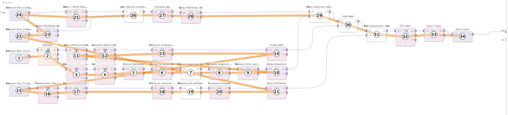

## Preparación de los Datos para Minería
El dataset creado en el proceso anterior contiene la información unificada de todas
las tablas del Data Warehouse, además se limpió el dataset y se quitaron muchos campos
irrelevantes. Así también como se construyeron indicadores para poder entender el
comportamiento de los clientes.

En este paso, realizaremos la ultima etapa de preparación en la que se trataran los
datos faltantes, se configuraran el atributo "id" y "label", se quitaran atributos
innecesarios y se discretizaran ciertos valores.

### Configuración de Atributos Especiales
Se configura el atributo _customer_id_ como "id" en RapidMiner, esto se debe a que el
atributo no tiene valor para el resto del análisis de los datos. Sí es necesario
para poder estudiar los resultados e identificar los clientes.

Luego, se configura el atributo _is_buyer_ como "label". Esta es nuestra variable
objetivo ya que la intención del proceso es identificar potenciales compradores del
nuevo producto.

### Datos Faltantes
Observamos el tratamiento de datos faltantes en dos atributos: _family_satus_ e _income_.
Como mencionamos anteriormente, existen clientes que eligen no incluir cierta información
personal. Para el caso de _income_ simplemente rellenamos los valores faltantes con 0,
para _family_satus_ utilizamos un nuevo valor "unknown". Existen otras estrategias
de tratamiento de datos faltantes como imputar los valores con un algoritmo, o utilizar
el máximo, mínimo o promedio; o simplemente descartar las instancias con datos faltantes.

### Remoción de Atributos Inútiles
Se utiliza el operador __Remove Useless Atributes__ para limpiar atributos que tengan
información irrelevante. Se configura el operador de tal forma que excluya los atributos
cuyo valor más frecuente ocurra en menos del 1% o en más del 99% de los casos.

### Discretización de Atributos
Los siguientes operadores se encargan de discretizar valores numéricos que no
son de tanta importancia a la hora de realizar la investigación, pero es útil
tener cierta representación de los mismos en el dataset resultante. Se
discretizan la edad, los atributos monetarios del dataset, el atributo "income"
y "customer_for_years".

### Remoción de Atributos y Guardado
Por último, quitamos el atributo "year_of_birth" del dataset (ya que no es de más 
utilidad) y guardamos los resultados en una tabla de RapidMiner llamada BaseMiningTable.
Con esto terminamos el proceso de preparación de los datos y construimos nuestro
dataset base para minar los datos.

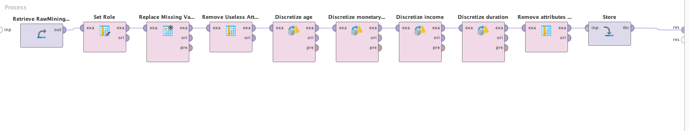

# Modelado y Evaluación
Lo primero a destacar es que la variable objetivo está muy desbalanceada, solamente
un 7% de los clientes son compradores. Esto es un problema ya que los algoritmos
de clasificación pueden obtener muy buenos resultados simplemente alegorizando a todos
los clientes como "no-buyers".

Para resolver este problema hay dos alternativas: Ponderación y Re-balanceo.

## Ponderación
En este caso se introduce un atributo especial en RapidMiner, el cual tiene la ponderación
para cada ejemplo. Con esta estrategia podemos agregarle más peso al valor del "label"
que tenga menos presencia.

Para esto utilizamos el operador __Generate Weight__ (Stratification). El operador
distribuye un valor total de peso en todos los ejemplos del dataset y reparte a
la mitad los valores entre "buyer" y "no-buyer". Se utiliza un valor total de 10000,
por lo que la suma de todas las ponderaciones de "buyer" dará 5000 y las de "no-buyer"
también.

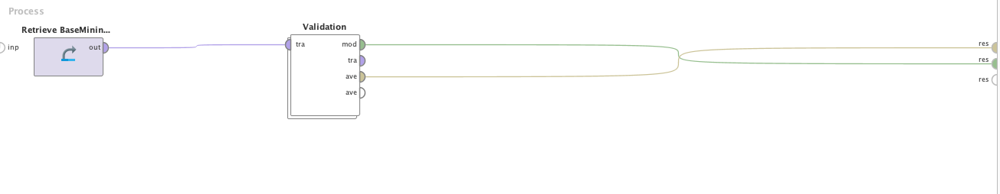

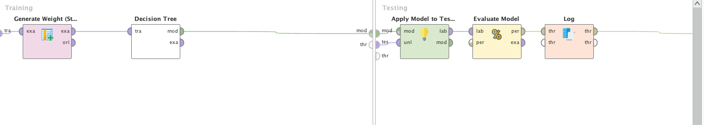

## Re-balanceo
En este caso simplemente creamos un subset especial del dataset, donde ambas "labels"
tienen aproximadamente la misma representación. Este subset se utilizará solamente para
la creación y el entrenamiento del modelo pero no para la evaluación y deploy.

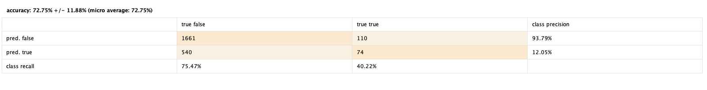

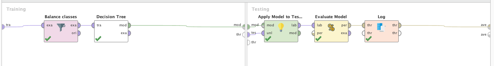

## Evaluación
Para la evaluación se utilizara Cross Validation, y se configura de esta forma:

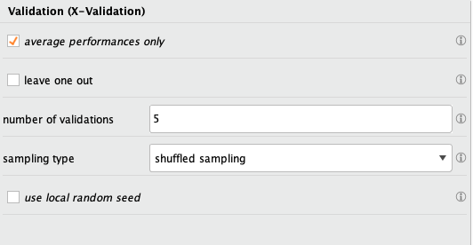

En este caso puede verse que el re-balanceo obtuvo mejores resultados que la ponderación.

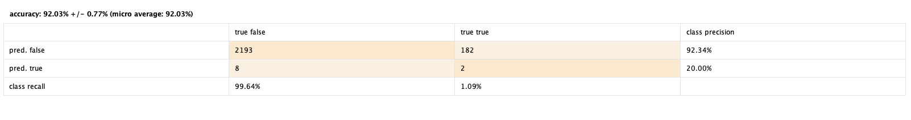

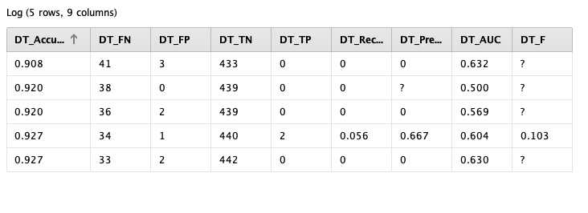

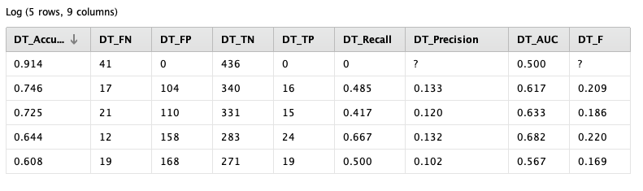

Es importante destacar que nuestro dataset tenía un 7% de representación de de compradores
("buyers"), por lo que nos es particularmente interesante observar los valores de recall
en ese contexto. Como podemos ver, la ponderación obtuvo un 40% de recall (bastante más que un
7%) y los valores de precisión fueron altos.

# Evaluación Avanzada
En esta sección se realizaran evaluaciones del modelo que van más allá del análisis
de la precisión y el recall. Puede observarse que tenemos dos atributos importantes:
_confidence(true)_ y _confidence(false)_. Representan la un valor de probabilidad con
la que los modelos hacen sus predicciones, podemos observar que para que un cliente sea
catalogado como "buyer" debemos tener una _confidence(true)_ mayor a 0.5.

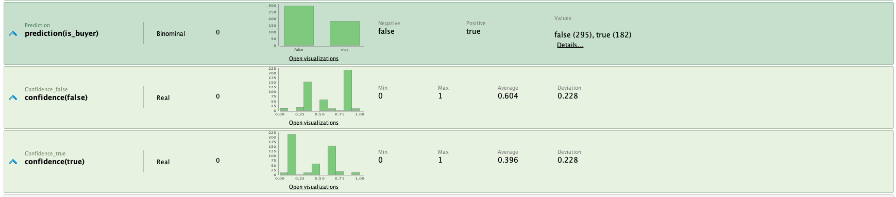

Cabe destacarse que ese umbral (actualmente en 0.5) puede ajustarse, para forzar al modelo
a clasificar clientes como "buyers" con mayor o menor confianza. Si el modelo es lo
suficientemente robusto, bajar ese umbral igual debería dar buenos resultados pero aumentamos
nuestras chances de clasificar falsos positivos significativamente.

## Lift Charts
Existe una herramienta de visualización llamada "Lift Charts" que nos permite
poder investigar la relación entre las clasificaciones del modelo y el valor
del umbral definido. La herramienta cuantifica la relación de los compradores 
predichos contra los compradores reales, a medida que cambia el umbral podemos
analizar los valores.

La creación de un Lift Chart puede verse en el siguiente proceso de RapidMiner:

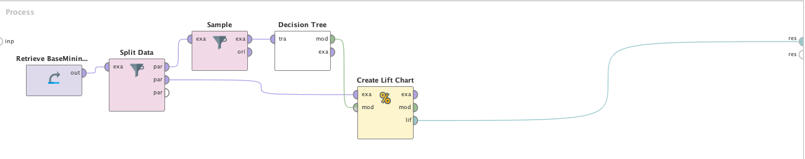

El proceso divide los datos, balanceándolos en un dataset de entrenamiento y otro
diferente de test. El operador __CreateLiftChart__ se aplica al dataset de test,
utilizando el modelo entrenado con el dataset de entrenamiento.

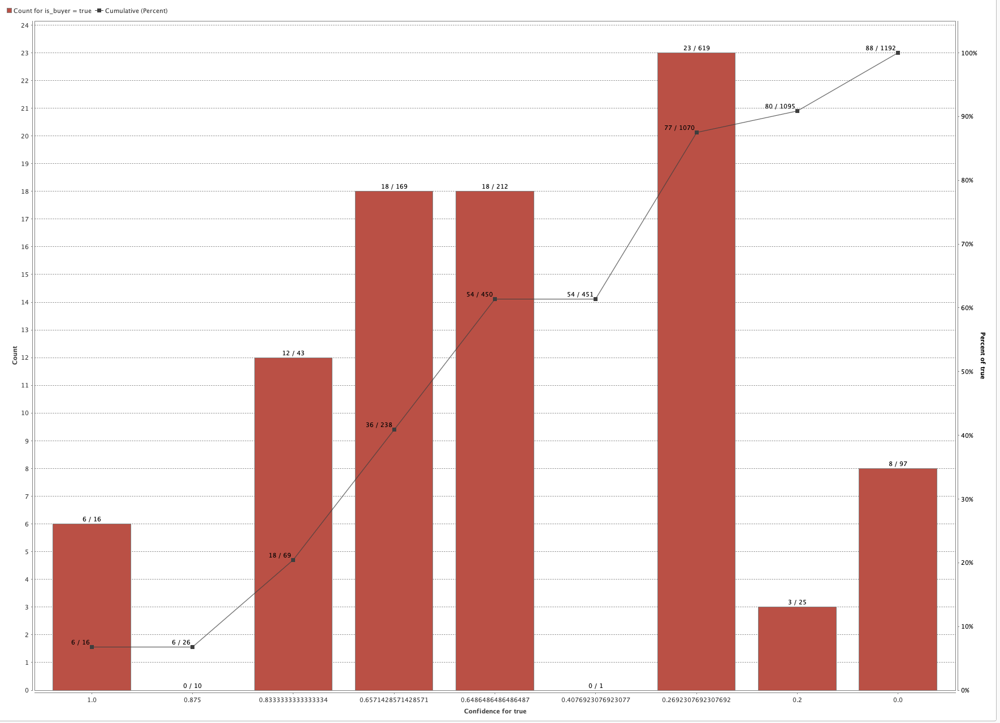

Como podemos observar, se crea el gráfico utilizando diferentes urnas (bins) para cada
valor de confianza asociado con la clase objetivo especificada. Nos interesa observar
los casos en que los clientes se clasifican como "buyers", por lo que utilizaremos el
valor "true".

Las barras del gráfico indican, para cada urna, el numero de ejemplos cuya confianza
es mayor al umbral definido para la urna. Además, podemos observar los valores que
exceden el umbral.

Este tipo de gráficos son muy útiles a la hora de necesitar rankings para responder
ciertas preguntas de mercado (como en este caso). Porque esta relación representada
en el gráfico es exactamente la información que se necesita para poder saber a quién
queremos apuntar primero en nuestra campaña de marketing.

## Roc Charts
Estos gráficos tienen un uso similar al anterior, y permiten otra visualización del
problema. Aquí podemos ver claramente la tendencia de la predicción de los clientes
a medida que el umbral se cambia.

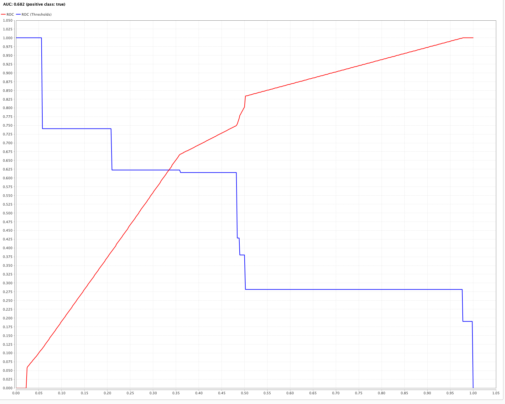

En el eje "x" podemos ver el ratio para los valores clasificados como falsos positivos
mientras que en el eje "y" vemos el umbral definido. Como se puede ver claramente,
a medida que reducimos el valor del umbral clasificamos a mas clientes como "buyers",
pero también vemos que aumentamos la cantidad de falsos positivos. Esta herramienta es
muy útil para entender hasta que punto sirve configurar el umbral del modelo, sin afectar
demasiado el desempeño de la campaña de marketing.

# Conclusiones
El proceso de Data Mining nos permite poder tomar decisiones a futuro, en este caso
el envió de mails en una campaña de Marketing, tomando en cuenta información guardada
en nuestros sistemas que de otra manera sería imposible entender y aplicar correctamente.

Luego de tener la data preparada, pudimos crear indicadores con comportamientos
de los clientes y entrenar modelos basándonos en esto. Con las herramientas de
evaluación vistas (Lift Chart, ROC), tenemos la posibilidad de ajustar esos
resultados para poder alinearlas con nuestra necesidad y objetivos. Por
ejemplo, si nuestro modelo final no llegara a la cantidad necesaria de
clasificaciones "buyer" podríamos (con los riesgos que esto trae) ajustar el
umbral para obtener mas potenciales compradores. Esto puede servir como
estrategia también para la siguiente ronda de mensajes (si fuera necesaria).
