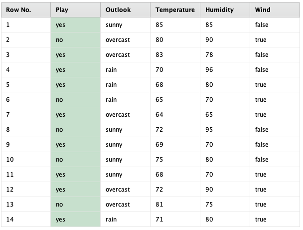
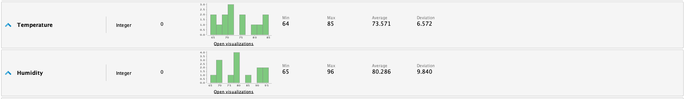
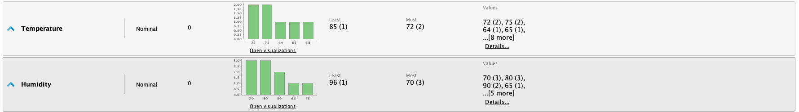
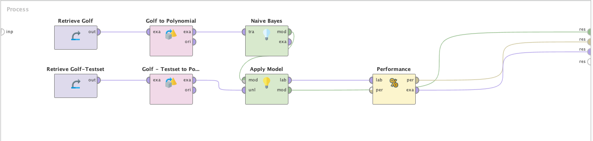
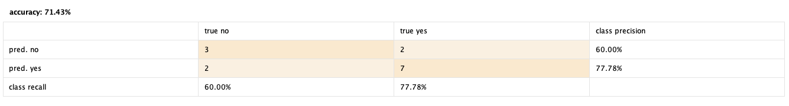
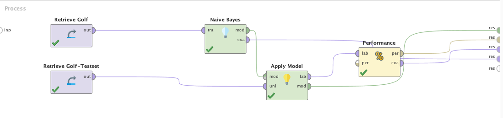
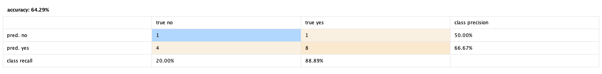

Es muy común tener datasets con atributos numéricos que representan variables
continuas, para la mayoría de los algoritmos de Machine Learning esto no es un
problema. Naive Bayes es un clasificador que funciona significativamente mejor con
entradas binarias, nominales y categóricas. Por lo que es necesario preparar el
dataset previo al entrenamiento del modelo para tener buenos resultados.

# Dataset
Utilizaremos un dataset de prueba llamado "Golf" para el entrenamiento y otro
llamado "Golf Test" para la validación del modelo. Ambos datasets están
incluidos en RapidMiner.  El dataset tiene la misma problemática que el dataset
de "Jugar Tenis" (en este caso para jugar al golf!), la diferencia es que los
atributos _Temperature_ y _Humidity_ son enteros en lugar de ser polinominales. 

# Preparación de los Datos
Como mencionamos anteriormente, el clasificador Naïve Bayes espera atributos categóricos.
Los atributos _Temperature_ y _Humidity_ presentan un problema ya que son enteros, para
solucionar esto utilizaremos el operador __NumericalToPolynominal__. Es importante tener
en cuenta de aplicar el operador tanto al dataset de entrenamiento como al de testing. 

Luego de aplicar el operador __NumericalToPolynominal__ podemos ver como son ajustados
los datos.

# Entrenamiento y Testing
Luego de preparar los datos, podemos entrenar el modelo. Como se puede observar
en RapidMiner, el modelo de Naïve Bayes no tiene ningún parametro de
configuración mas que la corrección de Laplace. La corrección de Laplace
permite que el modelo pueda lidiar con clases que no tengan valores y puedan
generar una probabilidad de 0, por lo que es recomendable mantenerla activa.

Al correr el proyecto de RapidMiner obtenemos la siguiente matriz de confusión.

# Entrenamiento y Testing sin Preparación de los Datos
Para poder medir el impacto de convertir las variables continuas en polinominales,
entrenaremos el mismo modelo de Naïve Bayes pero manteniendo las variables originales.

Como se puede observar, el modelo no maneja tan bien las variables continuas y tiene mas
dificultad para predecir los valores. Al convertir _Temperature_ y _Humidity_, el modelo
tuvo un accuracy de ~71%, en el caso de no convertirlas llegó a ~64%. Si bien no parece
ser una diferencia muy grande, el dataset es muy pequeño. Es importante destacar que
el impacto depende del efecto de las variables continuas en la clasificación. 
