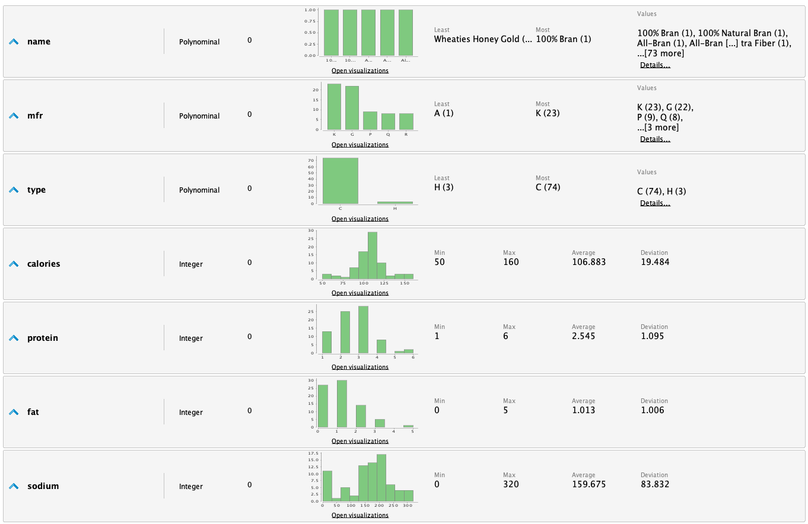
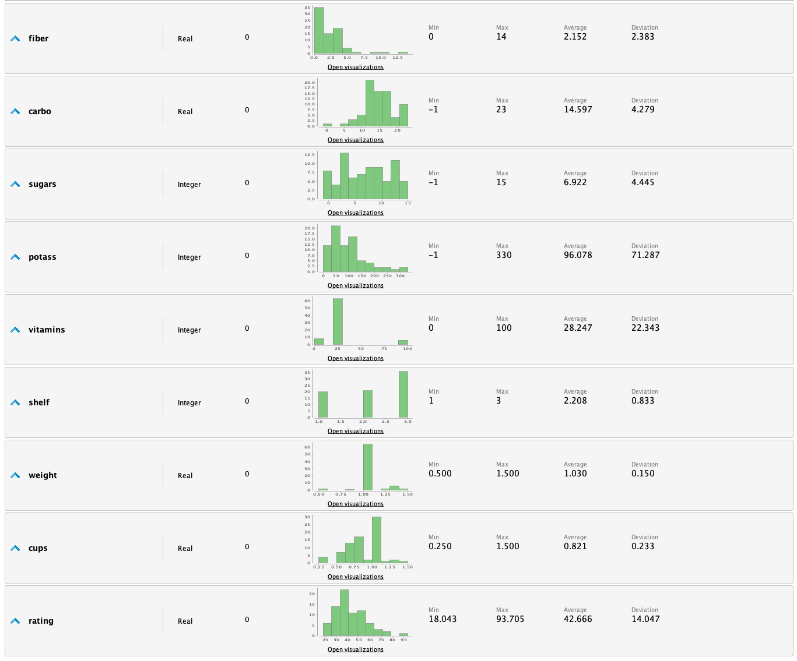
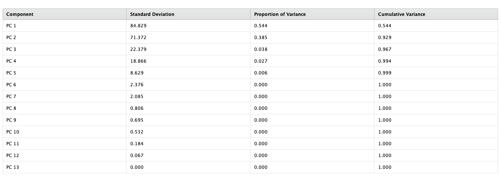
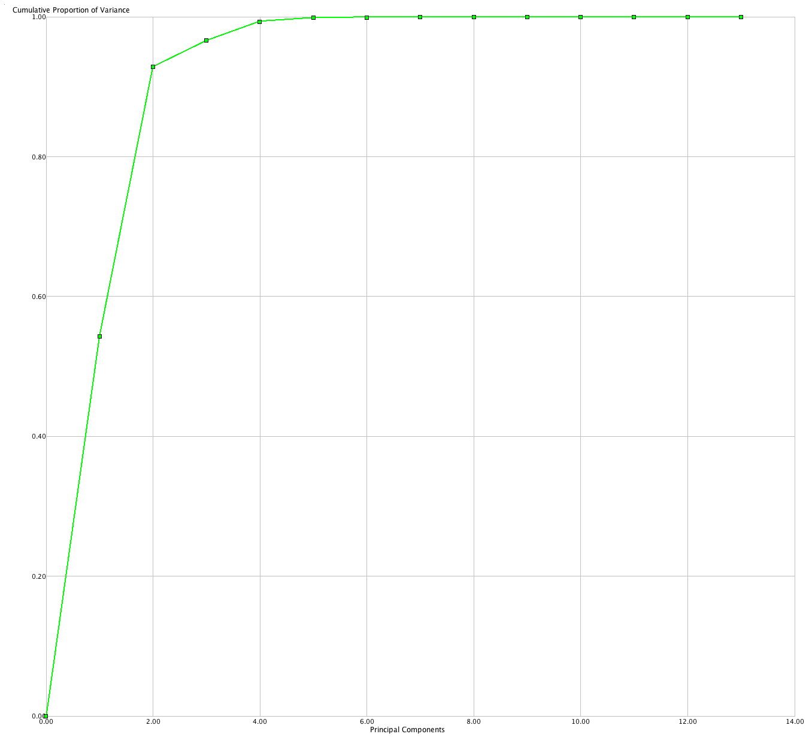
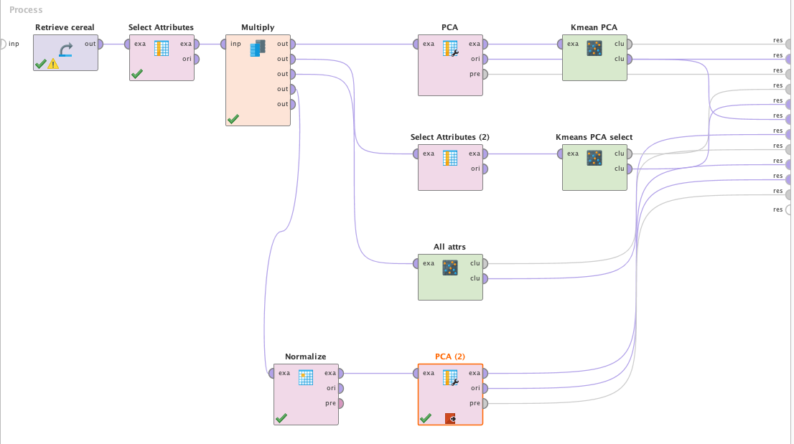
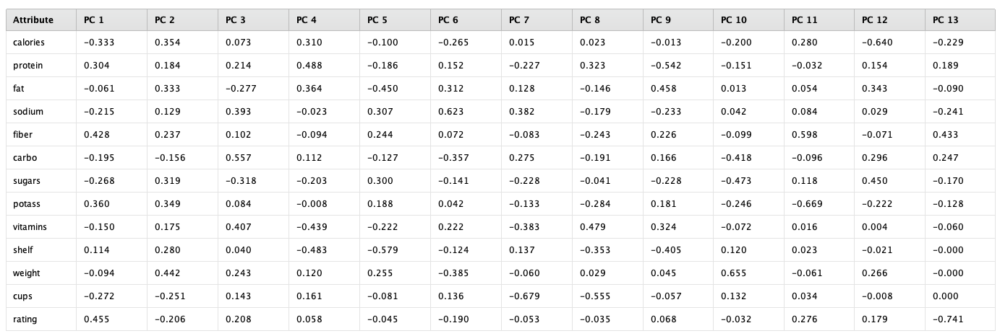
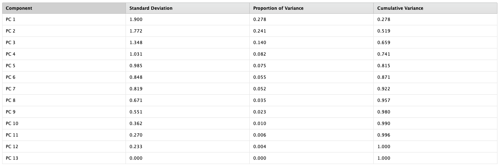
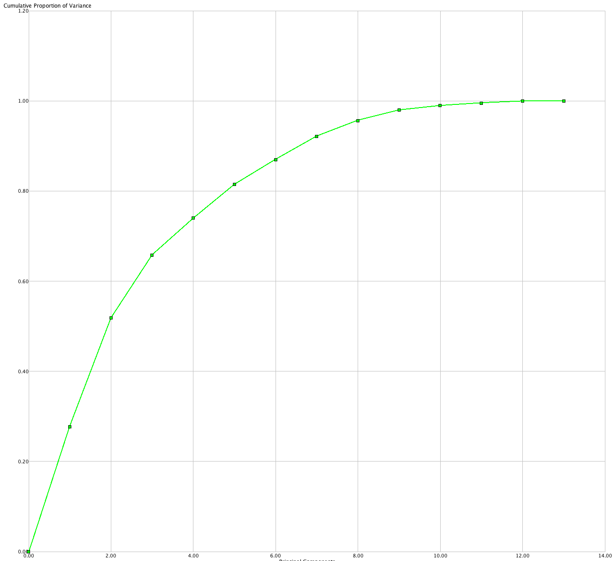

Los datasets de Machine Learning pueden tener una gran cantidad de atributos, esto
implica que los esfuerzos para poder analizar los datos, prepararlos y entrenar los
modelos genera un consumo de recursos muy importante. PCA es una técnica que permite
reducir la cantidad de atributos de un dataset, basándose en la idea que generalmente
la mayor parte de la varianza es responsabilidad de unos pocos atributos.

PCA captura los atributos que contienen la mayor cantidad de variabilidad en el dataset,
esto lo realiza transformando los atributos originales en un set de componentes principales.

# Dataset
Para aplicar PCA utilizaremos el dataset "cereal". Éste contiene información nutricional
de 80 productos de cereales. Contiene 13 atributos:
* _Name:_ Nombre del cereal. Tipo (polinominal)
* _mfr:_: Fabricante del cereal. Tipo (polinominal)
  Los posibles valores son:
  * A = American Home Food Products;
  * G = General Mills
  * K = Kelloggs
  * N = Nabisco
  * P = Post
  * Q = Quaker Oats
  * R = Ralston Purina
* _type:_ Tipo de cereal. Tipo (binominal). Los posibles valores son "cold" y "hot".
* _calories:_ Calorías por porción. Tipo (entero).
* _protein:_ Gramos de proteína. Tipo (entero).
* _fat:_ Gramos de grasa. Tipo (entero).
* _sodium:_ Miligramos de sodio. Tipo (entero).
* _fiber:_ Gramos de fibra. Tipo (real).
* _carbo:_ Gramos de carbohidratos complejos. Tipo (real).
* _sugars:_ Gramos de azúcar. Tipo (entero).
* _potass:_ Miligramos de potasio. Tipo (entero).
* _vitamins:_ Vitaminas y minerales. 0, 25 o 100 indicando el porcentaje recomendado por FDA.  Tipo (entero).
* _shelf:_ Estante. 1, 2 o 3 contando desde el piso. Tipo (entero).
* _weight:_ Peso en onzas para una porción. Tipo (real).
* _cups:_ Número de tazas por porción. Tipo (real).
* _rating:_ Un rating de los cereales. Tipo (real).

Dentro de RapidMiner podemos observar las siguientes estadísticas:

# Preparación de los Datos
PCA funciona solamente para atributos numéricos, por lo que necesitamos remover
los atributos que no sean numéricos del dataset. Además, PCA es muy sensible a los
efectos de la escala en los datos, por lo que es importante normalizar. De todas maneras
haremos el ejercicio de realizar PCA sin normalizar primero, para poder comparar los
datos.

# Ejecución de PCA
En RapidMiner tenemos el operador __PCA__, el parametro principal del operador es
_dimensionality reduction_. Éste parametro nos permite elegir la opción a utilizar para
reducir los atributos. Entre las opciones podemos elegir no hacer nada (es como si el
operador no existiera), elegir un valor fijo de atributos a quitar o quitar la cantidad
de atributos necesario para obtener un nivel mínimo de varianza (keep_variance).

En nuestro caso, utilizaremos la opción _keep variance_ con un umbral de 0.95.

Al ejecutar el proceso obtenemos los siguientes resultados:

La tabla anterior muestra los componentes principales creados y la varianza que cada
uno de estos tiene en el dataset. Como podemos observar, _PC1_, _PC2_ y _PC3_ son
responsables del 97% de la varianza del dataset. Esto tiene un impacto muy grande
a la hora de entrenar los modelos y analizar los resultados ya que redujimos
significativamente la cantidad de atributos (de 13 a 5). En datasets con cientos
de atributos esto realmente puede hacer la diferencia.

Cabe destacar que estos componentes principales son una combinación lineal de los
atributos originales, para poder determinar cuales son los atributos originales
más relevantes podemos observar la siguiente tabla.

Para obtener los atributos simplemente miramos cuales son los 3 valores con la
varianza más alta en los componentes principales. En este caso tenemos: _calories_,
_sodium_, _potassium_, _vitamins_ y _rating_.

# Evaluación
Para poder ver el efecto de PCA en el dataset vamos a utilizar un modelo de K-Means
clustering y vamos a comparar los resultados con todos los datos, utilizando los 
componentes principales y seleccionando a mano los atributos son mas significativos
en los componentes principales generados.

Realizando pruebas, en todos los casos obtuvimos 4 clusters de información con
diferencias mínimas en los elementos de los clusters. Con esto podemos comprobar
que por mas que realizamos una reducción muy importante de atributos del dataset,
los resultados no se vieron afectados de manera significativa.

## Riesgos de Usar PCA
Es importante entender que PCA tiene riesgos en su uso, el contexto en el cuál se
utiliza es muy importante. Imaginemos utilizar PCA en un dataset en el que tenemos
mucho ruido, claramente ese ruido va a ser muy importante en la varianza por lo
que también va a ser muy importante en PCA. 

Agregar datos no correlacionados y/o agregar datos correlacionados pero irrelevantes
no aporta. Debemos tener cuidado de que la información utilizada en el dataset sea
relevante y no tenga correlaciones falsas que terminaran afectando PCA.

La escala de los atributos importa como veremos en la siguiente sección, es importante
que los datos estén normalizados para que PCA pueda generar los mejores resultados.

## Datos Normalizados
Como comentamos en la sección de preparación de datos, es importante que los atributos
se encuentren normalizados a la hora de usar PCA. La evaluación anterior no tuvo
en cuenta la normalización de los datos, por lo que ahora agregaremos un operador de
normalización en RapidMiner para poder comparar.

Luego de normalizar y aplicar PCA nuevamente, vemos que para obtener el umbral de 95%
ahora necesitamos 8 atributos. Aumentamos considerablemente la cantidad de atributos
pero ahora la información de la varianza es más precisa, y podemos tomar en cuenta
atributos que no se tomaron en primer instancia.

Al analizar los vectores propios podemos obtener la nueva lista de atributos originales
que son responsables del 95% de la varianza del dataset. Éstos son: _rating_, _fiber_,
_potass_, _weight_, _calories_, _carbo_, _vitamins_, _sodium_, _sugars_, _fat_, _shelf_ y _protein_. Como podemos ver, esto solamente nos reduce 1 atributo del conjunto original.

# Recursos
[>> Dataset Cereal](cereal.csv)
[>> Proceso RapidMiner](pca.rmp)
