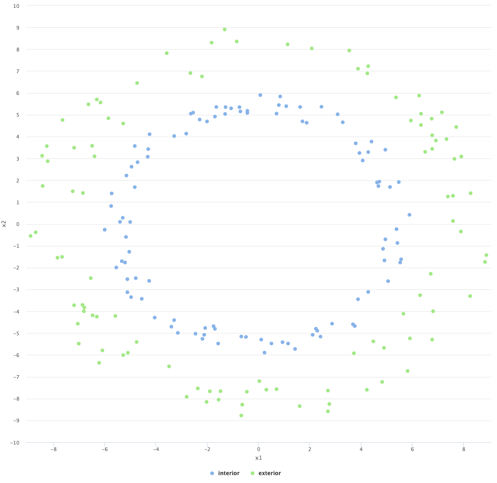
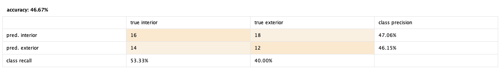
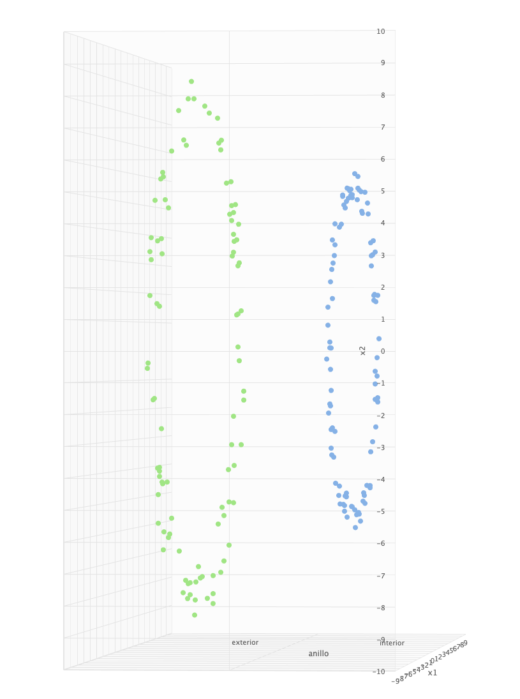
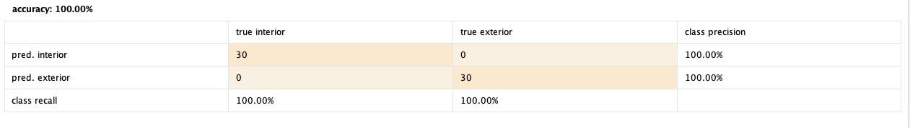
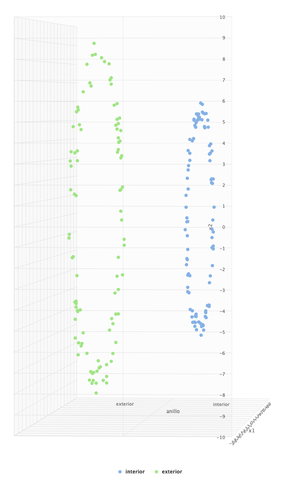
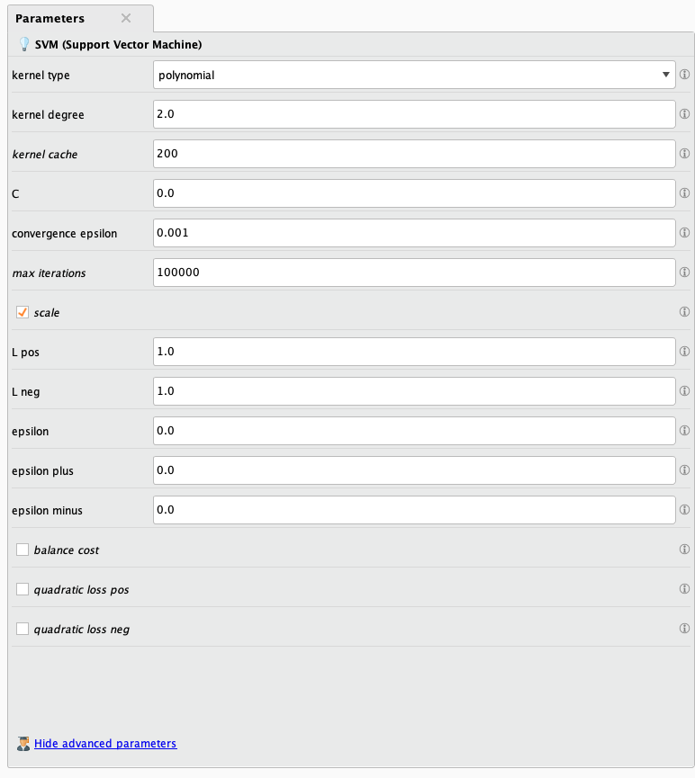

En el siguiente trabajo exploraremos el algoritmo de Support Vector Machines,
específicamente para el caso de un dataset no lineal. Veremos como SVM puede
utilizar kernel diferentes para ajustarse a los datos. El análisis del dataset
y el modelado serán realizados en RapidMiner.

# Dataset
Como mencionamos anteriormente, el dataset a utilizar define un problema que no
es separable linealmente, por lo tanto algoritmos lineares como regresión
lineal, regresión logística o incluso SVM con un kernel lineal que separe los
datos con un hiperplano lineal no pueden ser utilizados para este dataset.

El dataset cuenta con 3 atributos de entrada: _x1_, _x2_ e _y_ (todos con
valores reales), ademas tenemos la variable objetivo _anillo_, polinominal y
que puede tomar los valores _"interior"_ y _"exterior"_ indicando en cual de
los dos anillos se encuentra el dato. 

# Modelo en RapidMiner
A continuación explicaremos las decisiones tomadas para modelar el problema con
SVM dentro de RapidMiner.

## Preparación del Dataset
Lo primero que haremos es seleccionar el atributo _anillo_ como __label__
utilizando el operador __setRole__, ésto indica que es nuestra variable
objetivo. Luego tomaremos el operador __SelectAtributes__ para filtrar solamente
los atributos _x1_ y _x2_.  Para la validación del modelo utilizaremos el
operador __SplitValidation__ configurado como _relative_ en el _split_, el
ratio lo configuramos en 0.7 y el método de sampleo en _stratified_.

## Preparación del Modelo
Dentro del operador __SplitValidation__, configuraremos el modelo SVM.
En el panel izquierdo agregamos un operador SVM, mientras que en el panel
derecho agregamos dos operadores __ApplyModel__ y __Performance (Classification)__.
Esto nos permite entrenar el modelo, aplicarlo y medir su performance.

### Performance con SVM Lineal
Como mencionamos anteriormente, el dataset no es linealmente separable. Si intentamos
utilizar un kernel lineal, obtenemos malos resultados.

Utilizando un "3D Plot" en las herramientas de visualización podemos observar como
fueron clasificados los datos.

## Performance con SVM Polinomial
Al configurar el modelo SVM es importante prestar atención a que el kernel
utilizado sea el _polinomial_, esto se debe a que nuestro dataset forma dos
anillos. De otra manera no podremos separar las clases correctamente dentro de
nuestro dataset.

Es interesante destacar que existe un kernel radial, el cual también obtiene 100%
de exactitud y recall.

### Configuración utilizada dentro del Modelo SVM
Veremos los valores utilizados en el modelo SVM, en la mayoría de los casos se 
utilizaron los valores por defecto ya que el modelo se comportó de manera satisfactoria.

Para destacar dentro de la configuración tenemos el parámetro de complejidad __C__.
Éste parámetro es la constante de complejidad para SVM, el valor por defecto es 0
(y es el utilizado). Si el valor de __C__ es muy grande eso permite bordes mas suaves
para el hiperplano, lo que fácilmente puede terminar en un problema de over-fitting.
Por el contrario, si el valor es muy bajo podemos tendremos un problema de
sobre generalización.

# Recursos
[>> Dataset](no-lineal-dataset.csv)
[>> Proyecto de RapidMiner](svm-model.rmp)[^1]

[^1]: Para utilizar el proyecto de RapidMiner es necesario importar el dataset y cargarlo correctamente dentro de la herramienta.
