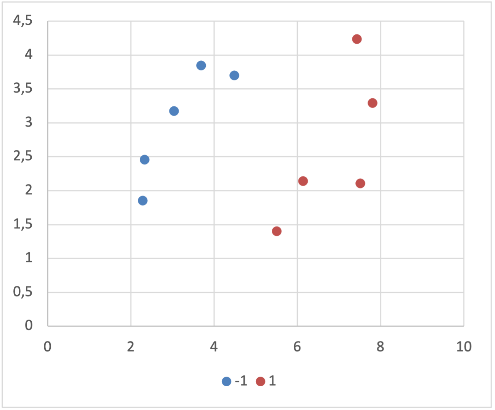
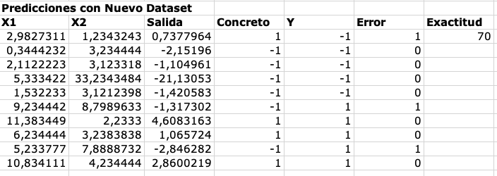

En el siguiente trabajo veremos el algoritmo de Support Vector Machines, nos
concentraremos en como funciona el mismo y lo desarrollaremos en una planilla
electrónica.
En el proceso existen dos partes importantes:
* Estimar los coeficientes del modelo
* Utilizar los datos de entrenamiento y hacer aprender al modelo

# Dataset
Utilizaremos un dataset artificial, preparado especialmente para funcionar
correctamente con SVM. El dataset contiene dos atributos _X1_ y _X2_; y una
variable de salida _Y_.  Claramente puede verse que los datos están muy bien
separados en sus clases, por lo que es un buen ejemplo para poder concentrarnos
en el funcionamiento del algoritmo pero no es interesante desde el punto de
vista de los datos.

# Modelo con SVM Lineal
El modelo de SVM Lineal es una línea, el objetivo del algoritmo es encontrar
valores para los coeficientes de manera tal que podamos separar mejor las
clases. Como ya vimos, el dataset a utilizar es artificial y esta dispuesto de
tal forma que las clases están muy bien separadas por una línea.

El modelo es de la siguiente forma[^1]:
[^1]: Los términos de la ecuación de la linea están agrupados para mejorar la legibilidad.

$$
B0 + (B1 * X1) + (B2 * X2) = 0
$$

Donde _B0_, _B1_ y _B2_ son los coeficientes; _X1_ y _X2_ son las variables de
entrada.  Para simplificar los cálculos vamos a quitar _B0_ (término
independiente), ésto implica que la recta va a pasar por el origen.

## Optimización de SVM
Para optimizar el modelo se utilizara una versión modificada del descenso de
gradiente especialmente optimizada para el caso llamada descenso de
sub-gradiente.  La idea es realizar una cantidad muy grande de iteraciones
hasta que el modelo se estabilice.

Necesitamos calcular un valor de _salida_ para entender como optimizar el modelo:

$$
Salida=Y * (B1 * X1 + B2 * X2)
$$

Para actualizar los coeficientes utilizaremos dos procedimientos diferentes,
dependiendo del valor de la salida y si esta es considerada o no un vector de
soporte que tenga impacto en la explicación de los datos.

Siendo _b_ el coeficiente a actualizar, _t_ el numero de iteración y _lambda_
un parámetro de aprendizaje del algoritmo, utilizaremos los siguientes modelos
(dependiendo de la salida).

Si la salida es mayor a 1, entonces no es considerada un vector de soporte y
decrementamos levemente los pesos.

$$
b = (1 - \frac{1}{t}) * b
$$

Si la salida es menor a 1, entonces es considerada un vector de soporte y
aumentamos los pesos.

$$
b = (1 - \frac{1}{t}) * b + \frac{1}{lambda * t} * (y * x)
$$

Repetimos el procedimiento hasta que obtenemos una tasa de error los
suficientemente baja o alcanzamos un numero máximo de iteraciones.

En la planilla electrónica adjunta se puede observar que realizamos 150
iteraciones (15 épocas) y con eso fue suficiente para obtener coeficientes que
pudieran predecir los valores de buena manera.  Ésto fue posible ya que el
dataset es artificial, pequeño y bien separado en sus clases.  Además,
utilizamos una tasa de aprendizaje (lambda=0.45) mucho más grande de lo normal
para acelerar el proceso de aprendizaje.

Analizando el resultado de graficar la exactitud por época, podemos observar
que a partir de la época 13 nuestro modelo llega a una exactitud del 100%.

## Resultados
Luego de que finalizamos todas las epocas, obtenemos los siguientes resultados:

$$
B1 = 0,54677816\\
B2 = -0,723550372
$$

El hiperplano aprendido es:

$$
0 + (0,54677816 * X2) + (-0,723550372 * X2)
$$

## Predicciones con el Modelo Obtenido
Utilizando el hiperplano calculado el modelo podrá realizar predicciones y
clasificar las entradas.

Para realizar las predicciones tomamos:

$$
salida= B1×X1+B2×X2
$$

$$
\text{Si } salida<0,Y=-1
$$

$$
\text{Si } salida>0,Y=1
$$

Primero, utilizaremos los datos de entrenamiento para las predicciones. Nuestro
modelo debería ser capaz de obtener un 100% de efectividad, ya que fue
entrenado con este preciso dataset.

### Predicciones con un Nuevo Dataset
Crearemos un dataset nuevo (también artificial), probaremos nuestro modelo con
estos nuevos datos para ver como se comporta.

Al utilizar nuestro modelo en el nuevo dataset obtenemos los siguientes resultados:

Obtenemos una exactitud del %70, lo que es aceptable. El modelo no pudo obtener un
100% de exactitud ya que los datos de entrenamiento no ocupaban todo el espacio del
problema. Nuestro nuevo dataset tuvo ciertas instancias que el hiperplano calculado
no pudo clasificar correctamente.

# Recursos
[>> Planilla Electrónica](svm-linear.xlsx)
