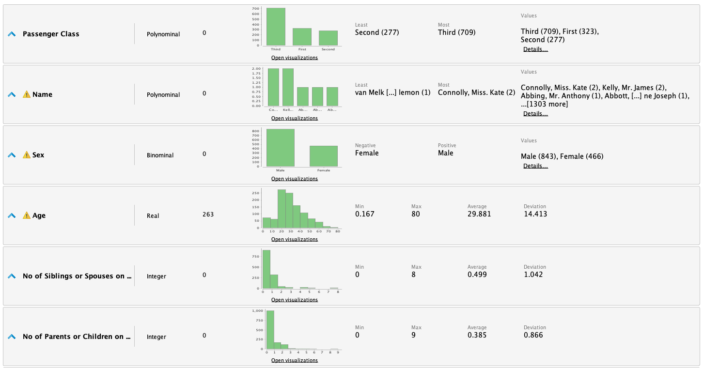
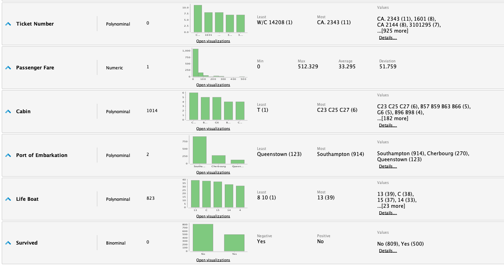
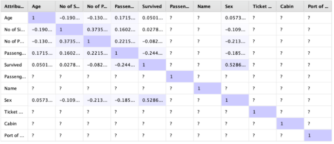

Investigaremos el dataset de Titanic y lo prepararemos sus datos para un futuro modelado.

# Dataset
El dataset de Titanic tiene datos de la tragedia que todos conocemos, con el estudio
de los mismos sería posible construir un modelo de Machine Learning para clasificar
a los pasajeros entre "sobrevivientes" y "no sobrevivientes". Para esto, primero
necesitamos trabajar con el dataset y prepararlo para un futuro modelado.

## Atributos

El dataset cuenta con los siguientes atributos:

| Atributo                           | Tipo        | Descripción                                             |
| --------                           | ----        | -----------                                             |
| Passenger Class                    | Polinominal | Indica la clase en la que viajo: Third, First o Second. |
| Name                               | Polinominal | Nombre del pasajero                                     |
| Sex                                | Binominal   | Hombre o Mujer                                          |
| Age                                | Real        | Edad                                                    |
| No of Siblings or Spouses on board | Integer     | Número de hermanos o esposo/esposa a bordo              |
| No of Parents or Children on board | Integer     | Número de padres o hijos a bordo                        |
| Ticket Number                      | Polinominal | Número de ticket                                        |
| Passenger Fare                     | Numérico    | Precio del pasaje                                       |
| Cabin                              | Polinominal | Cabina del pasajero                                     |
| Port of Embarkation                | Polinominal | Puerto de embarque                                      |
| Life Boat                          | Polinominal | Bote en el que evacuó                                   |
| Survived                           | Binominal   | Indica si el pasajero sobrevivió                        |

A continuación pueden verse las estadísticas de los atributos:

# Preparación de los datos

Es necesario hacer algunos ajustes en el dataset, hay atributos que no aportan al
modelo de Machine Learning.

Los siguientes atributos se sacarán:
* _Life Boat_: Hay mucha correlación entre sobrevivientes y el bote. Esta información 
  puede desviar al algoritmo.

Además, debemos analizar los datos faltantes. Existen varios atributos que tienen
datos faltantes: faltan 823 botes, 2 puertos de embarque, 263 edades, 1 Passanger Fare
y 1014 cabinas.

Para los atributos con pocos datos faltantes simplemente eliminamos las
instancias. Este en el caso de "Passanger Fare" y "Port of Embarkation".
Para el resto, utilizaremos el operador __Replace Missing Values__ para 
rellenar los datos faltantes con el promedio.

Como último paso de la limpieza normalizaremos el dataset, esto lo logramos
con el operador __Normalize__, aplicando "Z-transformation". La transformación
centra y escala los atributos, por lo que tendrán una media de 0 y una desviación
estándar de 1.

# Correlaciones
Con RapidMiner podemos genera una matriz de correlación:

En la mayoría de los casos no se observa una correlación notoria en los atributos.
Observamos que hay una correlación entre el sexo y la supervivencia, esto se puede
deber a que las mujeres y niños fueron los primeros en ser evacuados. El valor de
correlación no es tan elevado (0.52) por lo que se opta por dejar el atributo en el 
dataset.
