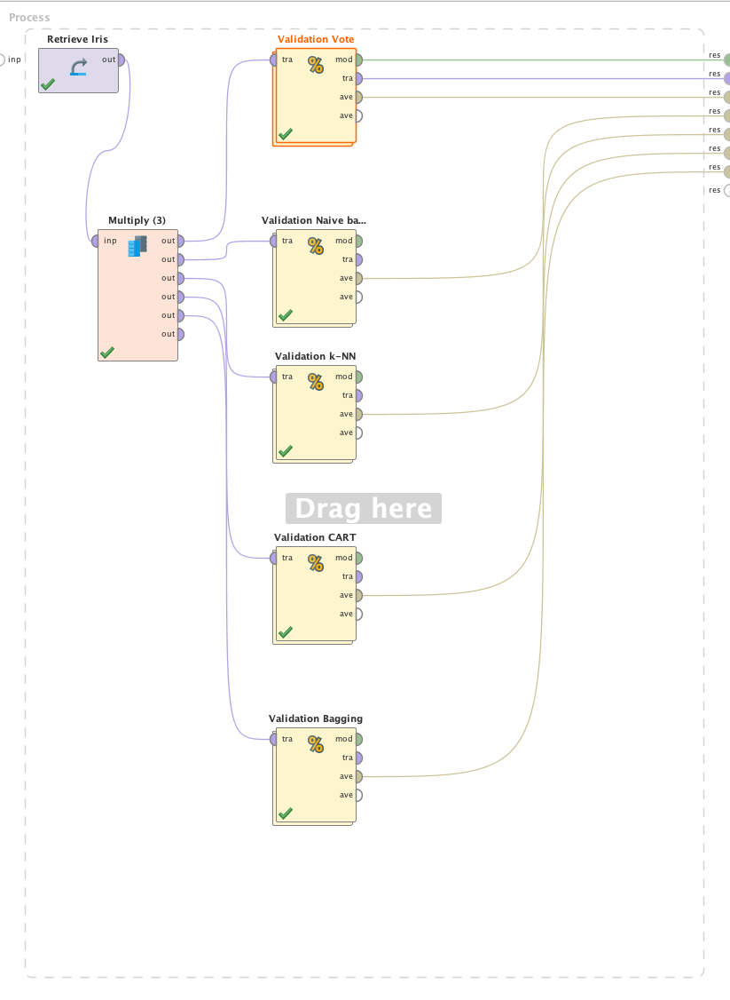

Los algoritmos de ensable son muy utilizados en Machine Learning, estos se
basan en el principio de "wisdom of the crowd" (sabiduría de la multitud); éste
principio dice que la opinión colectiva es superior a la opinión individual.
Tomando esto en cuenta, los algoritmos de ensamble toman varios modelos de
Machine Learning y en base al resultado de todos estos llega a una conclusión.
El algoritmo de Votación, simplemente se basa en la decisión de la mayoría.

# Descripción del Problema
Utilizaremos el dataset de Iris como prueba, y compararemos el resultado de
utilizar el algoritmo de votación (compuesto por Naïve Bayes, Árboles de
Decisión y k-NN) contra sus componentes individuales, por ultimo configuraremos
un modelo de Bagging con arboles de decisión (10 iteraciones).

# Modelado
Definiremos los modelos como se muestra a continuación:

El operador de Bagging tiene adentro un árbol de decisión con la misma configuración
utilizada anteriormente.

Al evaluar los resultados utilizaremos la misma configuración para los modelos base.

# Evaluación
Utilizaremos split validation en todos los casos, con un 70% de entrenamiento y
un 30% de testing. Además, se utilizara una semilla (1992) para que los
resultados sean reproducibles y las comparaciones tengan sentido.

Cómo puede observarse en todos los casos se obtuvieron buenos resultados, los
algoritmos independientemente tuvieron mejores resultados pero esto se debe a
que el dataset es pequeño y probablemente se esté haciendo overfitting. Los
algoritmos de votación tuvieron un poco menos de performance pero son más
robustos a la hora de clasificar nueva información.

# Recursos
[>>Proceso de RapidMiner](vote.rmp)
